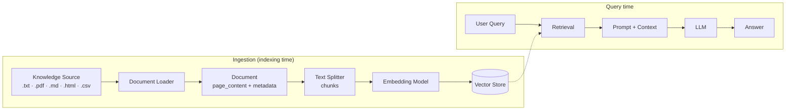
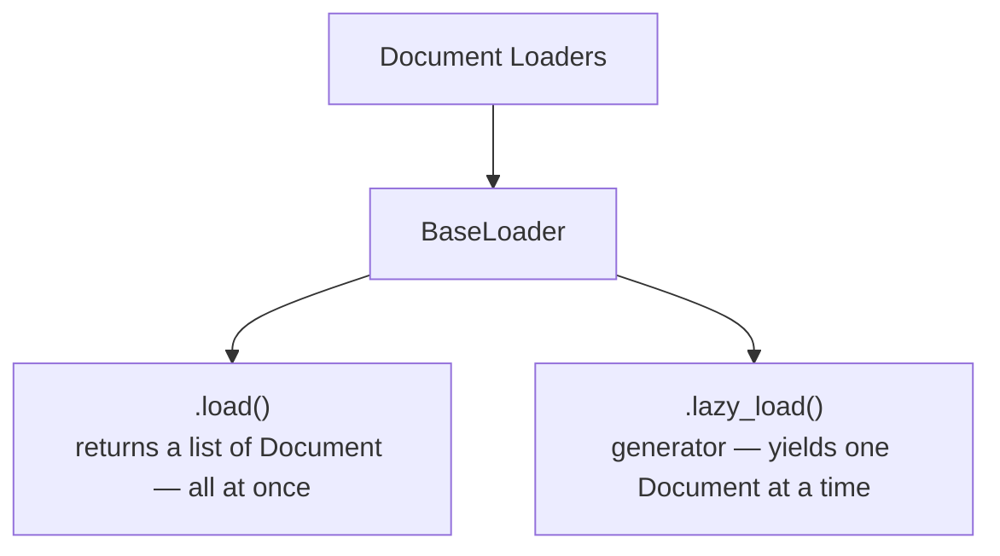
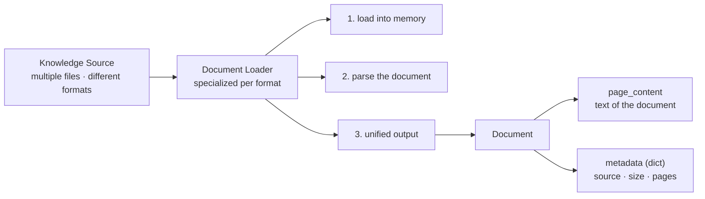

# Document Loaders — Revision Notes

Step 1 of any RAG pipeline: **data ingestion**. How raw files become `Document` objects the rest of the pipeline can use.

**Contents**

- [TL;DR](#tldr)
- [1. Why are loaders required?](#1-why-are-loaders-required)
- [2. What is a Document Loader?](#2-what-is-a-document-loader)
- [3. The `Document` object](#3-the-document-object)
- [4. Base loader interface](#4-base-loader-interface)
- [5. Loader cheat-sheet](#5-loader-cheat-sheet)
- [6. Code](#6-code)
- [7. Interview one-liners](#7-interview-one-liners)
- [Quick recap](#quick-recap)

---

## TL;DR

| What                                                                                                 | Input                                                                                                                   | 3 Tasks                                                                                                          | Output                                                                      |
| :--------------------------------------------------------------------------------------------------- | :---------------------------------------------------------------------------------------------------------------------- | :--------------------------------------------------------------------------------------------------------------- | :-------------------------------------------------------------------------- |
| The **data ingestion** step of RAG — the *translator* between messy sources and the pipeline | Rarely one clean file — a **directory of many files, many formats**: `.txt` `.pdf` `.md` `.html` `.csv` | **load** into memory → **parse** with a format-specific parser → return a **unified output** | The **`Document`** object — `page_content` (text) + `metadata` (dict) |

| Design                                                                                                          | API                                                                                  | Metadata                                                                              | Position                                                     |
| :-------------------------------------------------------------------------------------------------------------- | :----------------------------------------------------------------------------------- | :------------------------------------------------------------------------------------ | :----------------------------------------------------------- |
| One **specialized loader per format**, all behind the same `BaseLoader` → downstream code never changes | `.load()` = everything at once · `.lazy_load()` = generator, streams doc by doc | Not decoration — powers **source attribution** and **filtered retrieval** | Step 1 of the pipeline, **before** chunking / embedding |

---

## 1. Why are loaders required?



- The LLM has **no access to private / external knowledge** → we must build a knowledge base ourselves.
- That knowledge lives **in files, not in the model** — something has to get it into memory as text.
- A knowledge source is **not one file**:
  - a **directory** → **multiple files** → **different formats**
  - each format needs different handling
- No loader → no chunks → no embeddings → **no retrieval**.
- Loader = **translator**: many input formats in, one output shape out.

---

## 2. What is a Document Loader?

A component of the RAG pipeline with **3 key tasks**:

| #           | Task                         | What actually happens                                                            |
| :---------- | :--------------------------- | :------------------------------------------------------------------------------- |
| **a** | **Load** the document  | Pull bytes from disk / URL into memory (HDD → RAM)                              |
| **b** | **Parse** the document | A **specialized parser** reads the *document structure* and extracts text |
| **c** | **Extract & output**   | Return in a **unified format**, regardless of input type                    |

### Why parsing must be format-specific

| Format             | Where the structure lives                                 |
| :----------------- | :-------------------------------------------------------- |
| **Markdown** | Symbols — `# Title`, `##`, ordered lists              |
| **HTML**     | Tags — `<div>`, `<a>`; the text is buried inside them |
| **CSV**      | Tabular — `id, name, age, gender` rows                  |
| **PDF**      | Pages, columns, tables, embedded images                   |

> [!NOTE]
> **Many input formats → single output format.** Format variation stops at the loader, so everything downstream sees exactly one shape.

---

## 3. The `Document` object

Every loader returns a list of these — text plus where it came from:

```json
{
  "page_content": "Attention Is All You Need — the dominant sequence transduction models ...",
  "metadata": {
    "source": "../documents/attention_is_all_you_need.pdf",
    "page": 0,
    "total_pages": 15
  }
}
```

- **`page_content`** → the text of the document
- **`metadata`** → source, page, total_pages, size …

**Why metadata matters — two concrete payoffs:**

1. **Source attribution** → citations in the final answer ("from `policy.pdf`, p. 12").
2. **Filtering** → metadata filters at retrieval time (only this file, only `page > 10`, only this category).

---

## 4. Base loader interface



| Method           | Returns                                | Use when                                                                  |
| :--------------- | :------------------------------------- | :------------------------------------------------------------------------ |
| `.load()`      | `List[Document]`, fully materialized | Small / medium sources, notebook exploration                              |
| `.lazy_load()` | Generator of `Document`               | Large corpora, web crawls, streaming into a splitter — keeps memory flat |

Every document type gets its **own specialized loader**, but they all expose **this same interface**.

---

## 5. Loader cheat-sheet

| Loader                 | Source       | 1 `Document` =            | Use it for                                              |
| :--------------------- | :----------- | :------------------------- | :------------------------------------------------------ |
| `TextLoader`         | `.txt`     | whole file                 | Plain text — the simplest baseline                     |
| `CSVLoader`          | `.csv`     | **one row**          | Tabular records; columns split into content vs metadata |
| `JSONLoader`         | `.json`    | one item from a `jq` path | Nested / structured records (catalogs, API dumps)       |
| `PyPDFLoader` | `.pdf` | one page (`mode="page"`) | Default PDF choice — fastest; image OCR via `images_parser` |
| `PDFMinerLoader` | `.pdf` | page or whole doc | Better layout / table fidelity than PyPDF; also does image OCR |
| `PDFPlumberLoader` | `.pdf` | one page | Richest **metadata** + best table extraction; slowest, no OCR |
| `WebBaseLoader`      | list of URLs | one page per URL           | A known, fixed set of web pages                         |
| `RecursiveUrlLoader` | base URL     | one page per crawled URL   | Crawling a docs site to `max_depth`                    |

---

## 6. Code

<details open>
<summary><b>Text</b> — <code>TextLoader</code></summary>

```python
from pathlib import Path
from langchain_community.document_loaders import TextLoader

loader = TextLoader(file_path=Path("../documents/transformers.txt"))
documents = loader.load()          # List[Document], len == 1

documents[0].page_content          # the text
documents[0].metadata              # {'source': '...'}
```

</details>

<details>
<summary><b>CSV</b> — <code>CSVLoader</code>, split columns into content vs metadata</summary>

```python
from langchain_community.document_loaders.csv_loader import CSVLoader

loader = CSVLoader(
    file_path=file_path,
    source_column="Industry",
    metadata_columns=["Website", "Founded", "Number of employees"],
    content_columns=["Description"],
)
documents = loader.load()          # one Document per ROW
```

</details>

<details>
<summary><b>JSON</b> — <code>JSONLoader</code> with <code>jq_schema</code> + custom metadata</summary>

```python
from langchain_community.document_loaders.json_loader import JSONLoader

def metadata_func(record: dict, metadata: dict) -> dict:
    metadata["product_name"] = record["productName"]
    metadata["category"] = record["category"]
    metadata["price"] = record["price"]
    del metadata["seq_num"]
    return metadata

loader = JSONLoader(
    file_path=file_path.as_posix(),
    jq_schema=".products[]",       # jq path selecting each record
    content_key="Description",     # which field becomes page_content
    metadata_func=metadata_func,
)
documents = loader.load()
```

</details>

<details>
<summary><b>PDF</b> — three flavours (+ OCR for images)</summary>

```python
from langchain_community.document_loaders.pdf import PyPDFLoader
from langchain_community.document_loaders import PDFMinerLoader, PDFPlumberLoader
from langchain_community.document_loaders.parsers import RapidOCRBlobParser

# 1. plain, page-per-document
pypdf_loader = PyPDFLoader(file_path=path, mode="page")

# 2. same, but OCR the images too
pypdf_image_loader = PyPDFLoader(
    file_path=path,
    mode="page",
    extract_images=True,
    images_parser=RapidOCRBlobParser(),
    images_inner_format="html-img",
)

# 3. better layout / tables
pdfminer_loader = PDFMinerLoader(
    file_path=path,
    mode="page",
    extract_images=True,
    images_parser=RapidOCRBlobParser(),
)

# 4. richest metadata
plumber_loader = PDFPlumberLoader(file_path=path)

documents = pypdf_loader.load()
documents[0].metadata              # includes 'page'
```

</details>

<details>
<summary><b>Web</b> — <code>WebBaseLoader</code>, recursive crawl, lazy loading</summary>

```python
from langchain_community.document_loaders import WebBaseLoader, RecursiveUrlLoader

loader = WebBaseLoader(web_paths=[url_1, url_2, url_3])   # one Document per URL
documents = loader.load()

crawler = RecursiveUrlLoader(url=base_url, max_depth=2)   # follow links 2 levels deep

for document in crawler.lazy_load():                      # streams, doesn't materialize
    print(document.page_content[:300])
    print(document.metadata)
```

</details>

---

## 7. Interview one-liners

| Question                             | Answer                                                                                          |
| :----------------------------------- | :---------------------------------------------------------------------------------------------- |
| What does a loader actually return?  | A list of `Document`s — `page_content` + `metadata`, never raw bytes                      |
| Why not just `open().read()`?       | No structure parsing (HTML tags, PDF pages, CSV rows), no metadata, no unified interface        |
| `load()` vs `lazy_load()`?       | List vs generator; lazy keeps memory flat on large crawls / corpora                             |
| Why one loader per format?           | Parsing is format-specific; the **output** is what's shared, via `BaseLoader`            |
| What breaks if the loader is sloppy? | Garbage text → garbage chunks → garbage embeddings; no metadata → no citations, no filtering |
| Where do loaders sit?                | Step 1, **data ingestion**, before chunking                                                |

---

## Quick recap



- **Components of RAG:** ① Document Loaders → ② Text Splitters → ③ Embeddings → ④ Vector Stores → ⑤ Retrievers
- **Document Loaders** = data ingestion — bring **external knowledge into context**
- **3 tasks:** load into memory → parse (specialized parser) → return unified format
- **`Document`** = `page_content` (text) + `metadata` (dict: source, size, pages)
- **`BaseLoader`** exposes `load` and `lazy_load`
- **Next up:** Text Splitters → `BaseSplitter` (chunking strategies)
