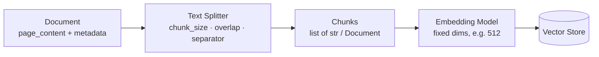
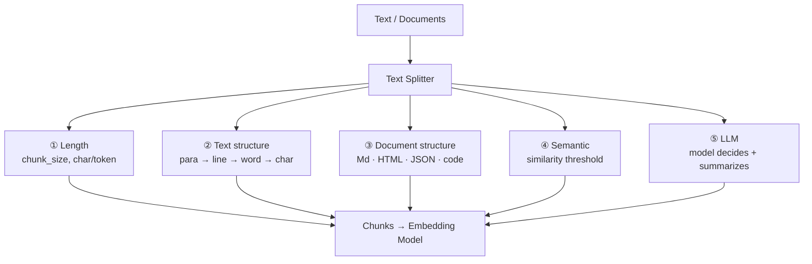

# Text Splitters — Revision Notes

Step 2 of the RAG pipeline: **chunking**. How `Document` objects get cut into retrievable pieces.

**Contents**

- [TL;DR](#tldr)
- [1. Why split at all?](#1-why-split-at-all)
- [2. The splitter API](#2-the-splitter-api)
- [3. The 5 chunking strategies](#3-the-5-chunking-strategies)
- [4. Strategy comparison](#4-strategy-comparison)
- [5. Code](#5-code)
- [6. Interview one-liners](#6-interview-one-liners)
- [Quick recap](#quick-recap)

---

## TL;DR

| What                                                                   | Input                                         | Key knobs                                        | Output                              |
| :--------------------------------------------------------------------- | :-------------------------------------------- | :----------------------------------------------- | :---------------------------------- |
| **Chunking** — cut loaded `Document`s into retrievable pieces | `str` or `list[Document]` from the loader | `chunk_size`, `chunk_overlap`, `separator` | `list[str]` or `list[Document]` |

| Why                                                                                                      | Embedding limit                                                                                                     | The 5 strategies                                                  | Default pick                                                                |
| :------------------------------------------------------------------------------------------------------- | :------------------------------------------------------------------------------------------------------------------ | :---------------------------------------------------------------- | :-------------------------------------------------------------------------- |
| Context window is finite +**lost in the middle** — models attend to the start/end, not the middle | Embedding models have**fixed output dims** (e.g. 512) — cramming 10k words into one vector loses information | Length → Text structure → Document structure → Semantic → LLM | **`RecursiveCharacterTextSplitter`** — best size/coherence balance |

---

## 1. Why split at all?



Four reasons, all of them real failures if you skip it:

| Reason                          | What breaks without chunking                                                                                                                                        |
| :------------------------------ | :------------------------------------------------------------------------------------------------------------------------------------------------------------------ |
| **Context window**        | Finite (e.g. 200K). A 1000-page PDF as one blob simply does not fit                                                                                                 |
| **Lost in the middle**    | Even inside the window, the model attends to the**start and end** — content in the middle gets ignored                                                       |
| **Embedding compression** | Embedding models emit**fixed dimensions**. 10k words → 512 numbers = heavy information loss; the same 512 dims holding 1k words is **10× less lossy** |
| **Retrieval precision**   | Whole-document vectors are**not specific to the query** — you retrieve the entire doc when you needed one paragraph                                          |

> [!NOTE]
> Two goals of splitting: **① never breach the context limit** and **② avoid the lost-in-the-middle problem**. Everything else is a refinement of those two.

---

## 2. The splitter API

Every `TextSplitter` subclass exposes the same three methods:

| Method                 | Input              | Output                                  |
| :--------------------- | :----------------- | :-------------------------------------- |
| `split_text()`       | `str`            | `list[str]`                           |
| `split_documents()`  | `list[Document]` | `list[Document]` (metadata preserved) |
| `create_documents()` | `list[str]`      | `list[Document]`                      |

> [!WARNING]
> `MarkdownHeaderTextSplitter` / `HTMLHeaderTextSplitter` break this — only `split_text()`, and it returns **`Document`s, not strings**. `RecursiveJsonSplitter` has no `split_documents()`.

**Three knobs:**

- **`chunk_size`** — the *maximum* chunk length. **Not a guarantee** — an unbreakable piece comes out oversized (`Created a chunk of size N...`)
- **`chunk_overlap`** — characters repeated from the previous chunk, to bridge context
- **`separator`(`s`)** — where cuts are allowed: `""` char · `" "` word · `"\n"` line · `"\n\n"` para. `CharacterTextSplitter` takes one, `RecursiveCharacterTextSplitter` a list

Measured in **characters** (`len`) or **tokens** (`from_tiktoken_encoder`) — tokens are what model limits actually use.

---

## 3. The 5 chunking strategies

### ① Length-based (fixed-size)

Cut every N characters or tokens. The simplest possible rule.

| Yes | No |
| :--- | :--- |
| Simple, fast, parallelizable | Splits mid-sentence / mid-word |
| Predictable chunk sizes | Ignores structure and meaning |
| Consistent memory usage | Overlap duplicates data |

### ② Text-structure-based (recursive) — *the default*

Walk a separator list, going finer **only while a chunk is still too big**, then merge the pieces back up toward `chunk_size`:

```
["\n\n", "\n", " ", ""]   →   paragraphs → lines → words → characters
```

**Worked example** — `chunk_size=10`, two paragraphs of two lines each:

```
"\n\n"  →  Para 1 (31), Para 2 (43)        both too big
"\n"    →  4 lines (14, 16, 17, 25)        still too big
" "     →  words: Hi(2) how(3) are(3) …     small enough
merge   →  ['Hi how are', 'you', 'My name', 'is Rahul', 'I am',
            'teaching', 'RAG', 'We are', 'Learning', 'about RAG']
```

Merging is **greedy**, not balanced — `'Hi how are'` hits exactly 10, `'you'` is the leftover.

| Yes | No |
| :--- | :--- |
| Best size ↔ coherence balance | More complex than fixed-size |
| Preserves language structure | Separator choice matters |
| **Recommended default** | Variable chunk sizes |

### ③ Document-structure-based

Split on the document's own structure instead of on length — Markdown headers, HTML tags, JSON objects, code `class` / `def`.

- `from_language(Language.PYTHON)` → `['\nclass ', '\ndef ', '\n\tdef ', …]`, then the normal fallbacks
- `MarkdownHeaderTextSplitter` → headings become **metadata** (returns `Document`s)

| Yes | No |
| :--- | :--- |
| Preserves logical organization | Structured documents only |
| Metadata-rich (headers, sections) | Long sections → huge chunks |
| Natural boundaries, better recall | Needs a format-specific splitter |

### ④ Semantic-similarity-based

Embed each sentence; start a new chunk where **adjacent similarity drops** below a threshold.

```
t1 ──0.7── t2 ──0.85── t3 ──0.1── t4 ──0.6── t5
                         ↑ break here     →  C1 = t1+t2+t3   C2 = t4+t5
```

*API note: `SemanticChunker` measures **distance** (`1 − cos`) and breaks where it **exceeds** the threshold — unit depends on `breakpoint_threshold_type` (`percentile` default · `standard_deviation` default 3 · `interquartile` · `gradient`).*

| Yes | No |
| :--- | :--- |
| Semantically coherent chunks | Embeds every sentence — slow, costly |
| Natural topic boundaries | Needs an embedding model |
| Better retrieval performance | Chunk count unpredictable |

### ⑤ LLM-based

Let an LLM pick the boundaries via **structured output**, optionally writing a **summary per chunk** into metadata.

| Yes | No |
| :--- | :--- |
| Most context-aware splitting | Very expensive, slowest |
| Adds contextual summaries | **Non-deterministic** |
| Adapts to any document type | Overkill for simple docs |

---

## 4. Strategy comparison

| Strategy                     | Splits on                    | Cost                | Chunk size             | Use when                                        |
| :--------------------------- | :--------------------------- | :------------------ | :--------------------- | :---------------------------------------------- |
| **Length**             | fixed char/token count       | free                | predictable            | Baseline, uniform text, speed matters           |
| **Recursive**          | separator hierarchy          | free                | variable               | **Default for most use cases**            |
| **Document structure** | headers / tags / code blocks | free                | variable, can be large | Markdown, HTML, JSON, source code               |
| **Semantic**           | cosine-similarity drop       | embedding calls     | unpredictable          | Topic-mixed text where coherence matters most   |
| **LLM**                | model judgement              | LLM calls (highest) | unpredictable          | Small, high-value corpora; want chunk summaries |

---

## 5. Code

<details open>
<summary><b>Length-based</b> — <code>CharacterTextSplitter</code>, overlap, token counting</summary>

```python
from langchain_text_splitters import CharacterTextSplitter

splitter = CharacterTextSplitter(
    chunk_size=100,
    chunk_overlap=0,
    length_function=len,
    separator="",          # "" char · " " word · "\n" line · "\n\n" paragraph
)
chunks = splitter.split_text(text)          # list[str]

# overlap keeps context across the boundary
splitter = CharacterTextSplitter(chunk_size=100, chunk_overlap=20, separator="")

# count TOKENS instead of characters — this is what model limits actually use
token_splitter = CharacterTextSplitter.from_tiktoken_encoder(
    encoding_name="cl100k_base",
    chunk_size=50,
    chunk_overlap=5,
)
```

</details>

<details>
<summary><b>Recursive</b> — <code>RecursiveCharacterTextSplitter</code> (the default choice)</summary>

```python
from langchain_text_splitters import RecursiveCharacterTextSplitter

splitter = RecursiveCharacterTextSplitter(
    chunk_size=150,
    chunk_overlap=20,
)                                            # separators default to ["\n\n", "\n", " ", ""]

chunks = splitter.split_text(example_text)   # list[str]

# keep metadata: Document in -> Document out
from langchain_core.documents import Document
docs = [Document(page_content=t) for t in list_of_text]
chunk_docs = splitter.split_documents(docs)  # list[Document]
```

</details>

<details>
<summary><b>Document structure</b> — code, Markdown, JSON</summary>

```python
from langchain_text_splitters import RecursiveCharacterTextSplitter, Language

# --- Python source: splits on class / def / indented def, then normal fallbacks ---
python_splitter = RecursiveCharacterTextSplitter.from_language(
    language=Language.PYTHON,
    chunk_size=700,
    chunk_overlap=100,
)
code_chunks = python_splitter.split_text(python_code)
python_splitter.get_separators_for_language(Language.PYTHON)   # inspect them

# --- Markdown: headers become metadata ---
from langchain_text_splitters import MarkdownHeaderTextSplitter

markdown_splitter = MarkdownHeaderTextSplitter(
    headers_to_split_on=[("#", "Header_1"), ("##", "Header_2"), ("###", "Header_3")],
    strip_headers=False,
)
markdown_chunks = markdown_splitter.split_text(MARKDOWN_TEXT)

# --- JSON: recursive split by object ---
from langchain_text_splitters import RecursiveJsonSplitter

json_splitter = RecursiveJsonSplitter(max_chunk_size=200)
json_splitter.split_json(json_data=JSON_DATA)   # list[dict]
json_splitter.split_text(JSON_DATA)             # list[str]
```

</details>

<details>
<summary><b>Semantic</b> — <code>SemanticChunker</code> + embeddings</summary>

```python
from langchain_experimental.text_splitter import SemanticChunker
from langchain_openai import OpenAIEmbeddings

chunker = SemanticChunker(
    embeddings=OpenAIEmbeddings(),
    breakpoint_threshold_type="standard_deviation",   # percentile (default) | standard_deviation
                                                      # | interquartile | gradient
    breakpoint_threshold_amount=0.1,
)
chunks = chunker.split_text(text)
```

</details>

<details>
<summary><b>LLM-based</b> — structured output + per-chunk summaries</summary>

```python
from pydantic import BaseModel
from langchain_openai.chat_models import ChatOpenAI
from langchain_core.prompts import ChatPromptTemplate
from langchain_core.documents import Document

class Chunk(BaseModel):
    chunk_text: str
    summary: str

class Chunker(BaseModel):
    chunks: list[Chunk]

llm_chunker = ChatOpenAI(model="gpt-5-mini").with_structured_output(schema=Chunker)

prompt = ChatPromptTemplate(messages=[
    ("system", "You are an expert Text Chunker... You understand the natural topic "
               "boundaries of text and do not change the existing text. Also generate "
               "a 1-2 line summary of each chunk."),
    ("human", "Split the given text into chunks\nText: {text}"),
], input_variables=["text"])

response = (prompt | llm_chunker).invoke({"text": text})

# the summary becomes metadata
docs = [Document(page_content=c.chunk_text, metadata={"summary": c.summary})
        for c in response.chunks]
```

</details>

---

## 6. Interview one-liners

**Why chunk at all?**
Context limit + lost-in-the-middle + embedding compression loss + retrieval precision.

**What is "lost in the middle"?**
Models attend to the start and end of the context; content in the middle is effectively ignored.

**Which splitter is the default?**
`RecursiveCharacterTextSplitter` — best size/coherence tradeoff.

**How does recursive actually work?**
Walks `["\n\n", "\n", " ", ""]`, splitting finer only while chunks exceed `chunk_size`, then merges the pieces back up greedily.

**Why `chunk_overlap`?**
Preserves context across boundaries — at the cost of duplicated data.

**Is `chunk_size` guaranteed?**
No. With a non-empty separator an unbreakable piece comes out oversized — LangChain warns `Created a chunk of size N...`. Recursive avoids this by falling through to finer separators.

**Does every splitter have the same 3 methods?**
No. `MarkdownHeaderTextSplitter` / `HTMLHeaderTextSplitter` have only `split_text()`, and it returns `Document`s, not strings.

**`split_text` vs `split_documents`?**
`str → list[str]` vs `list[Document] → list[Document]` (keeps metadata).

**Characters or tokens?**
Tokens — that's the unit the model's limit is measured in (`from_tiktoken_encoder`).

**When is semantic chunking worth it?**
Topic-mixed text where coherence beats cost — remember it embeds every sentence.

**Downside of LLM chunking?**
Expensive, slow, non-deterministic — reserve it for small, high-value corpora.

---

## Quick recap



- **Components of RAG:** ① Document Loaders → ② **Text Splitters** → ③ Embeddings → ④ Vector Stores → ⑤ Retrievers
- **Text Splitters** = Documents → **Chunks**
- **Why:** context limit · lost in the middle · fixed embedding dims · query-specific retrieval
- **Knobs:** `chunk_size` (max) · `chunk_overlap` (context bridge) · `separator` (where cuts are allowed)
- **API:** `split_text` (str→list[str]) · `split_documents` (Doc→Doc) · `create_documents` (str→Doc)
- **5 strategies:** Length → Text structure → Document structure → Semantic → LLM (cost and intelligence both rise left to right)
- **Next up:** Text Embeddings → embedding models, vectors, distance metrics
