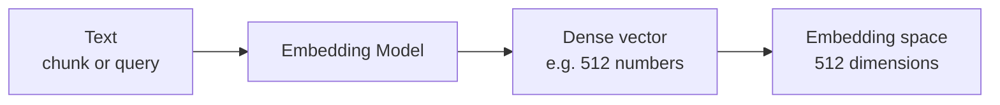
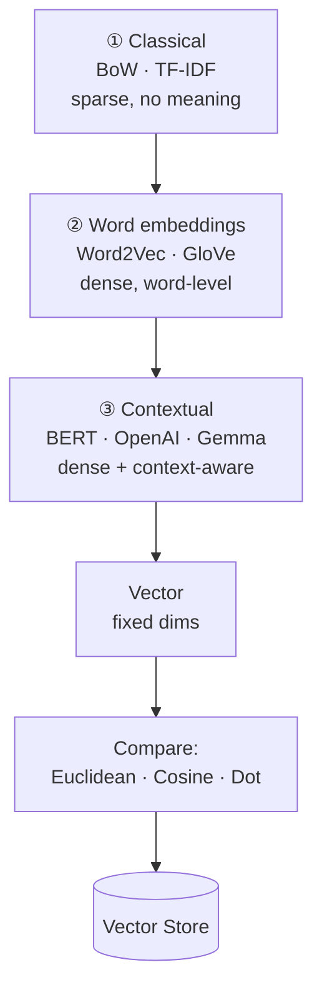

# Text Embeddings — Revision Notes

Step 3 of the RAG pipeline: turning chunks into **vectors** that carry meaning, so similarity becomes arithmetic.

**Contents**

- [TL;DR](#tldr)
- [1. How we got here — 3 stages](#1-how-we-got-here--3-stages)
- [2. Embedding space](#2-embedding-space)
- [3. Distance metrics](#3-distance-metrics)
- [4. Dimensions and tradeoffs](#4-dimensions-and-tradeoffs)
- [5. Proprietary vs open source](#5-proprietary-vs-open-source)
- [6. Code](#6-code)
- [7. Interview one-liners](#7-interview-one-liners)
- [Quick recap](#quick-recap)

---

## TL;DR

| What                                                                                        | Input                                     | Output                                                                | Key property                                              |
| :------------------------------------------------------------------------------------------ | :---------------------------------------- | :-------------------------------------------------------------------- | :-------------------------------------------------------- |
| An**embedding model** encodes text into numbers that carry **semantic meaning** | `str` (query) or `list[str]` (chunks) | a**dense vector** — e.g. 384 / 768 / 1024 / 1536 / 3072 floats | **Fixed dimensionality**, whatever the input length |

| Similarity                                                            | Metrics                                     | Dimensions                                                               | The shortcut                                                 |
| :-------------------------------------------------------------------- | :------------------------------------------ | :----------------------------------------------------------------------- | :----------------------------------------------------------- |
| Similar meaning → vectors**close together** in embedding space | Euclidean ·**Cosine** · Dot product | ↑ dims = finer meaning, but ↑ storage, ↑ latency, diminishing quality | Normalized vectors →**cosine = dot product** (faster) |

---

## 1. How we got here — 3 stages

ML models can't consume text — categorical data has to be **encoded into numbers** first.

| Stage                     | Approach                                   | Vector type                                      | Problem it left behind                                                                                 |
| :------------------------ | :----------------------------------------- | :----------------------------------------------- | :----------------------------------------------------------------------------------------------------- |
| **① Classical** | BoW, TF-IDF — count word frequency        | **Sparse** (`1 × 10,000`, mostly zeros) | No meaning at all, just counts; vocabulary-sized and wasteful                                          |
| **② Word embeddings** | Word2Vec, GloVe (deep learning, ~768 dims) | **Dense**                                  | Semantic, but**one vector per word** — "bank" is identical in *river bank* and *money bank* |
| **③ Contextual** | BERT, OpenAI, Gemma, Sentence Transformers | **Dense + context-aware**                  | — this is what we use today                                                                           |

**Stage ① — sparse vectors:** vocabulary = the unique set of words (English ≈ 10k+). Each text becomes a count vector over the whole vocabulary, so nearly every entry is `0`.

```
        Cat  Sat  Mat  Rat  Wall  Ball
Text 1   1    1    1    0    0     0
Text 2   2    0    3    2    0     1
```

**Stage ② — why dense won:** ① reduced dimensionality (far fewer calculations) and ② every feature carries information instead of mostly zeros.

**Stage ③ — the fix:** the same word gets a *different* vector depending on its neighbours, so `Money Bank` → E₁ and `River Bank` → E₂. Embeddings also moved up from words to **sentences and paragraphs**.

---

## 2. Embedding space



- The space has **as many dimensions as the vectors do** — 512-dim vectors live in a 512-dim hyperspace.
- Each dimension is a **learned feature** capturing some aspect of the text — no one labels them.
- Text about similar things **clusters**: `Python` and `JS` sit near each other inside a bigger *programming* region, far from `Farming` or `Healthcare`.
- Both **documents and the query** go through the *same* model, so the query vector lands near the chunks that answer it.

> [!IMPORTANT]
> Query and documents **must** be embedded with the same model — different models produce incomparable spaces. Switching models means **re-embedding everything**.

---

## 3. Distance metrics

### ① Euclidean distance

Straight-line distance between two points.

```
d = √( (x₁−y₁)² + (x₂−y₂)² + … + (xₙ−yₙ)² )

A = (2,4), B = (3,2)  →  √( (2−3)² + (4−2)² ) = √5 = 2.23
```

**Lower = more similar.** Sensitive to **both direction and magnitude**, and degrades as dimensions grow.

### ② Cosine similarity — *the usual choice*

The cosine of the **angle** between two vectors. **Bounded to [−1, +1]**:

| Value         | Angle             | Meaning                        |
| :------------ | :---------------- | :----------------------------- |
| **+1**  | 0°               | Most similar — same direction |
| **0**   | 90° (orthogonal) | Unrelated                      |
| **−1** | 180°             | Completely opposite            |

```
cosine similarity = (A · B) / (‖A‖ × ‖B‖)
```

**Lower angle = more similar.** Sensitive to **direction only** — magnitude is divided out, so a long vector and a short one pointing the same way score identically (`A→B = A→C = 0.7`). That's usually what you want: length reflects text size, not meaning.

### ③ Dot product

```
A · B = (x₁y₁) + (x₂y₂) + … + (xₙyₙ)

A = [2, 3, 5], B = [1, 2, 4]  →  2 + 6 + 20 = 28
```

**Unbounded** scalar — higher = more similar. Both vectors must have the **same dimensionality**.

> [!NOTE]
> **The shortcut that matters:** if vectors are **normalized** (`‖A‖ = ‖B‖ = 1`), then `cosine = (A·B) / (1×1) = A·B` — cosine similarity *is* the dot product. Most embedding models return normalized vectors, so vector stores use the dot product and skip the magnitude computation and the division. Lower latency, faster retrieval.

| Metric                | Bounded?  | Sensitive to          | Use when                                 |
| :-------------------- | :-------- | :-------------------- | :--------------------------------------- |
| **Euclidean**   | no        | direction + magnitude | KNN, low dimensions                      |
| **Cosine**      | −1 … +1 | direction only        | **Text similarity — the default** |
| **Dot product** | no        | direction + magnitude | Vectors already normalized (fastest)     |

---

## 4. Dimensions and tradeoffs

Common sizes: **384 · 768 · 1024 · 1536 · 3072** (many models also allow custom, e.g. 256 or 512).

**Higher dimensions give you:**

1. More nuanced semantic relationships
2. Better separation of *small* differences in meaning (e.g. CL vs SL vs CCL leave policy)
3. Better retrieval

**But the cost is real:**

| Cost              | What happens as dimensions rise                                                                                                                                  |
| :---------------- | :--------------------------------------------------------------------------------------------------------------------------------------------------------------- |
| **Quality** | **Diminishing returns** — the curve plateaus. If your domains are far apart (Python vs Healthcare), extra dims make *no difference*                     |
| **Storage** | Each number is a 32-bit float =**4 bytes**. 384 dims → 1,536 B ≈ 1.5 KB per vector. 2M vectors ≈ **3 GB**; at 1536 dims ≈ **12 GB** — 4× |
| **Network** | Bigger vectors move over the wire on every query — cloud DB cost rises with them                                                                                |
| **Latency** | Similarity is element-wise, so it scales with dims. 1000 docs @ 384 ≈**200 ms**; @ 1536 ≈ **800 ms** — a compounding effect                       |

> [!TIP]
> Don't default to the biggest model. Match dimensions to how *fine* the distinctions in your corpus actually are.

---

## 5. Proprietary vs open source

| Aspect                | **Proprietary** (API)                      | **Open source** (self-hosted)                          |
| :-------------------- | :----------------------------------------------- | :----------------------------------------------------------- |
| **Examples**    | OpenAI`text-embedding-3-large` / `-small`    | `embeddinggemma`, BERT, Sentence Transformers (via Ollama) |
| **Cost model**  | Pay**per embedding** — expensive at scale | Infrastructure only (GPU servers — not cheap)               |
| **Privacy**     | Text leaves your network                         | **Everything stays on your servers**                   |
| **Performance** | State of the art                                 | Usually slightly behind                                      |
| **Ops**         | None — they scale it                            | GPU setup, deployment, monitoring, upgrades                  |
| **Limits**      | Rate limits, uptime depends on vendor            | **No rate limits**, works offline                      |
| **Flexibility** | No fine-tuning,**vendor lock-in**          | Fine-tune on your domain, you own the model                  |

> [!WARNING]
> **Vendor lock-in is expensive here:** migrating providers means re-embedding your entire knowledge base, not just swapping a key.

---

## 6. Code

<details open>
<summary><b>OpenAI</b> — <code>OpenAIEmbeddings</code>, query vs documents, custom dimensions</summary>

```python
from langchain_openai import OpenAIEmbeddings

embedder_large = OpenAIEmbeddings(model="text-embedding-3-large")   # 3072 dims
embedder_small = OpenAIEmbeddings(model="text-embedding-3-small")   # 1536 dims

# one string -> one vector
embeddings = embedder_large.embed_query(text=query)
len(embeddings)

# many chunks -> many vectors
text_documents = [doc.page_content for doc in chunks]
document_embeddings = embedder_large.embed_documents(texts=text_documents)

# shrink the output dimensionality
embedder_256 = OpenAIEmbeddings(model="text-embedding-3-large", dimensions=256)
len(embedder_256.embed_query(text=query))    # 256
```

</details>

<details>
<summary><b>Ollama</b> — local models, raw client + LangChain wrapper</summary>

```python
import ollama
from langchain_ollama.embeddings import OllamaEmbeddings

# --- raw ollama client ---
res = ollama.embed(model="embeddinggemma", input=query)
res["embeddings"][0]                       # the vector

res = ollama.embed(model="embeddinggemma", input=query, dimensions=512)

# batch: pass a list
document_embeddings = ollama.embed(
    model="embeddinggemma",
    input=text_documents,
)["embeddings"]

# --- same thing through LangChain ---
langchain_embedder = OllamaEmbeddings(model="embeddinggemma")
langchain_embedder.embed_documents(texts=text_documents)
langchain_embedder.embed_query(query)
```

</details>

<details>
<summary><b>Full ingestion chain</b> — load → split → embed</summary>

```python
from langchain_community.document_loaders import PyPDFLoader
from langchain_text_splitters import RecursiveCharacterTextSplitter

docs = PyPDFLoader(file_path="../documents/Openclaw_Research_Report.pdf").load()

chunks = RecursiveCharacterTextSplitter(
    chunk_size=300,
    chunk_overlap=50,
).split_documents(docs)

text_documents = [doc.page_content for doc in chunks]
document_embeddings = embedder_large.embed_documents(texts=text_documents)

len(document_embeddings)       # one vector per chunk
len(document_embeddings[0])    # the model's dimensionality
```

</details>

---

## 7. Interview one-liners

**What is a text embedding?**
A dense vector of fixed length that encodes the *meaning* of text, so semantic similarity becomes vector arithmetic.

**Sparse vs dense vectors?**
Sparse (BoW/TF-IDF) is vocabulary-sized and mostly zeros with no meaning; dense is small, and every dimension carries learned information.

**Why did Word2Vec/GloVe get replaced?**
They give one fixed vector per word — "bank" is the same in *river bank* and *money bank*. Contextual models embed the word differently based on its neighbours.

**Why is the output dimensionality fixed?**
The model always emits the same number of features, regardless of input length — which is exactly why long text must be chunked first.

**`embed_query` vs `embed_documents`?**
One string → one vector, vs a list of strings → a list of vectors. Both must use the **same model**.

**Which distance metric, and why?**
Cosine similarity — bounded to [−1, +1] and sensitive only to direction, so text length doesn't distort similarity.

**When is dot product the same as cosine?**
When the vectors are normalized (`‖A‖ = ‖B‖ = 1`). Most models normalize, so stores use the dot product for speed.

**What does Euclidean distance get wrong here?**
It reacts to magnitude as well as direction, and degrades as dimensionality grows.

**Are more dimensions always better?**
No — quality plateaus, while storage, network cost and latency keep rising (384→1536 is 4× storage and ~4× query time).

**Why can't I switch embedding models later?**
Vectors from different models aren't comparable — you'd have to re-embed the entire knowledge base.

---

## Quick recap



- **Components of RAG:** ① Document Loaders → ② Text Splitters → ③ **Embeddings** → ④ Vector Stores → ⑤ Retrievers
- **Embedding model** = text → dense vector of **fixed dimensionality**, carrying semantic meaning
- **3 stages:** sparse counts → dense word vectors → contextual embeddings
- **Embedding space:** as many dims as the vector; similar meaning clusters together
- **Metrics:** Euclidean (magnitude-sensitive) · **Cosine** (angle, bounded, default) · Dot (unbounded, fastest when normalized)
- **Dimensions:** more nuance, but 4× storage / latency and diminishing quality
- **Models:** proprietary (easy, pay-per-call, lock-in) vs open source (private, free per call, you run the GPUs)
- **Next up:** Vector Stores → storage, indexing, search, CRUD
