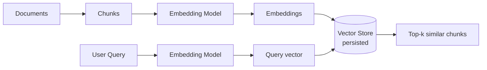
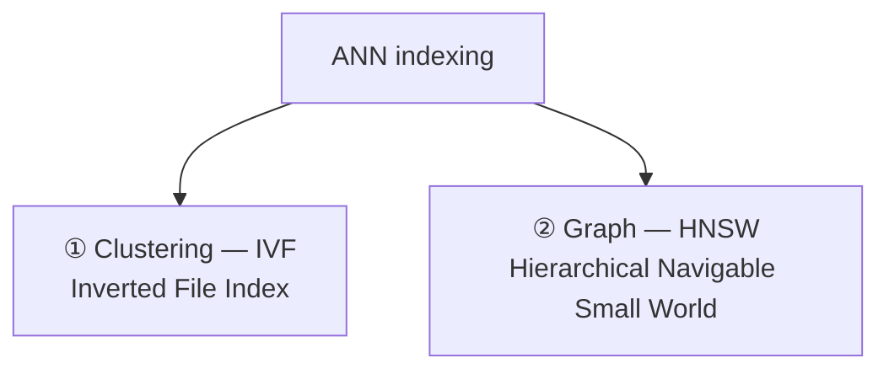
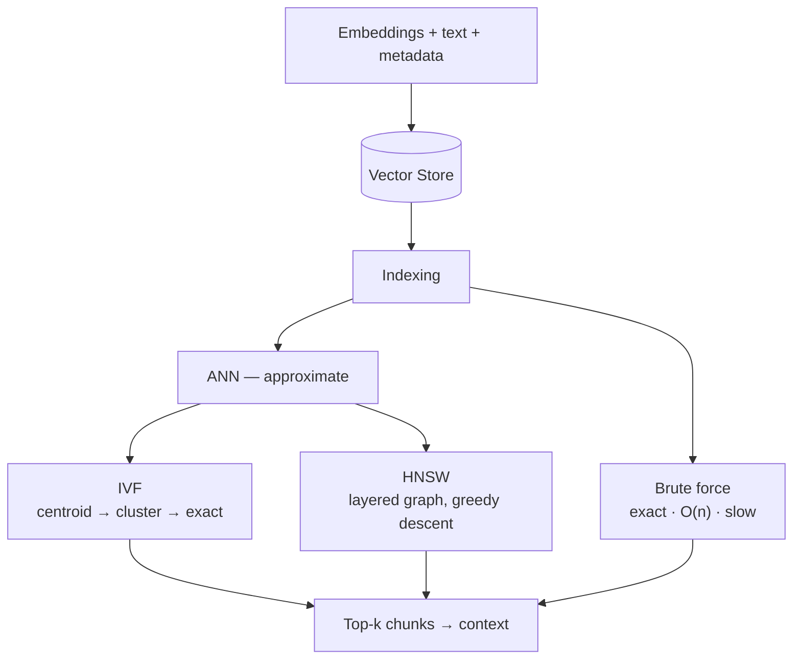

# Vector Stores — Revision Notes

Step 4 of the RAG pipeline: the **knowledge base**. Where embeddings live, how they're indexed, and how similarity search actually finds them fast.

**Contents**

- [TL;DR](#tldr)
- [1. Why persist embeddings?](#1-why-persist-embeddings)
- [2. What's stored — the record](#2-whats-stored--the-record)
- [3. Brute force vs indexing](#3-brute-force-vs-indexing)
- [4. ANN — IVF (clustering)](#4-ann--ivf-clustering)
- [5. ANN — HNSW (graph)](#5-ann--hnsw-graph)
- [6. Chroma DB](#6-chroma-db)
- [7. Code](#7-code)
- [8. Interview one-liners](#8-interview-one-liners)
- [Quick recap](#quick-recap)

---

## TL;DR

| What | Stores | Core job | Why not a normal DB |
| :--- | :--- | :--- | :--- |
| A **vector store** is the persisted knowledge base | id + **embedding** + original text + metadata | **Similarity search** — find the k nearest vectors to a query | Normal DBs match values exactly; this matches *meaning*, by distance |

| Why persist | Search options | The tradeoff | Chroma |
| :--- | :--- | :--- | :--- |
| Embedding is **slow and costly** — do it once, reuse forever | **Brute force** (exact, `O(n)`) vs **ANN** (approximate, fast) | ANN gives up ~1–5% accuracy to avoid scanning everything | Open source, on-disk persistence, full **CRUD** |

---

## 1. Why persist embeddings?



- Embedding 5 lakh chunks through a deep-learning model is **slow** and **costs money**. It's a **one-time process** — so you save the result.
- **Documents are static** → embed once, persist. **The query is dynamic** → embedded fresh on every request, never stored.
- Persisting also gives you **CRUD**: Create (add), Read, Update (re-embed and replace), Delete.

---

## 2. What's stored — the record

The unit of information in a vector store:

```json
{
  "id":        "chunk_001",
  "embedding": [0.23, -0.17, 0.85, "...", 0.61],
  "document":  "LangChain is a framework for...",
  "metadata":  { "source": "doc1.pdf", "page": 3 }
}
```

| Field | Purpose |
| :--- | :--- |
| `id` | Unique identifier — how you update and delete |
| `embedding` | The vector — what similarity is computed on |
| `document` | The **original text**, so you can return it as context |
| `metadata` | Filterable info — source, page, topic |

> [!NOTE]
> The text is stored *alongside* the vector. Search finds the nearest vector, then hands back its text — that text becomes the LLM's context.

**Vector store vs vector database:** a *store* handles embeddings + search; a *database* adds full DB functionality on top. FAISS is minimal; Chroma is open source; Pinecone / Milvus / Qdrant are the cloud-scale options.

---

## 3. Brute force vs indexing

**Brute force (exact search):** compute `S(Q, Dᵢ)` for **every** document.

- Latency is **`O(n)`** where n = number of embeddings
- **Best possible accuracy** — it literally checks everything
- Fine for 10,000 docs; hopeless at 10 lakh / 1 crore

**Indexing** = a way to **organize embeddings** so a query only searches a **subset of documents**.

**ANN — Approximate Nearest Neighbour search:** accept a *suboptimal* answer (~95–99% accuracy) in exchange for a massive speedup.



---

## 4. ANN — IVF (clustering)

Group embeddings into clusters (unsupervised, e.g. **K-Means**). Each cluster gets a **centroid** — the average vector, effectively the cluster's *topic*.

```
C1 (Python)        →  [E3, E5, E7, E10]
C2 (Heart Disease) →  [E1, E2, E6]
C3 (AQI)           →  [E4, E8, E9]
```

**Search:**

1. Compare the query vector against the **centroids only** → 3 scores
2. Sort, take the top centroid → `C2`
3. Run an **exact search inside that cluster only** → 3 more scores

**= 6 calculations instead of 10.** At scale: 1 lakh embeddings in 20 clusters of 5,000 → **20 centroid + 5,000 in-cluster ≈ 5,020** comparisons instead of 1,00,000.

> [!WARNING]
> The accuracy cost: if the true nearest neighbour sits just across a cluster boundary, checking only the winning cluster **misses it**.

---

## 5. ANN — HNSW (graph)

### The intuition — six degrees of separation

A "small world" network: person A has ~100 connections, each of those ~200 more…

```
100 × 200 × 200 × 200  →  5–6 hops reaches the entire population of Earth
```

Same idea in embedding space: each **vector is a node**, edges connect it to its **local neighbourhood** (its semantically similar vectors). You reach anywhere in very few hops.

### The hierarchy — stacked layers

| Layer | How it's built | Contents |
| :--- | :--- | :--- |
| **Layer 0** (base) | Every embedding, all connections visible | `Py 1.0 — Js 1.5 — P 5.0 — O 5.3 — T 9.0` |
| **Layer 1** | **Randomly promote** some vectors from layer 0, rebuild the graph | `Js 1.5 — P 5.0 — T 9.0` |
| **Layer 2** | Randomly promote some from layer 1, rebuild again | `P 5.0 — T 9.0` |

Sparse at the top, dense at the bottom — a skip-list over the embedding space.

*In the real algorithm each node is assigned its maximum level **when it is inserted**, drawn from an exponentially decaying distribution — it isn't built layer-by-layer in passes. Same resulting shape, and the layer-by-layer view is the easier one to remember.*

### The search — greedy descent

Query *"Reducing CO₂ from atmosphere"* → embedding **5.2**:

| Layer | Compare | Result |
| :--- | :--- | :--- |
| **2** | P (5.0) vs T (9.0) → 1 score | P is closer → drop down |
| **1** | P (5.0) vs T (9.0) → 1 score | P again → drop down |
| **0** | P (5.0) vs O (5.3) → 2 scores | **O (5.3)** is nearest → retrieve |

**4 calculations total.** Start coarse at the top, refine on the way down.

> [!WARNING]
> It's a **greedy** walk, so it can stroll straight past the true nearest neighbour — hence 95–99%, not 100%.

| Aspect | **IVF** | **HNSW** |
| :--- | :--- | :--- |
| Structure | Clusters + centroids | Layered proximity graph |
| Search | Pick cluster → exact search inside | Greedy hop down the layers |
| Misses when | True match is in another cluster | Greedy path walks past it |
| Build cost | Cheap (one clustering pass) | Higher (graph construction) |

---

## 6. Chroma DB

| Aspect | Chroma |
| :--- | :--- |
| **What** | Open-source vector store, free to use (paid cloud features available) |
| **Persistence** | **On disk** (non-volatile — HDD/SSD) via `persist_directory`, or in-memory (RAM, volatile — lost on restart) |
| **Organised by** | **Collections** — named buckets of records, set with `collection_name` |
| **Integration** | First-class LangChain support: `langchain_chroma.Chroma` |
| **Index used** | **HNSW** (via `hnswlib`) — so §5 is what's running under the hood |
| **Default metric** | **L2 (squared Euclidean)** — *not* cosine |

> [!WARNING]
> **Chroma defaults to L2, not cosine.** After all of §3 in the embeddings notes, that's easy to assume wrong. To use cosine, set it when the collection is created:
>
> ```python
> Chroma(..., collection_configuration={"hnsw": {"space": "cosine"}})   # cosine, L2, ip
> ```
> The metric is fixed at creation time — changing it later means rebuilding the collection.

Alternatives: **FAISS** (minimal, in-process), **Pinecone / Milvus / Qdrant** (cloud, managed persistence).

---

## 7. Code

<details open>
<summary><b>Connect</b> — create or reopen a persistent collection</summary>

```python
from langchain_chroma import Chroma
from langchain_openai import OpenAIEmbeddings

embeddings = OpenAIEmbeddings(model="text-embedding-3-small")

vector_store = Chroma(
    collection_name="demo_2",
    embedding_function=embeddings,          # used for BOTH writes and queries
    persist_directory=str(persist_directory),
)
```

Reopening later uses the **exact same three arguments** — same collection name, same path, and critically the **same embedding model**.

</details>

<details>
<summary><b>Create</b> — add documents (Chroma embeds them for you)</summary>

```python
from uuid import uuid4
from langchain_core.documents import Document

documents = [
    Document(
        id=str(uuid4()),
        page_content=item["text"],
        metadata={"topic": item["topic"], "doc_number": item["doc_number"]},
    )
    for item in document_examples
]

document_ids = vector_store.add_documents(documents)    # embedding happens here
```

</details>

<details>
<summary><b>Read</b> — raw records vs Documents</summary>

```python
# low-level Chroma structure: dict of ids / embeddings / documents / metadatas
raw = vector_store.get(include=["embeddings", "metadatas", "documents"])
len(raw["ids"])

# high-level: returns LangChain Document objects
docs = vector_store.get_by_ids(document_ids[-3:])
```

</details>

<details>
<summary><b>Search</b> — similarity, with and without scores</summary>

```python
results = vector_store.similarity_search(query, k=3)

# same, but each result is (Document, score)
for doc, score in vector_store.similarity_search_with_score(query, k=2):
    print(f"{score:.4f}  page={doc.metadata.get('page_label')}")
    print(doc.page_content)
```

> [!WARNING]
> **That score is a DISTANCE, not a similarity — lower is better.** Real output from the CRUD
> notebook, query *"How does RAG help an LLM answer questions using outside knowledge?"*:
>
> | Score | Chunk |
> | :--- | :--- |
> | **0.8068** | "RAG combines retrieval with generation…" ← best match |
> | 0.9389 | "Prompt design can improve how clearly an LLM…" |
> | 1.0750 | "A retriever in a RAG pipeline finds relevant chunks…" |
>
> The score **rises as relevance falls**. And values **> 1** prove it isn't cosine similarity
> (which is bounded to [−1, +1]) — it's squared L2 distance, Chroma's default.

</details>

<details>
<summary><b>Update / Delete</b> — CRUD by id</summary>

```python
# update: same ids, new Document objects -> re-embedded and replaced
vector_store.update_documents(ids=ids_to_update, documents=updated_documents)

# delete
vector_store.delete(ids=ids_to_delete)

remaining = vector_store.get()["ids"]
```

</details>

<details>
<summary><b>Full pipeline</b> — PDF → chunks → Chroma → retrieval</summary>

```python
from langchain_community.document_loaders import PyPDFLoader
from langchain_text_splitters import RecursiveCharacterTextSplitter

docs = PyPDFLoader(str(pdf_path)).load()

chunked_docs = RecursiveCharacterTextSplitter(
    chunk_size=300,
    chunk_overlap=50,
).split_documents(docs)

# NOTE the argument name changes: `embedding_function=` in the constructor,
# but `embedding=` here. from_documents creates the collection AND inserts.
vector_store = Chroma.from_documents(
    documents=chunked_docs,
    embedding=embeddings,
    collection_name="rag-pipeline",
    persist_directory=str(persist_directory),
)

results = vector_store.similarity_search("How do AI agents use tools and memory?", k=3)
```

</details>

---

## 8. Interview one-liners

**What is a vector store?**
A database that persists embeddings alongside their text and metadata, and retrieves them by **similarity** rather than exact match.

**Why persist embeddings instead of computing them per query?**
Embedding is slow and costs money. Documents are static, so it's a one-time cost; only the query is embedded at request time.

**What does one record hold?**
`id`, the `embedding`, the original `document` text, and filterable `metadata`.

**Why is the original text stored too?**
Because the vector is unreadable — the retrieved *text* is what actually goes into the LLM's prompt.

**Brute force vs ANN?**
Brute force compares the query with every vector — `O(n)`, exact, unusable at scale. ANN searches an organised subset for ~95–99% accuracy at a fraction of the cost.

**How does IVF work?**
Cluster the vectors, compare the query only against **centroids**, then run an exact search inside the winning cluster.

**How does HNSW work?**
A multi-layer proximity graph. Start at the sparse top layer, greedily hop toward the query, drop a layer, repeat — coarse to fine.

**Why is ANN not 100% accurate?**
IVF misses matches sitting in a non-selected cluster; HNSW's greedy walk can pass the true nearest neighbour.

**Is a higher similarity score better?**
In Chroma, no — `similarity_search_with_score` returns a **distance**, so lower is better, and with the default L2 metric it isn't even bounded.

**In-memory vs on-disk?**
In-memory (RAM) is volatile and dies with the process; on-disk survives restarts — which is the whole point of persisting.

**What must stay identical when reopening a store?**
The collection name, the persist directory, **and the embedding model** — a different model produces incomparable vectors.

---

## Quick recap



- **Components of RAG:** ① Document Loaders → ② Text Splitters → ③ Embeddings → ④ **Vector Stores** → ⑤ Retrievers
- **Vector store** = persisted knowledge base: `id` + `embedding` + `document` + `metadata`
- **Why persist:** embedding is costly and slow; documents are static, the query is dynamic
- **Search:** brute force = exact but `O(n)`; **ANN** = approximate, 95–99%, far faster
- **IVF:** cluster → compare centroids → exact search in the winner
- **HNSW:** stacked graph layers, greedy hop from sparse top to dense base
- **Chroma:** open source, on-disk persistence, collections, full CRUD
- **Next up:** Retrievers → search strategies on top of the store
