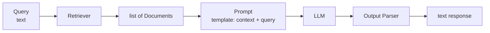
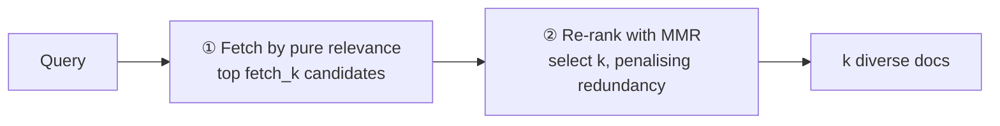
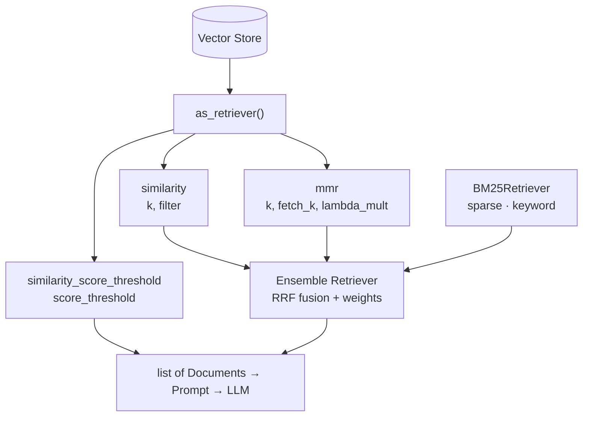

# Retrievers — Revision Notes

Step 5 of the RAG pipeline: the **tunable search layer** on top of the vector store, and the piece that actually plugs into a chain.

**Contents**

- [TL;DR](#tldr)
- [1. Why not just similarity_search?](#1-why-not-just-similarity_search)
- [2. The as_retriever API](#2-the-as_retriever-api)
- [3. Similarity + score threshold](#3-similarity--score-threshold)
- [4. MMR — relevance vs diversity](#4-mmr--relevance-vs-diversity)
- [5. BM25 — keyword search](#5-bm25--keyword-search)
- [6. Hybrid search + RRF](#6-hybrid-search--rrf)
- [7. Code](#7-code)
- [8. Interview one-liners](#8-interview-one-liners)
- [Quick recap](#quick-recap)

---

## TL;DR

| What | Input | Output | Why not the store directly |
| :--- | :--- | :--- | :--- |
| A **retriever** is a tunable, chainable search interface | a query `str` | `list[Document]` | `vectorstore.similarity_search()` has no tuning and **isn't a Runnable** |

| Dense (semantic) | Sparse (keyword) | Combine them | Tuning knobs |
| :--- | :--- | :--- | :--- |
| `similarity` · `similarity_score_threshold` · `mmr` | **BM25** — TF-IDF descendant, no embeddings | **Hybrid search** via `EnsembleRetriever` + **RRF** | `k` · `filter` · `lambda_mult` |

---

## 1. Why not just `similarity_search`?

A vector store does three things: **storage, indexing, searching**. `vectorstore.similarity_search(query)` is *basic retrieval* — it works, but there's no tuning and no customisation.

A **retriever** built with `as_retriever()` is a **sub-component of the vector store**, made for *advanced retrieval*: search parameters you can tune, and — critically — it's a **Runnable**, so it composes into chains.

But *retriever* is the broader interface — **BM25** (§5) is one with no vector store and no embeddings at all.



> [!NOTE]
> `similarity_search()` is fine for poking around in a notebook. Inside a chain you want `as_retriever()` — it's the piece that pipes into a prompt.

---

## 2. The `as_retriever` API

```python
vectorstore.as_retriever(search_type=..., search_kwargs={...})
```

| `search_type` | What it does | Its `search_kwargs` |
| :--- | :--- | :--- |
| **`"similarity"`** *(default)* | Top-k most similar | `k` (default 4) · `filter` (metadata dict) · `where_document` (doc content) |
| **`"mmr"`** | Relevance **+ diversity** | `k` (default 4) · `fetch_k` (candidates, default 20) · `lambda_mult` (default 0.5) |
| **`"similarity_score_threshold"`** | Only results above a cutoff | `score_threshold` (float 0.0–1.0) |

The retriever object then behaves like any Runnable:

```python
retriever.invoke(query)   # -> list[Document]
```

---

## 3. Similarity + score threshold

**`"similarity"`** — score → sort → take top `k`. The plain workhorse.

**`"similarity_score_threshold"`** — same, but drops anything below `score_threshold`, so the result count **varies**: a good query returns several docs, an off-topic query can return **zero**. That's the point — it refuses to hand the LLM junk context.

> [!WARNING]
> **Threshold is a *similarity*, but `similarity_search_with_score` returns a *distance*.** They run in opposite directions. With cosine, convert:
>
> ```python
> for _, score in vectorstore.similarity_search_with_score(query, k=3):
>     print(f"Similarity: {1 - score:.4f}")     # distance -> similarity
> ```
>
> Also note Chroma defaults to **L2**, so set cosine explicitly if you want thresholds in a predictable 0–1 range:
>
> ```python
> Chroma(..., collection_configuration={"hnsw": {"space": "cosine"}})   # cosine, L2, ip
> ```

---

## 4. MMR — relevance vs diversity

**Maximal Marginal Relevance.** Plain similarity search has a failure mode: the top-k are all highly similar **to each other** — near-duplicates. You asked for `k=5` and got C1, C2, C3 saying the same thing, wasting context on **redundant info**.

MMR wants results that are both **relevant to the query** and **dissimilar from each other**.

### The formula

```
MMR(dᵢ) = λ · Sim(dᵢ, Q)  −  (1 − λ) · max Sim(dᵢ, dⱼ)
                                        dⱼ ∈ S
```

| Term | Meaning |
| :--- | :--- |
| `Sim(dᵢ, Q)` | Similarity between the doc and the **query** → relevance |
| `max Sim(dᵢ, dⱼ)` | Highest similarity to an **already-selected** doc → redundancy penalty |
| `λ` = `lambda_mult` | The dial: **1.0 = relevance only** (identical to similarity search), **0.0 = diversity only** |

### The two stages



> [!IMPORTANT]
> `fetch_k` must exceed `k` or there's nothing to diversify over — MMR can only re-rank the candidate pool it was given.

---

## 5. BM25 — keyword search

**BM25 = "Best Match 25"** (the 25th iteration of the algorithm). Pure **keyword matching** — an improved **TF-IDF**, with *no embeddings and no vector store*.

```
score(D,Q) = Σ  IDF(q) · [ f(q,D) · (k₁+1) ] / [ f(q,D) + k₁ · (1 − b + b · |D|/avgdl) ]
            q∈Q
```

| Concept | Meaning |
| :--- | :--- |
| **TF** — term frequency | How often the term appears in this document |
| **IDF** — inverse document frequency | Rare terms across the corpus count for more |
| `\|D\|/avgdl` | Length normalisation — long docs don't win just by being long |

**Variants:** `BM25Retriever.from_documents(docs, bm25_variant="plus")` — `okapi` is the default; **BM25Plus** guarantees every matched term contributes a *positive* score, which improves recall on short documents (exactly the case in these notebooks). `BM25L` is the third option.

| BM25 wins | BM25 fails |
| :--- | :--- |
| Exact keyword overlap — *"antibiotic bacterial infection"* hits the antibiotics doc | No shared words — *"a structure that feels light and with windows"* misses the Gothic cathedral doc entirely |
| Names, IDs, codes, jargon | Synonyms and paraphrase |
| No embedding cost, no API | Anything requiring meaning |

---

## 6. Hybrid search + RRF

Two complementary families:

| Aspect | **Dense / semantic** | **Sparse / keyword** |
| :--- | :--- | :--- |
| Retrievers | `similarity`, `similarity_score_threshold`, `mmr` | `BM25Retriever` |
| Matches on | Meaning | Exact tokens |
| Blind spot | Exact rare terms | Synonyms, paraphrase |

**Hybrid search** = run both and **fuse** the result lists, via the **Ensemble Retriever**. You give it a **list of retrievers** and a **weight** each — their say in the final result (e.g. `0.8` dense / `0.2` sparse).

### RRF — Reciprocal Rank Fusion

Merging lists by raw score is impossible — BM25 scores and cosine distances aren't on the same scale. RRF ignores scores and uses **rank position** only:

```
score(d) = Σ  weightᵢ × 1 / (rankᵢ(d) + rrf_k)
           i
```

- `rrf_k` (default **60**) is a smoothing constant — it dampens the outsized advantage of the rank-1 doc so lower-ranked results still contribute
- A document not returned by a retriever simply contributes **0** for that retriever
- Being ranked well by **both** retrievers beats being rank-1 in only one

The canonical demo: docs 1–2 contain the word *"vaccine"* (BM25 finds them), docs 3–5 discuss *immune system / antibodies / herd immunity* without ever saying "vaccine" (only dense search finds them). The ensemble returns both groups.

---

## 7. Code

<details open>
<summary><b>Basic retriever</b> — <code>as_retriever</code> and why it beats <code>similarity_search</code></summary>

```python
from langchain_chroma import Chroma
from langchain_openai import OpenAIEmbeddings

vectorstore = Chroma.from_documents(
    documents=docs,
    embedding=OpenAIEmbeddings(model="text-embedding-3-small"),
    collection_name="similarity_search_demo",     # no persist_directory = in-memory
)

retriever = vectorstore.as_retriever(
    search_type="similarity",        # similarity | similarity_score_threshold | mmr
    search_kwargs={"k": 2},
)

results = retriever.invoke("How do rockets work?")   # Runnable -> chainable
```

</details>

<details>
<summary><b>Score threshold</b> — variable result count, and the distance→similarity conversion</summary>

```python
vectorstore = Chroma(
    embedding_function=embeddings,
    collection_name="demo",
    collection_configuration={"hnsw": {"space": "cosine"}},   # cosine, L2, ip
)

# raw scores are DISTANCES
for doc, score in vectorstore.similarity_search_with_score(query, k=3):
    print(f"Distance: {score:.4f} | Similarity: {1 - score:.4f}")

retriever = vectorstore.as_retriever(
    search_type="similarity_score_threshold",
    search_kwargs={"score_threshold": 0.43},
)
results = retriever.invoke(query)      # may return fewer than k — or nothing at all
```

</details>

<details>
<summary><b>MMR</b> — sweeping <code>lambda_mult</code> to see redundancy disappear</summary>

```python
for lm in [1.0, 0.7, 0.5, 0.0]:
    retriever = vectorstore.as_retriever(
        search_type="mmr",
        search_kwargs={"k": 3, "fetch_k": 10, "lambda_mult": lm},
    )
    results = retriever.invoke("deep learning model training and its optimization techniques")
```

`lambda_mult=1.0` returns three near-identical *gradient descent* docs.
Lower it and MMR swaps two of them for *Dropout*, *Batch Norm*, *LR Scheduler*.

</details>

<details>
<summary><b>BM25</b> — no embeddings, no vector store</summary>

```python
from langchain_community.retrievers import BM25Retriever

retriever = BM25Retriever.from_documents(docs, k=2)   # builds an inverted index
# default variant is "okapi"; the hybrid notebooks switch to "plus" (see below)
results = retriever.invoke("antibiotic bacterial infection treatment")
```

</details>

<details>
<summary><b>Hybrid search</b> — <code>EnsembleRetriever</code> with weights</summary>

```python
from langchain_community.retrievers import BM25Retriever
from langchain_classic.retrievers import EnsembleRetriever

chroma_retriever = vectorstore.as_retriever(search_type="similarity", search_kwargs={"k": 4})

# k=2 matters: BM25Retriever defaults to k=4, which would out-vote the dense
# retriever in the fusion. bm25_variant="plus" improves recall on short docs.
bm25_retriever = BM25Retriever.from_documents(docs, k=2, bm25_variant="plus")

ensemble_retriever = EnsembleRetriever(
    retrievers=[chroma_retriever, bm25_retriever],
    weights=[0.8, 0.2],        # dense gets 80% of the say
)

results = ensemble_retriever.invoke("How do vaccines work to protect against diseases?")
```

</details>

<details>
<summary><b>Custom ensemble</b> — implementing RRF on <code>BaseRetriever</code></summary>

```python
from langchain_core.retrievers import BaseRetriever
from langchain_core.callbacks.manager import CallbackManagerForRetrieverRun

class MyEnsembleRetriever(BaseRetriever):
    """RRF:  score(d) = Σ weightᵢ × 1 / (rankᵢ(d) + rrf_k)

    rrf_k (default 60) dampens the rank-1 advantage so lower-ranked
    results still contribute. Docs a retriever didn't return score 0 for it.
    """
    retrievers: List[BaseRetriever]
    weights: List[float]
    rrf_k: int = 60

my_ensemble = MyEnsembleRetriever(
    retrievers=[chroma_retriever, bm25_retriever],
    weights=[0.8, 0.2],
    rrf_k=60,
)
```

Worth writing once — `EnsembleRetriever` now lives in `langchain_classic`, and subclassing `BaseRetriever` is the durable way to control fusion.

</details>

---

## 8. Interview one-liners

**Retriever vs `similarity_search()`?**
Same underlying search, but a retriever is tunable *and* a Runnable — so it composes into chains.

**What problem does MMR solve?**
Top-k results that are near-duplicates of each other — redundant context wasting the window.

**Why does MMR need `fetch_k`?**
It re-ranks a candidate pool: fetch `fetch_k` by relevance, then select `k` diverse ones from those. `fetch_k` must be > `k`.

**When does BM25 beat dense retrieval?**
Exact terms — names, IDs, codes, jargon. It fails on paraphrase with no shared words.

**What is hybrid search?**
Dense + sparse run together and their result lists fused, covering both meaning and exact terms.

**Why RRF instead of merging scores?**
BM25 scores and cosine distances aren't comparable scales. RRF uses **rank position** only.

**Is a higher `score_threshold` result score better?**
Careful — the threshold is a *similarity*, but `similarity_search_with_score` returns a *distance*. Opposite directions.

---

## Quick recap



- **Components of RAG:** ① Loaders → ② Splitters → ③ Embeddings → ④ Vector Stores → ⑤ **Retrievers**
- **Retriever** = tunable + chainable search over the store; always returns `list[Document]`
- **`as_retriever(search_type, search_kwargs)`** — `similarity` · `similarity_score_threshold` · `mmr`
- **MMR** = `λ·Sim(d,Q) − (1−λ)·max Sim(d,dⱼ)` — fixes redundant top-k; two stages via `fetch_k`
- **BM25** = sparse keyword scoring (TF-IDF descendant); great on exact terms, blind to meaning
- **Hybrid** = dense + sparse fused by **RRF** (`1/(rank + 60)`), weighted per retriever
- **Next up:** Advanced Retrievers → contextual compression, parent document, self-query
