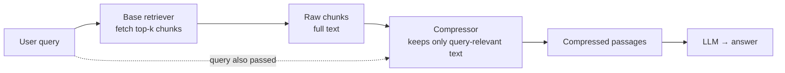
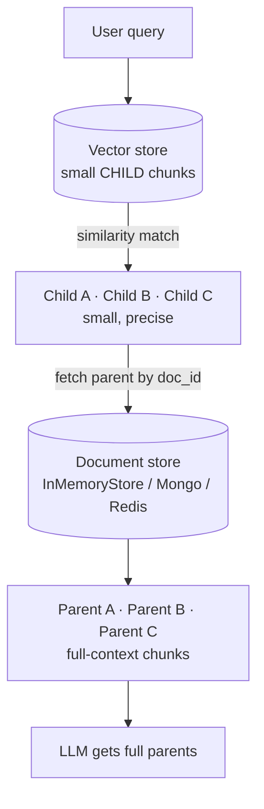
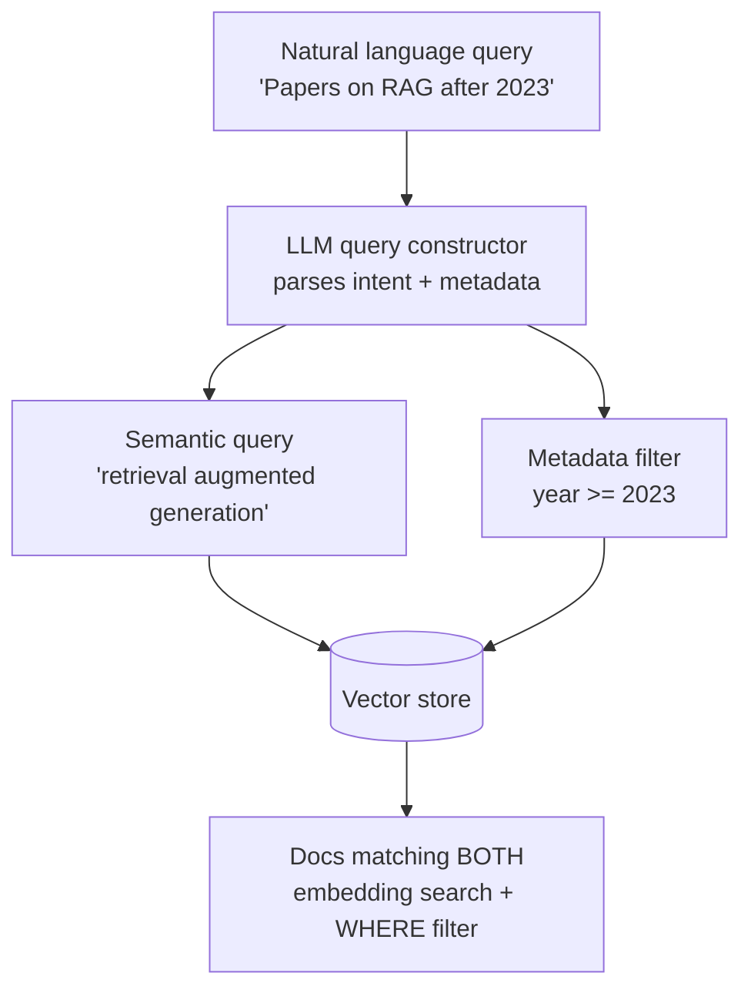
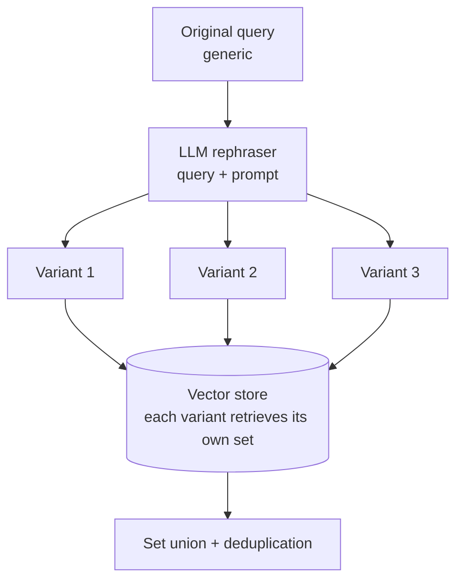
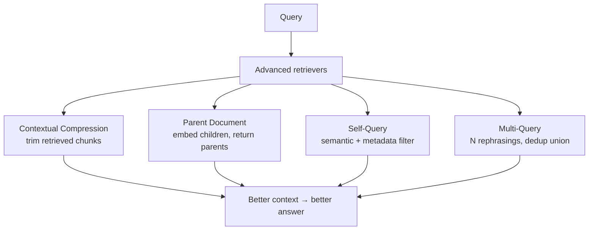

# Advanced Retrievers — Revision Notes

Four techniques that fix a specific failure of plain top-k retrieval — by trimming context, restoring context, filtering on metadata, or rewriting the query.

**Contents**

- [TL;DR](#tldr)
- [1. Contextual Compression](#1-contextual-compression)
- [2. Parent Document](#2-parent-document)
- [3. Self-Query](#3-self-query)
- [4. Multi-Query](#4-multi-query)
- [5. Which one when](#5-which-one-when)
- [6. Code](#6-code)
- [7. Interview one-liners](#7-interview-one-liners)
- [Quick recap](#quick-recap)

---

## TL;DR

| Retriever | Fixes | How | LLM needed? |
| :--- | :--- | :--- | :--- |
| **Contextual Compression** | Retrieved chunks contain irrelevant filler | Trim each chunk down to the sentences that answer the query | Yes (or an embeddings filter) |
| **Parent Document** | Small chunks retrieve well but lack context | Embed **small children**, return their **large parents** | No |
| **Self-Query** | Query mixes meaning *and* metadata constraints | LLM splits it into semantic query + metadata filter | Yes |
| **Multi-Query** | One phrasing misses relevant docs | LLM writes N rephrasings, union the results | Yes |

---

## 1. Contextual Compression

**Problem:** the base retriever hands back whole chunks. A chunk may be 90% irrelevant to *this* query — wasted tokens, diluted answer.



The compressor receives **two things**: the **query** and the **retrieved chunks** — that's what makes the compression *contextual*. Result: **fewer tokens, better answer.**

### Three compressor types

| Compressor | What it does | Cost |
| :--- | :--- | :--- |
| **`LLMChainExtractor`** | LLM extracts the relevant sentences from each doc | one LLM call **per document** |
| **`EmbeddingsFilter`** | Drops whole docs below a `similarity_threshold` | embeddings only — cheap |
| **`DocumentCompressorPipeline`** | Chains them | — |

> [!TIP]
> Order the pipeline **cheap first**: `EmbeddingsFilter` → `LLMChainExtractor`. Filtering the obviously irrelevant docs out first means fewer expensive LLM calls.

---

## 2. Parent Document

**Problem:** a size conflict. **Small chunks** embed precisely and retrieve accurately, but hand the LLM too little context. **Large chunks** give good context but embed poorly — meaning gets diluted across 1000 words compressed into one vector.

**The fix: do both.** Embed the small ones, return the big ones.



| Piece | Holds | Why |
| :--- | :--- | :--- |
| **Vector store** | child chunks (e.g. 400 chars) | precise **search** |
| **Document store** | parent chunks (e.g. 1500 chars), keyed by id | full **context** |
| **Child metadata** | the `parent_doc_id` | the link between the two |

Only the **children are embedded** — parents are never vectorised, just looked up by key.

> [!WARNING]
> **`k` counts children, not parents — so you usually get back fewer documents than `k`.** Several matching children often share one parent, and the parents are deduplicated. In `parent_document_retriever.ipynb` (11 parents / 102 children), `search_kwargs={'k': 3}` returns **1 parent chunk** — all three child hits came from the same parent.

> [!NOTE]
> `InMemoryStore` holds `Document` objects directly. `LocalFileStore` is a **ByteStore** — it only persists raw bytes, so wrap it in `create_kv_docstore()` to store `Document`s on disk.

---

## 3. Self-Query

**Problem:** *"sci-fi movies released after 2005"* is two questions in one — a **semantic** part ("sci-fi") and a **metadata constraint** ("year > 2005"). Similarity search treats the whole string as meaning and cannot enforce the constraint.



This is **query decomposition**: the LLM outputs a structured object, and a **translator** (`ChromaTranslator`) converts the filter into the store's native query language.

You must declare the schema up front so the LLM knows what it can filter on:

```python
metadata_field_info = [
    AttributeInfo(name="year", description="The year the movie was released", type="integer"),
    ...
]
```

With `enable_limit=True`, the LLM can also set `k` from the query itself (*"Recommend me **2** sci-fi movies"*).

> [!NOTE]
> The built-in retriever supports LangChain's full comparator set — `eq` `ne` `gt` `gte` `lt` `lte` `contain` `like` `in` `nin` — and boolean operators (`and` / `or` / `not`). The `custom_self_query.ipynb` schema deliberately implements only the six numeric/equality ones, which is why its Pydantic model lists just those.

---

## 4. Multi-Query

**Problem:** users write **generic** queries. One phrasing produces one embedding, which reaches one neighbourhood of the vector space — relevant docs phrased differently get missed.



3 variants × `k=3` → up to 9 docs → deduplicated union. Trades **more LLM + retrieval calls** for **higher recall**.

> [!NOTE]
> `include_original=True` adds the user's own phrasing to the variant set — otherwise a doc matching the original wording exactly could be missed.

---

## 5. Which one when

| Symptom | Reach for |
| :--- | :--- |
| Context window full of filler; answers vague | **Contextual Compression** |
| Retrieval is accurate but answers lack background | **Parent Document** |
| Queries carry filters — dates, authors, categories | **Self-Query** |
| Relevant docs exist but aren't being found | **Multi-Query** |

| Retriever | Extra LLM calls | Extra storage | Changes what's *retrieved* | Changes what's *returned* |
| :--- | :--- | :--- | :--- | :--- |
| Compression | per doc | — | no | trimmed |
| Parent Document | none | docstore | no | parents |
| Self-Query | 1 per query | — | filtered | no |
| Multi-Query | 1 per query | — | widened | no |

They compose — a self-query retriever can be the `base_retriever` of a compression retriever.

---

## 6. Code

<details open>
<summary><b>Contextual Compression</b> — extractor, filter, and a cheap-first pipeline</summary>

```python
from langchain_classic.retrievers import ContextualCompressionRetriever
from langchain_classic.retrievers.document_compressors import (
    LLMChainExtractor, EmbeddingsFilter, DocumentCompressorPipeline,
)

base_retriever = vectorstore.as_retriever(search_kwargs={"k": 3})

# 1. LLM extracts relevant sentences — one call per document
compressor = LLMChainExtractor.from_llm(llm)

# 2. embeddings-only filter — drops whole docs below the threshold
embeddings_filter = EmbeddingsFilter(embeddings=embeddings, similarity_threshold=0.732)

# 3. chain them: cheap filter first, expensive LLM second
pipeline = DocumentCompressorPipeline(transformers=[embeddings_filter, compressor])

retriever = ContextualCompressionRetriever(
    base_compressor=pipeline,
    base_retriever=base_retriever,
)
```

</details>

<details>
<summary><b>Parent Document</b> — two splitters, two stores</summary>

```python
from langchain_classic.retrievers import ParentDocumentRetriever
from langchain_classic.storage import InMemoryStore, LocalFileStore, create_kv_docstore

parent_splitter = RecursiveCharacterTextSplitter(chunk_size=1500, chunk_overlap=200)
child_splitter  = RecursiveCharacterTextSplitter(chunk_size=400,  chunk_overlap=50)

retriever = ParentDocumentRetriever(
    vectorstore=Chroma(collection_name="children", embedding_function=embeddings),
    docstore=InMemoryStore(),          # parents live here, not in the vector store
    child_splitter=child_splitter,
    parent_splitter=parent_splitter,
    search_kwargs={"k": 3},            # k applies to CHILD matches
)
retriever.add_documents(docs)          # splits, embeds children, stores parents

# to persist parents on disk, wrap the ByteStore so it can hold Documents
docstore = create_kv_docstore(LocalFileStore("./local_parent_store"))
```

</details>

<details>
<summary><b>Self-Query</b> — declare the metadata schema</summary>

```python
from langchain_classic.retrievers import SelfQueryRetriever
from langchain_classic.chains.query_constructor.schema import AttributeInfo
from langchain_community.query_constructors.chroma import ChromaTranslator

metadata_field_info = [
    AttributeInfo(name="genre",    description="action, sci-fi, drama, comedy", type="string"),
    AttributeInfo(name="year",     description="The year the movie was released", type="integer"),
    AttributeInfo(name="rating",   description="IMDb rating (0-10)", type="float"),
    AttributeInfo(name="director", description="The director", type="string"),
]

retriever = SelfQueryRetriever.from_llm(
    llm=llm,
    vectorstore=vectorstore,
    document_contents="Brief plot descriptions of movies",
    metadata_field_info=metadata_field_info,
    structured_query_translator=ChromaTranslator(),
    enable_limit=True,      # lets the LLM set k from the query
)

retriever.invoke("Recommend me 2 sci-fi movies released after 2000")
```

</details>

<details>
<summary><b>Multi-Query</b> — one line, plus the flag worth knowing</summary>

```python
from langchain_classic.retrievers import MultiQueryRetriever

retriever = MultiQueryRetriever.from_llm(
    retriever=base_retriever,
    llm=llm,
    include_original=True,     # keep the user's own phrasing in the variant set
)
```

</details>

<details>
<summary><b>Custom versions</b> — the pattern behind all four</summary>

```python
class MyRetriever(BaseRetriever):
    base_retriever: BaseRetriever
    # ...whatever extra pieces the technique needs

    def _get_relevant_documents(self, query: str) -> list[Document]:
        docs = self.base_retriever.invoke(query)   # 1. retrieve
        return transform(query, docs)              # 2. compress / expand / filter
```

Every `custom_*.ipynb` is this shape — subclass `BaseRetriever`, implement `_get_relevant_documents`, do the technique's work inside it. Structured output (a Pydantic schema) is how the LLM-driven ones get machine-readable queries or filters back.

</details>

---

## 7. Interview one-liners

**What does contextual compression compress?**
The retrieved chunks — not the query, not the index. It trims each chunk to the parts that answer *this* query.

**Why is it "contextual"?**
The compressor sees the query as well as the documents, so relevance is judged against the actual question.

**Why does Parent Document exist?**
Small chunks retrieve precisely but lack context; large chunks give context but embed poorly. It embeds children and returns parents, getting both.

**What's in the vector store vs the docstore?**
Children (embedded, searched) vs parents (looked up by `parent_doc_id`, never embedded).

**What does Self-Query actually do?**
Uses an LLM to split a natural-language query into a semantic part and a structured metadata filter, then applies both.

**Why does Self-Query need `AttributeInfo`?**
The LLM can only build filters over fields it knows exist, with their types.

**What does Multi-Query trade?**
Extra LLM and retrieval calls for higher recall — several phrasings reach parts of the vector space one phrasing misses.

**Which of these need an LLM at query time?**
All but Parent Document — it's pure embedding lookup plus a key fetch.

---

## Quick recap



- **Components of RAG:** ① Loaders → ② Splitters → ③ Embeddings → ④ Vector Stores → ⑤ Retrievers → ⑥ **Advanced Retrievers**
- **Compression** — fewer tokens: `LLMChainExtractor` (per-doc LLM) · `EmbeddingsFilter` (cheap) · pipeline them cheap-first
- **Parent Document** — children embedded for precision, parents returned for context; two stores, linked by `parent_doc_id`
- **Self-Query** — query decomposition into semantic query + WHERE filter, via `AttributeInfo` + a translator
- **Multi-Query** — LLM rephrases, each variant retrieves, results deduplicated; `include_original=True`
- **All four** are just `BaseRetriever` + `_get_relevant_documents` — retrieve, then transform
- **Next up:** Rerankers → cross-encoder re-scoring of retrieved candidates
