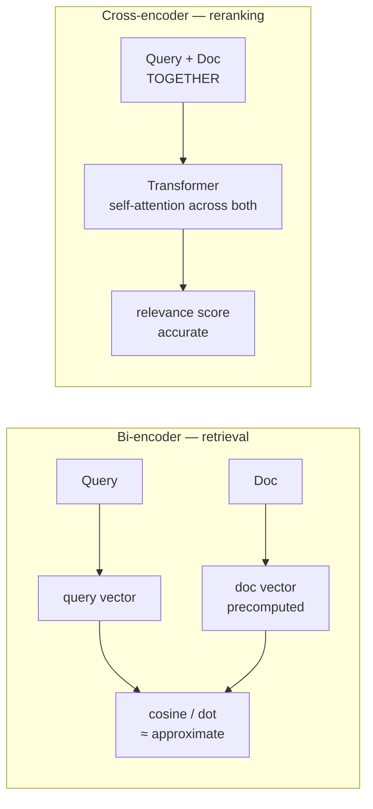
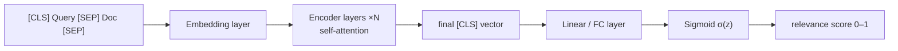
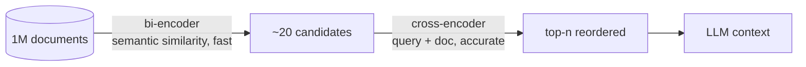
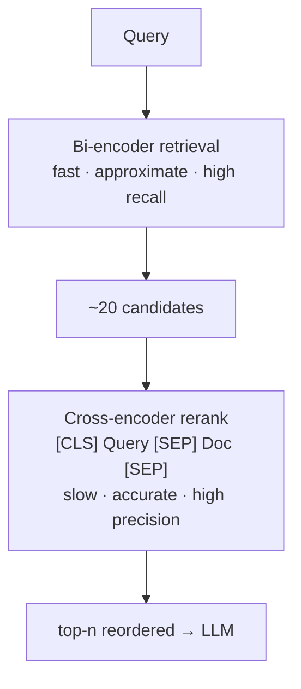

# Rerankers — Revision Notes

A second, slower, far more accurate scoring pass over the documents retrieval already found.

**Contents**

- [TL;DR](#tldr)
- [1. Why reranking is required](#1-why-reranking-is-required)
- [2. Bi-encoder vs cross-encoder](#2-bi-encoder-vs-cross-encoder)
- [3. How the cross-encoder scores](#3-how-the-cross-encoder-scores)
- [4. Where it sits — the two-stage funnel](#4-where-it-sits--the-two-stage-funnel)
- [5. Code](#5-code)
- [6. Interview one-liners](#6-interview-one-liners)
- [Quick recap](#quick-recap)

---

## TL;DR

| What | Input | Output | Why |
| :--- | :--- | :--- | :--- |
| A **reranker** re-scores already-retrieved docs | the **query + each doc together** | a fresh relevance score per doc → reorder | Vector search ranks by *approximate* similarity between two vectors compressed separately |

| Retrieval uses | Reranking uses | Cost | So you |
| :--- | :--- | :--- | :--- |
| **Bi-encoder** — query and doc encoded *separately*, compared as vectors | **Cross-encoder** — query and doc encoded *together*, one model pass | Bi-encoder: fast, scales. Cross-encoder: slow, no precomputation possible | Retrieve wide with the bi-encoder, rerank narrow with the cross-encoder |

---

## 1. Why reranking is required

The ranking that comes out of a vector store is **approximate**, and it's worth being precise about why:

```
Text chunk (1000 chars)  →  embedding model  →  256 dims
```

That's **lossy compression**. Fine-grained information — the detail that decides whether *this* chunk actually answers *this* query — is exactly what gets squeezed out. The retrieved order is therefore *"vague in nature"*: good enough to find candidates, not good enough to trust as a final ranking.

Two more structural reasons the initial ranking is weak:

| Reason | What it means |
| :--- | :--- |
| **Doc embeddings are static** | Computed once at ingestion, with **no knowledge of the query** that will arrive later |
| **No query–doc interaction** | The two vectors never "see" each other — similarity is measured *after* both have been independently compressed |

> [!NOTE]
> Reranking happens **after retrieval**. It doesn't search — it takes the initial ranks and reorders them.

---

## 2. Bi-encoder vs cross-encoder



| Aspect | **Bi-encoder** | **Cross-encoder** |
| :--- | :--- | :--- |
| Encodes | Query and doc **separately** | Query and doc **as one input** |
| Doc vectors | **Precomputed once**, stored | **Nothing can be precomputed** |
| Per new query | One query embedding, then vector math | **Re-run the model for every (query, doc) pair** |
| Speed | Fast, scales to millions | Slow |
| Accuracy | Approximate | Accurate |
| Used for | **Retrieval** | **Reranking** |

That last row is the whole point: the cross-encoder's accuracy comes from letting **self-attention run across the query and the document at once**, so it models the actual *relationship* between them instead of comparing two independently-lossy summaries.

---

## 3. How the cross-encoder scores

A cross-encoder is a transformer (typically BERT-based) fed **one concatenated sequence**:

```
[CLS] Query [SEP] Doc Chunk [SEP]
```

For a 10-token query and a 300-token chunk: `1 [CLS] + 10 + 300 + 2 [SEP]` = **313 vectors** in.



**The `[CLS]` token is what carries the answer.** Through each layer it accumulates context from every other token:

```
Layer 1:   [CLS] attends to raw token embeddings
Layer 2:   [CLS] attends to layer-1-enriched vectors
Layer 3:   [CLS] attends to layer-2-enriched vectors
...        (12 layers in BERT-base)
Layer 12:  [CLS] has accumulated context from ALL tokens
```

By the final layer, that single vector encodes the **query–document relationship**. A linear layer plus a **sigmoid** turns it into a probability between **0 and 1** — the relevance score used to reorder.

---

## 4. Where it sits — the two-stage funnel

You cannot run a cross-encoder over a million documents — it would mean a million model passes per query. So the two encoders split the work:



| Stage | Model | Job | Optimised for |
| :--- | :--- | :--- | :--- |
| **1. Retrieve** | Bi-encoder | Millions → tens | **Recall** — don't miss anything |
| **2. Rerank** | Cross-encoder | Tens → top n | **Precision** — get the order right |

Two knobs, and they're easy to confuse:

| Knob | Set on | Meaning | Default |
| :--- | :--- | :--- | :--- |
| **`k`** | the base retriever | how many candidates go **into** the reranker | 4 |
| **`top_n`** | the reranker | how many survive and come **out** | **3** |

Both notebooks retrieve `k=5` and get back **3 documents** — that's `top_n=3`, not a filter or a threshold.

> [!IMPORTANT]
> Retrieve **wider than you need** (`k=5`, `k=10`, `k=20`) so the reranker has real candidates to promote. Reranking a top-3 that already missed the answer cannot help — a reranker only reorders, it never retrieves anything new.

---

## 5. Code

In LangChain a reranker is a **document compressor**, so it plugs into `ContextualCompressionRetriever` exactly like the compressors in the previous section.

<details open>
<summary><b>Cohere</b> — hosted reranking API</summary>

```python
from langchain_cohere import CohereRerank
from langchain_classic.retrievers.contextual_compression import ContextualCompressionRetriever

retriever = vectorstore.as_retriever(search_kwargs={"k": 5})   # retrieve wide

compressor = CohereRerank(model="rerank-english-v3.0")   # top_n defaults to 3

compression_retriever = ContextualCompressionRetriever(
    base_compressor=compressor,
    base_retriever=retriever,
)

reranked = compression_retriever.invoke(query)     # 5 in -> top_n=3 out
```

</details>

<details>
<summary><b>FlashRank</b> — local, no API key</summary>

```python
from langchain_community.document_compressors import FlashrankRerank

compressor = FlashrankRerank(model="ms-marco-MiniLM-L-12-v2")

compression_retriever = ContextualCompressionRetriever(
    base_compressor=compressor,
    base_retriever=retriever,
)
```

Same wiring, different compressor — swapping rerankers is a one-line change.

</details>

| Aspect | `CohereRerank` | `FlashrankRerank` |
| :--- | :--- | :--- |
| Runs | Hosted API | **Locally** |
| Needs | `COHERE_API_KEY` | nothing |
| Model used | `rerank-english-v3.0` | `ms-marco-MiniLM-L-12-v2` |
| Cost | Per call | Free (CPU) |

---

## 6. Interview one-liners

**What does a reranker do?**
Re-scores documents that retrieval already returned, using a model that reads the query and the document together, then reorders them.

**Why isn't vector similarity good enough?**
It compares two vectors that were compressed independently and lossily — a 1000-char chunk squeezed into 256 dims. The order is approximate.

**Bi-encoder vs cross-encoder?**
Bi-encoder encodes query and doc separately so doc vectors can be precomputed — fast, approximate. Cross-encoder encodes them together in one pass — accurate, but nothing can be cached.

**Why can't we just use a cross-encoder for retrieval?**
It needs one model pass per (query, doc) pair. Over a million docs that's a million passes per query.

**What produces the score?**
The final `[CLS]` vector, which has accumulated context from every token through self-attention, passed through a linear layer and a sigmoid → 0–1.

**Where does reranking sit?**
After retrieval, before the prompt. Retrieve wide for recall, rerank narrow for precision.

**Why did I retrieve 5 documents but get 3 back?**
`top_n` on the reranker defaults to 3. `k` controls what goes in, `top_n` controls what comes out.

**Can a reranker fix bad retrieval?**
No. It only reorders what it's given — if the right document was never retrieved, reranking cannot bring it back.

---

## Quick recap



- **Components of RAG:** … ⑤ Retrievers → ⑥ Advanced Retrievers → ⑦ **Rerankers**
- **Why:** embeddings are **lossy** (1000 chars → 256 dims) and doc vectors are **static** — the initial ranking is approximate
- **Bi-encoder** = separate encoding, precomputable, fast → **retrieval**
- **Cross-encoder** = joint encoding, self-attention across query + doc → **reranking**
- **Score** = final `[CLS]` vector → linear → sigmoid → 0–1 relevance
- **Funnel:** 1M → bi-encoder → ~20 → cross-encoder → top-n
- **In LangChain:** a reranker is a compressor — wire it through `ContextualCompressionRetriever`
- **Next up:** RAG Fusion → multi-query + RRF over the fused result sets
