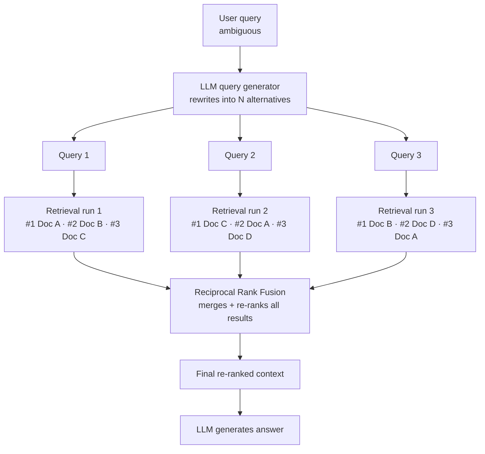
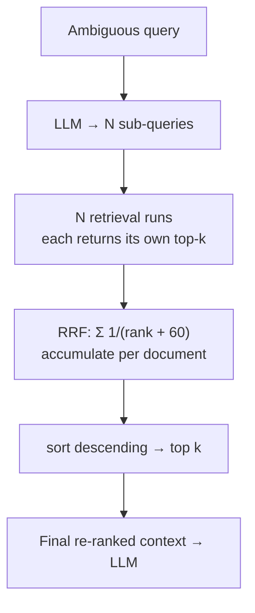

# RAG Fusion — Revision Notes

One query becomes many, each retrieves its own list, and **Reciprocal Rank Fusion** merges those lists into one ranking that rewards **consistency**.

**Contents**

- [TL;DR](#tldr)
- [1. What RAG Fusion is](#1-what-rag-fusion-is)
- [2. RRF — the formula](#2-rrf--the-formula)
- [3. Worked example](#3-worked-example)
- [4. What `k` actually controls](#4-what-k-actually-controls)
- [5. Advantages and disadvantages](#5-advantages-and-disadvantages)
- [6. Code](#6-code)
- [7. Interview one-liners](#7-interview-one-liners)
- [Quick recap](#quick-recap)

---

## TL;DR

| What | Input | Output | The mechanism |
| :--- | :--- | :--- | :--- |
| **RAG Fusion** = multi-query retrieval + **rank-based** merging | one (often ambiguous) user query | one fused, re-ranked `list[Document]` | **RRF** — score by **rank position**, not by similarity score |

| Why fuse on rank | The formula | Default `k` | What wins |
| :--- | :--- | :--- | :--- |
| Different runs produce scores on incomparable scales | `Σ 1 / (rank + k)` | **60** | A doc ranked *decently in many lists* beats a doc ranked *first in one* |

---

## 1. What RAG Fusion is

The bottleneck is the **single query**: one phrasing → one vector → one neighbourhood of the store. An ambiguous question retrieves an ambiguous slice.



Each run returns its own **top-k** list. RRF merges them.

> [!NOTE]
> **RAG Fusion vs Multi-Query.** Multi-Query (in `06`) also generates variants, but merges by **set union + deduplication** — every doc is equal. RAG Fusion merges by **rank**, producing an actual ordering. The rewriting is the same; the fusion is the point.

---

## 2. RRF — the formula

```
RRF score(d)  =  Σ   1 / (rank + k)
                runs
```

| Piece | Meaning |
| :--- | :--- |
| `rank` | The document's **position** in that run's list (1-based) |
| `k` | Smoothing constant — **60** by convention |
| Missing from a run | Contributes **0** for that run |

**Why rank and not score?** Similarity scores from different retrieval runs aren't on a comparable scale, so they can't be added. Rank position always is.

**What RRF rewards:** *consistency*. A document that shows up **most of the time across the runs** accumulates contributions from each, and beats a document that ranked #1 in exactly one run.

---

## 3. Worked example

Three runs, each returning three documents:

```
Run 1:  [ Doc2 , Doc5 , Doc1 ]
Run 2:  [ Doc3 , Doc2 , Doc1 ]
Run 3:  [ Doc2 , Doc4 , Doc3 ]
```

Scoring with `1/(rank + 60)` — a document missing from a run contributes `0`:

| Doc | Run 1 | Run 2 | Run 3 | Sum | Score |
| :--- | :--- | :--- | :--- | :--- | :--- |
| **Doc 2** | rank 1 → `1/61` | rank 2 → `1/62` | rank 1 → `1/61` | `1/61 + 1/62 + 1/61` | **0.0489** |
| **Doc 3** | — → `0` | rank 1 → `1/61` | rank 3 → `1/63` | `1/61 + 1/63` | **0.0323** |
| **Doc 1** | rank 3 → `1/63` | rank 3 → `1/63` | — → `0` | `1/63 + 1/63` | **0.0317** |

**Re-ranked output: `[Doc2, Doc3, Doc1]`**

Read the result, not just the arithmetic:

- **Doc 2 wins** — the only document in **all three** runs, twice at rank 1. Consistency compounds.
- **Doc 3 beats Doc 1** even though both appear in exactly **two** runs. Doc 3 has a rank-1; Doc 1 has two rank-3s. Position still breaks ties between equally-consistent docs.
- But the margin is **0.0006** — with `k = 60` the gap between adjacent ranks is tiny, which is the whole point of the next section.

---

## 4. What `k` actually controls

`k` sets how steeply score falls off with rank:

| `k` | rank 1 | rank 2 | rank 3 | Effect |
| :--- | :--- | :--- | :--- | :--- |
| **1** | `1/2` = 0.5000 | `1/3` = 0.3333 | `1/4` = 0.2500 | **Steep** — rank 1 dominates |
| **60** | `1/61` = 0.0164 | `1/62` = 0.0161 | `1/63` = 0.0159 | **Flat** — position barely matters |
| **100** | `1/101` = 0.0099 | `1/102` = 0.0098 | `1/103` = 0.0097 | Flatter still |

```
larger k  →  bigger denominator  →  smaller values  →  flatter curve
          →  rank position matters LESS
          →  appearing in MANY lists matters MORE
```

That's the design intent of `k = 60`: deliberately flatten the per-rank advantage so that **agreement across runs** — not one run's confidence — decides the final order.

---

## 5. Advantages and disadvantages

| Yes | No |
| :--- | :--- |
| Better **accuracy + coverage** from one ambiguous query | **API calls** — one LLM call to generate the sub-queries |
| **Simple to apply** — RRF is a few lines | **Latency** — N retrieval runs instead of 1 |
| **Intuitive / easy to understand** — no tuning, no training | **Cost** — scales with the number of sub-queries |
| Scores need no normalisation across runs | Fusion quality depends on the rewrites being genuinely different |

---

## 6. Code

The whole technique lives in [`code/rag_fusion.py`](../code/rag_fusion.py) as a reusable `RAGFusion` class with two constructors.

<details open>
<summary><b>The RRF core</b> — the loop that does the work</summary>

```python
def _reciprocal_rank_fusion(self, retrieved_docs: list[list[Document]]) -> list[Document]:
    doc_scores: dict[str, tuple[float, Document]] = {}   # {"doc_text": (score, doc)}

    for retrieved_set in retrieved_docs:
        for rank, doc in enumerate(retrieved_set, start=1):    # rank is 1-based
            rrf_score = 1.0 / (rank + 60)
            key = doc.page_content                             # dedup key

            if key in doc_scores:
                prev_score, prev_doc = doc_scores[key]
                doc_scores[key] = (prev_score + rrf_score, prev_doc)   # accumulate
            else:
                doc_scores[key] = (rrf_score, doc)

    sorted_docs = sorted(doc_scores.values(), key=lambda x: x[0], reverse=True)
    return [doc for _, doc in sorted_docs]
```

Note the dedup key is **`page_content`** — the same text retrieved by two sub-queries is one document whose score accumulates.

</details>

<details>
<summary><b>Mode 1 — <code>from_llm</code></b>: sub-queries from one query</summary>

```python
class SubQuerySchema(BaseModel):
    sub_queries: list[str] = Field(..., description="List of sub-queries generated from the main query.")

rag_fusion = RAGFusion.from_llm(
    llm=llm,
    retriever=retriever,
    num_subqueries=3,
    k=5,                    # how many fused docs come back
)

fused_docs = rag_fusion.invoke(query)
```

Generates N sub-queries via **structured output**, retrieves for each, then RRF-fuses.

</details>

<details>
<summary><b>Mode 2 — <code>from_retrievers</code></b>: one query, several retrievers</summary>

```python
rag_fusion = RAGFusion.from_retrievers(
    base_retrievers=[chroma_retriever, bm25_retriever],
    weights=[0.5, 0.5],
    k=5,
)
```

</details>

> [!IMPORTANT]
> The two modes fuse in **different places**. `from_llm` runs the class's own `_reciprocal_rank_fusion`. `from_retrievers` wraps the retrievers in an `EnsembleRetriever` — so `invoke()` takes the `else` branch and returns `self.retriever.invoke(query)[:k]`, relying on **EnsembleRetriever's built-in RRF**. Same algorithm, different owner.

---

## 7. Interview one-liners

**What is RAG Fusion?**
Generate N rewrites of the query, retrieve for each, then merge the ranked lists with Reciprocal Rank Fusion into one ordering.

**RAG Fusion vs Multi-Query?**
Both rewrite the query. Multi-Query merges by set union — order is lost. RAG Fusion merges by rank, so the output is genuinely re-ranked.

**Why fuse on rank instead of score?**
Scores from different runs are on incomparable scales and can't be summed. Rank position always can.

**What's the formula?**
`Σ 1/(rank + k)` over the runs a document appears in, `k = 60` by convention. Missing from a run contributes 0.

**What does RRF reward?**
Consistency. A doc ranked decently across many runs beats one ranked #1 in a single run.

**What does `k` do?**
Controls the fall-off. Small `k` makes rank 1 dominate; large `k` flattens the curve so cross-run agreement matters more than exact position.

**What's the cost?**
One LLM call for the rewrites, plus N retrieval runs instead of one — API cost and latency both scale with N.

---

## Quick recap



- **Components of RAG:** … ⑥ Advanced Retrievers → ⑦ Rerankers → ⑧ **RAG Fusion**
- **Problem:** one query = one phrasing = one slice of the vector space
- **RRF:** `Σ 1/(rank + k)`, `k = 60`, absent from a run = 0
- **Worked result:** Doc2 `0.0489` > Doc3 `0.0323` > Doc1 `0.0317` — consistency beats one good rank
- **`k` is a flattening dial:** bigger `k` → rank matters less, agreement matters more
- **Trade:** accuracy + coverage, paid for in API calls, latency and cost
- **Next up:** HyDE → embed a *hypothetical answer* instead of the question
