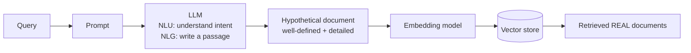
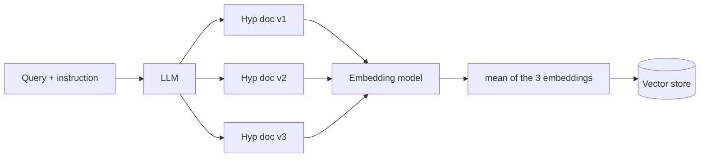
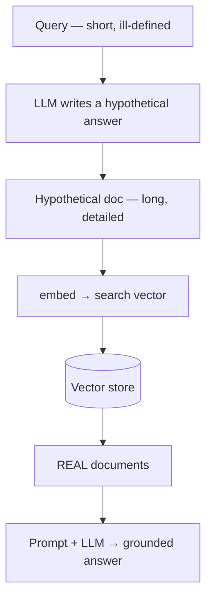

# HyDE — Revision Notes

**Hypothetical Document Embeddings.** Don't search with the question — search with a *made-up answer* to the question.

**Contents**

- [TL;DR](#tldr)
- [1. The problem — query/document asymmetry](#1-the-problem--querydocument-asymmetry)
- [2. How HyDE works](#2-how-hyde-works)
- [3. The multi-document variant](#3-the-multi-document-variant)
- [4. Limitations](#4-limitations)
- [5. Code](#5-code)
- [6. Interview one-liners](#6-interview-one-liners)
- [Quick recap](#quick-recap)

---

## TL;DR

| What | Replaces | With | Why it works |
| :--- | :--- | :--- | :--- |
| **HyDE** — embed a *hypothetical answer* instead of the question | the query vector | the **generated document's** vector | You end up comparing **doc ↔ doc** instead of **question ↔ doc** |

| The asymmetry | The fix | Cost | The catch |
| :--- | :--- | :--- | :--- |
| Queries are short and ill-defined; documents are long and detailed — they embed into different regions | LLM writes a passage that *looks like* an answer, then you embed **that** | One extra LLM call before every retrieval | The hypothetical document is **fake** — it can hallucinate |

---

## 1. The problem — query/document asymmetry

A vector store contains **documents**: well-defined, detailed, rich in semantic meaning. A query is the opposite — short, vague, often ill-defined. Embedding a weak query gives a **weak vector**, and the retrieval quality drops with it.

```
Well-defined text   →  strong semantic meaning  →  good vector
Ill-defined text    →  weak semantic meaning    →  poor vector   ← your query
```

Geometrically, the query vector often lands **between** clusters rather than inside the right one:

| Approach | Query vector lands | Result |
| :--- | :--- | :--- |
| **Similarity search** | outside the clusters, straddling two of them | ambiguous — pulls documents from the wrong cluster |
| **HyDE** | **inside** the relevant cluster, among the document embeddings | the neighbours it finds are the right ones |

The root cause: you're comparing **a question against answers**. Those are different kinds of text.

---

## 2. How HyDE works

Turn the question into something answer-shaped *first*, then search with that.



Compare the two paths:

```
Normal:   Query  →  vector             →  vector store  →  retrieval
HyDE:     Query  →  prompt  →  LLM  →  hypothetical doc  →  vector  →  vector store  →  retrieval
```

The hypothetical document **replaces the query vector entirely** — it is a *search probe*, never shown to the user.

| Comparison | Match quality |
| :--- | :--- |
| Query ↔ Docs | **weak** — asymmetric |
| **HypDoc ↔ Docs** | **better** — both are documents |

> [!IMPORTANT]
> The generated document is **not** the answer and never reaches the final prompt. The LLM's answer is still grounded in the **real** documents that retrieval returns.

---

## 3. The multi-document variant

Instead of one hypothetical document, generate **several versions** and average their embeddings:



Three versions → three embeddings → **mean** → one search vector. Averaging dilutes any single hallucinated passage, so the probe is more stable than any one generation.

---

## 4. Limitations

| Issue | Why it matters |
| :--- | :--- |
| **It's a fake document** | The LLM writes from parametric memory with **no external knowledge** — it can hallucinate |
| **Plausible ≠ correct** | The passage only has to *look* like an answer to be a good probe — but a badly wrong one probes the wrong region |
| **Extra LLM call** | Latency and cost on **every** query, before retrieval even starts |
| **Weak on unknown domains** | If the model knows nothing about the topic, its hypothetical document is noise |

The saving grace: a hallucinated probe still usually lands in the right *neighbourhood*, and the actual context comes from real retrieved documents.

---

## 5. Code

The technique lives in [`code/hyde.py`](../code/hyde.py) — about 20 lines of real logic.

<details open>
<summary><b>The class</b> — generate, then retrieve</summary>

```python
class CustomHypotheticalDocumentEmbedder:

    def __init__(self, llm_chain: RunnableSequence, retriever: BaseRetriever):
        self.llm_chain = llm_chain
        self.retriever = retriever

    def _generate_hypothetical_document(self, query: str) -> str:
        hypothetical_document = self.llm_chain.invoke({"query": query})
        return hypothetical_document.content

    def _get_relevant_documents(self, hypothetical_document: str) -> list[Document]:
        return self.retriever.invoke(hypothetical_document)   # <- searches with the FAKE doc

    def invoke(self, query: str) -> list[Document]:
        hypothetical_document = self._generate_hypothetical_document(query)
        return self._get_relevant_documents(hypothetical_document)
```

The whole trick is in `_get_relevant_documents`: the retriever is invoked with the **generated text**, not the query.

</details>

<details>
<summary><b>The prompt</b> — why its wording matters</summary>

```python
("system",
 "You are an expert document writer. Given a user query, your task is to generate a hypothetical document "
 "that would directly and thoroughly answer the query. "
 "The document should be written as if it were a real, authoritative passage retrieved from a knowledge base — "
 "not a response to the user, but a self-contained piece of text that contains the answer. "
 "Write in a factual, informative tone. Do not include phrases like 'Based on your query' or 'Here is a document'. "
 "Output only the hypothetical document text, nothing else.")
```

Every clause is doing a job: the output must read like a **corpus passage**, not like chat. Conversational framing ("Here is a document…") would embed like a *reply*, reintroducing the very asymmetry HyDE removes.

</details>

<details>
<summary><b>Two LLMs, two jobs</b></summary>

```python
document_llm   = ChatOpenAI(model="gpt-5-mini", temperature=0)     # writes the probe
generation_llm = ChatOpenAI(model="gpt-5-mini", temperature=0.5)   # writes the answer

hyde_retriever = CustomHypotheticalDocumentEmbedder.from_llm(
    llm=document_llm,
    retriever=vectorstore.as_retriever(search_kwargs={"k": 3}),
)

retrieved_docs = hyde_retriever.invoke(query)
context = "\n\n".join(doc.page_content for doc in retrieved_docs)   # REAL docs only
```

`temperature=0` for the probe — you want a stable, predictable search vector, not creativity. Higher temperature for the final answer.

</details>

---

## 6. Interview one-liners

**What is HyDE?**
Ask an LLM to write a hypothetical answer to the query, embed *that*, and use it as the search vector instead of the query's own embedding.

**What problem does it solve?**
Query/document asymmetry — short vague questions and long detailed documents embed differently, so question↔document similarity is weak.

**Does the hypothetical document go into the prompt?**
No. It's only a search probe. The final answer is grounded in the real retrieved documents.

**What if the LLM hallucinates it?**
Likely, and mostly tolerable — a plausible-but-wrong passage still lands near the right region. Generating several and averaging their embeddings reduces the risk.

**What temperature for the probe?**
0 — you want a stable search vector, not a creative one.

**What does it cost?**
One extra LLM call per query, before retrieval — latency and money on every request.

**When does HyDE fail?**
On domains the model knows nothing about; the hypothetical document is then just noise.

---

## Quick recap



- **Components of RAG:** … ⑦ Rerankers → ⑧ RAG Fusion → ⑨ **HyDE**
- **Problem:** question↔document is an **asymmetric** comparison; weak query → weak vector
- **Fix:** generate an answer-shaped passage, embed it, search with it — now it's **doc ↔ doc**
- **The probe never reaches the prompt** — real retrieved docs are the context
- **Variant:** N hypothetical docs → **mean** of their embeddings → steadier probe
- **Catch:** it's a fake document; plausible ≠ correct, and it costs an LLM call per query
- **Next up:** Agentic RAG → the model decides when and how to retrieve
