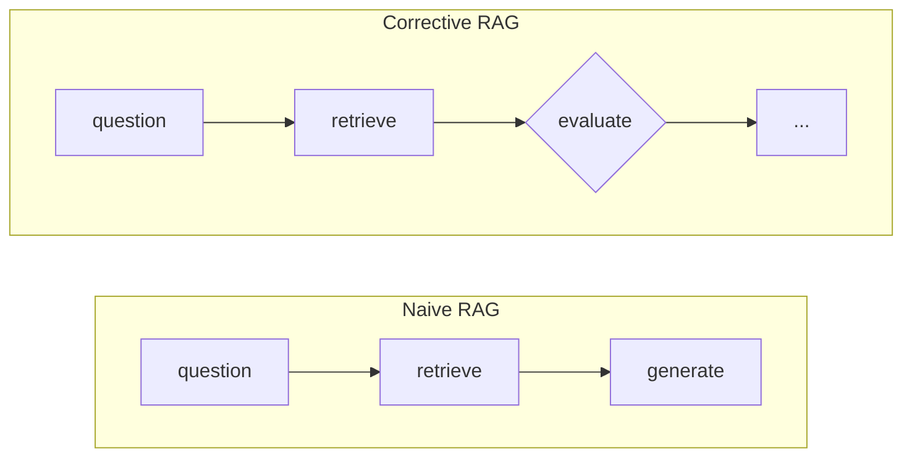
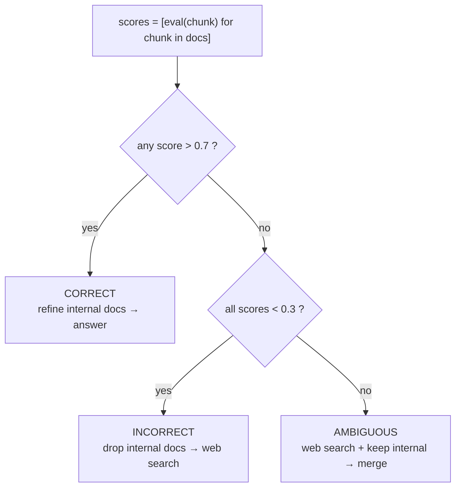
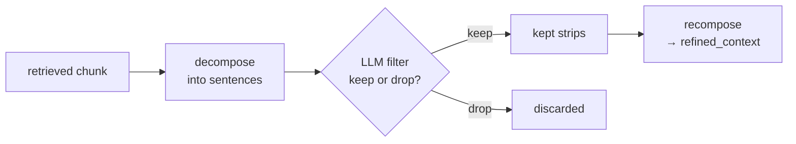
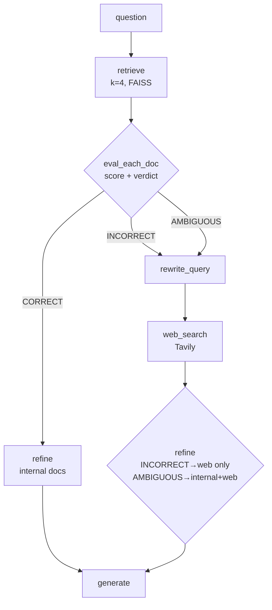
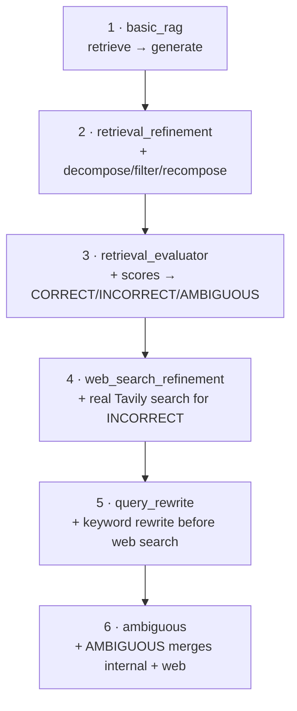

# Corrective RAG (CRAG) — Visual Revision Notes

> Built from `crag/code/1_basic_rag.ipynb` → `crag/code/6_ambiguous.ipynb`
> Paper: Yan et al., 2024 — *Corrective Retrieval Augmented Generation*
> Beautiful standalone version of these same notes: open [`process.html`](./process.html) in a browser.

---

## 1. Why CRAG? (one picture)

Naive RAG never checks its own retrieval. CRAG grades it first.



- **Naive:** trusts whatever comes back, even if it's junk → hallucination that *looks* grounded.
- **Corrective:** grades the retrieval, then picks one of 3 actions before answering.

---

## 2. The verdict — a traffic light

Every retrieved chunk gets a score `0.0–1.0`. Two thresholds turn all the scores into **one** verdict.



| Verdict | Condition | Action |
|---|---|---|
| **CORRECT** | at least one chunk `> 0.7` | refine internal docs only |
| **AMBIGUOUS** | mixed — none great, not all bad | refine internal **+** web docs, merged |
| **INCORRECT** | every chunk `< 0.3` | discard internal, refine web docs only |

```python
UPPER_TH, LOWER_TH = 0.7, 0.3
if any(s > UPPER_TH for s in scores):   verdict = "CORRECT"
elif all(s < LOWER_TH for s in scores): verdict = "INCORRECT"
else:                                   verdict = "AMBIGUOUS"
```

---

## 3. Knowledge refinement — decompose → filter → recompose

A chunk is rarely all-signal. CRAG splits it into sentence "strips" and keeps only the relevant ones.



Real example from `2_retrieval_refinement.ipynb`, question = *"Explain the bias–variance tradeoff"*:

| Strip | Verdict |
|---|---|
| "Bias… is due to wrong assumptions, such as assuming the data is linear when it is actually quadratic." | keep |
| "A high-bias model is most likely to underfit the training data." | keep |
| "Irreducible error — this part is due to the noisiness of the data itself." | drop |
| "Regularized Linear Models — a good way to reduce overfitting is to regularize the model." | drop |

```python
def decompose_to_sentences(text):
    text = re.sub(r"\s+", " ", text).strip()
    return [s.strip() for s in re.split(r"(?<=[.!?])\s+", text) if len(s.strip()) > 20]

kept = [s for s in strips if filter_chain.invoke({"question": q, "sentence": s}).keep]
refined_context = "\n".join(kept)
```

**Why sentence-level, not whole-chunk?** One good sentence shouldn't be thrown out because the rest of its chunk was noise — and vice versa.

---

## 4. The full pipeline (final build, notebook 6)



- **CORRECT** is the only shortcut — it skips rewrite and web search entirely.
- **INCORRECT** and **AMBIGUOUS** both take the detour; only `refine()`'s choice of *which* docs to use differs.
- Every path ends the same way: answer only from `refined_context`, never raw chunks.

---

## 5. How it was built — one notebook, one new piece



| # | Notebook (in `crag/code/`) | What it adds |
|---|---|---|
| 1 | `1_basic_rag.ipynb` | Baseline: retrieve → generate, no checks |
| 2 | `2_retrieval_refinement.ipynb` | Decompose → filter → recompose |
| 3 | `3_retrieval_evaluator.ipynb` | Per-chunk scoring, 3-way verdict, routing (web branches stubbed) |
| 4 | `4_web_search_refinement.ipynb` | Real web search for INCORRECT |
| 5 | `5_query_rewrite.ipynb` | Rewrite question → keyword query before search |
| 6 | `6_ambiguous.ipynb` | AMBIGUOUS stops dead-ending; merges internal + web |

Corpus: all six notebooks load the same PDFs from `../documents/` (CRAG's own corpus — each technique folder in this repo keeps its own `documents/`).

---

## 6. Glossary

| Term | Meaning |
|---|---|
| **strips** | sentences a chunk is decomposed into — the unit CRAG filters at |
| **refine()** | decompose → filter → recompose, shared by every verdict branch |
| **verdict** | `CORRECT` / `INCORRECT` / `AMBIGUOUS`, derived from chunk scores |
| **UPPER_TH / LOWER_TH** | 0.7 / 0.3 — the cutoffs that produce the verdict |
| **query rewrite** | question → short keyword query for the web search tool |
| **corrective action** | paper's term for "go get better knowledge" (web search here) |

---

## 7. Self-test

- **Why not always web search and skip the evaluator?** → internal retrieval is cheaper and often already good enough; the evaluator avoids paying the web-search cost when it isn't needed.
- **Why filter sentence-by-sentence, not whole chunks?** → chunks mix signal and noise; sentence-level keeps the useful line without dragging in the rest.
- **INCORRECT vs AMBIGUOUS — what actually differs?** → both rewrite + web search; only `refine()`'s doc selection differs (web-only vs internal+web).
- **What do the two thresholds gate?** → `UPPER_TH`: "is one chunk good enough alone?" `LOWER_TH`: "is this chunk worth keeping at all?" (used for both the INCORRECT check and building `good_docs`).

---

## 8. One-line recall

> Score chunks → 3-way verdict → CORRECT trusts internal, INCORRECT replaces with web, AMBIGUOUS merges both → every path refines (decompose/filter/recompose) before generating.
