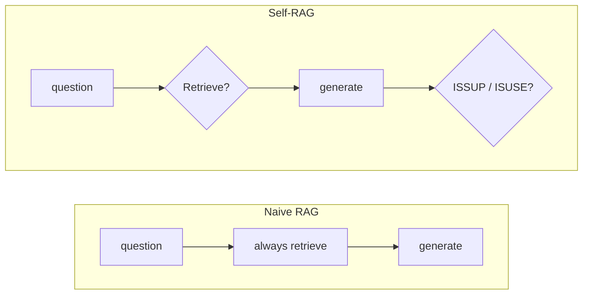
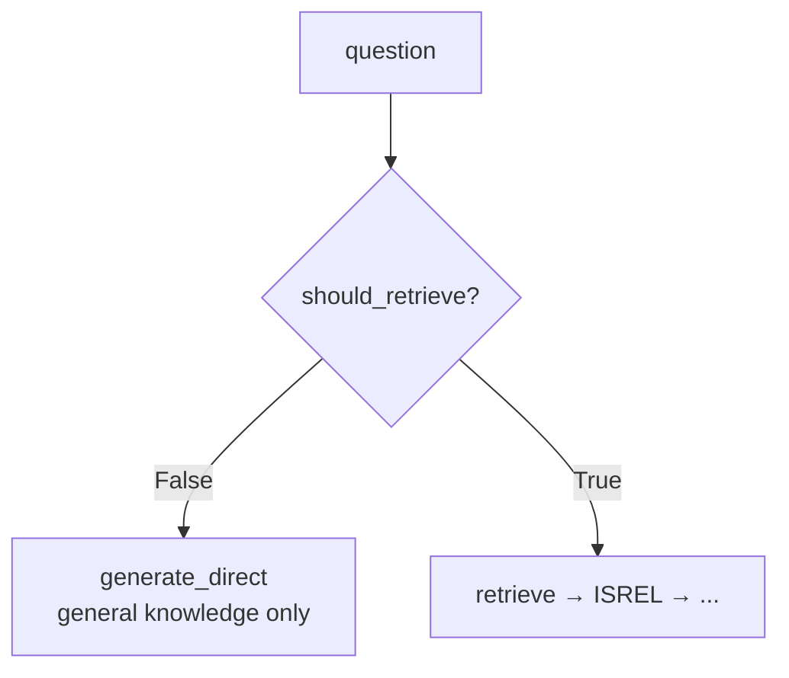
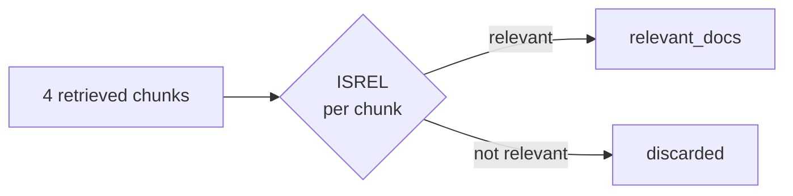
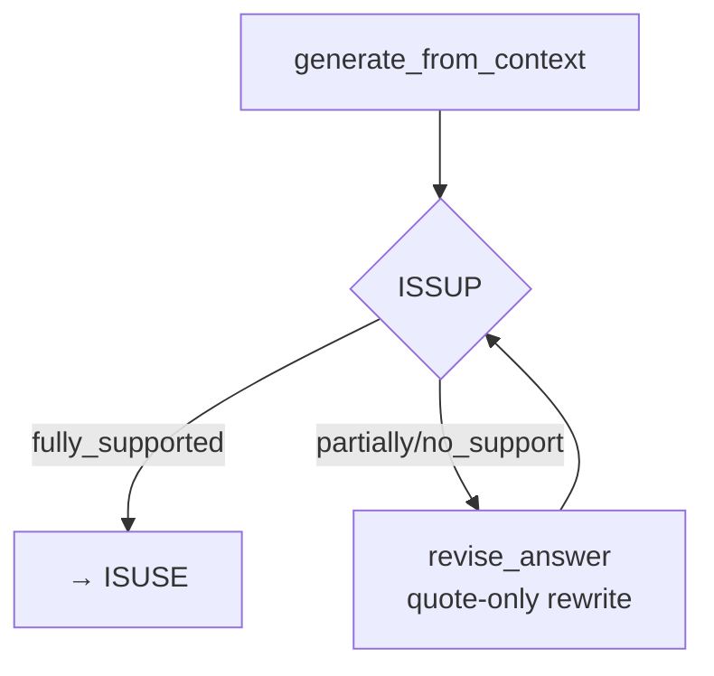
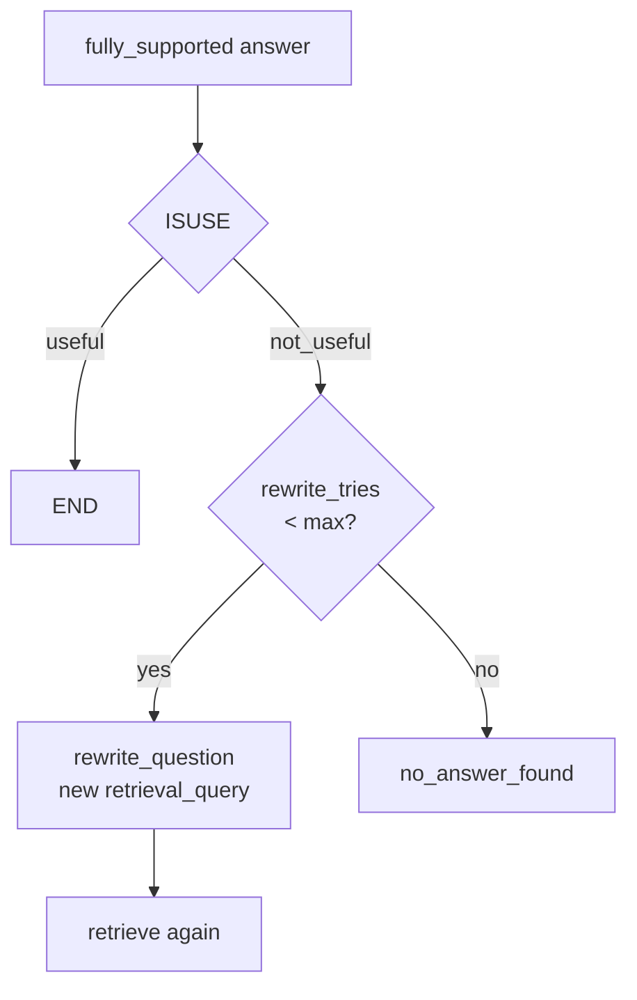
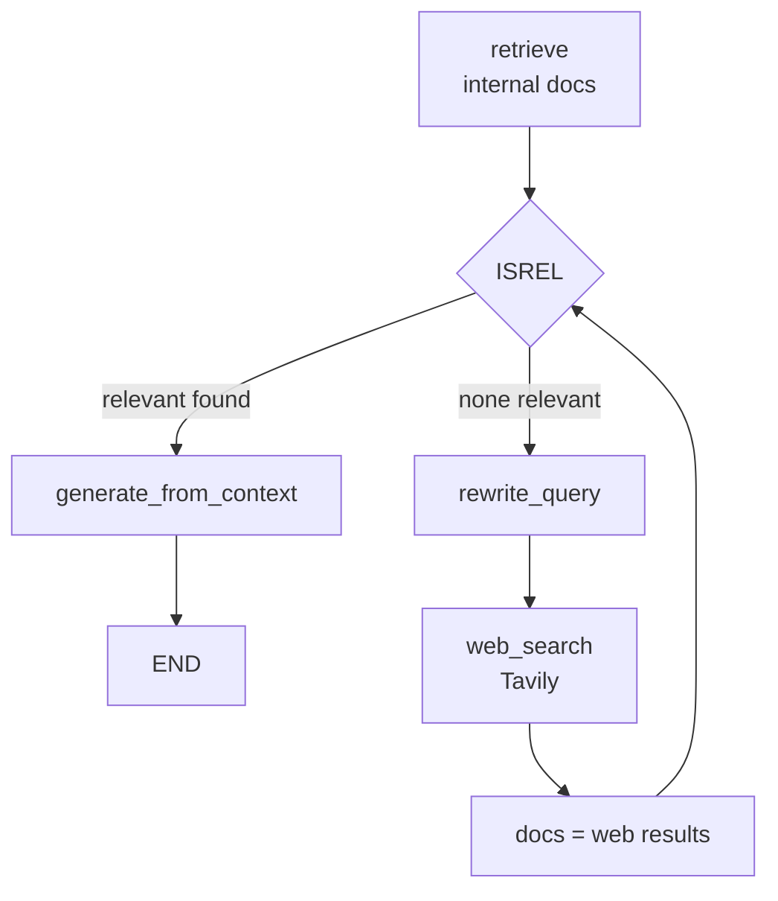
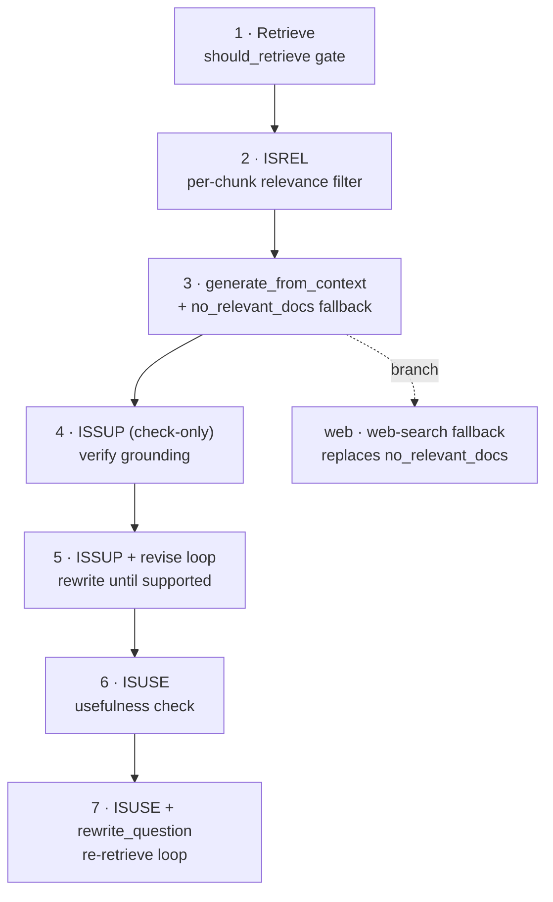

# Self-RAG — Visual Revision Notes

> Built from `self-rag/code/self_rag_step1.ipynb` → `self_rag_step7.ipynb`, plus `self_rag_web.ipynb`
> Paper: Asai et al., 2023 — *Self-RAG: Learning to Retrieve, Generate, and Critique through Self-Reflection*
> Companion: open [`process.html`](./process.html) in a browser for the fully styled version.

---

## 1. Why Self-RAG? (one picture)

CRAG's evaluator sits *outside* the model, grading retrieval after the fact. Self-RAG pushes the grading *inside* the model's own turn — before generating (should I even retrieve?) and after generating (is what I said actually supported, and actually useful?).



- **Naive:** retrieves every time, generates, never re-checks its own output.
- **Self-RAG:** decides *if* retrieval is even worth it, then — after generating — critiques its own answer twice before handing it back.

---

## 2. The four reflection tokens

| Token | Question it answers | Where it lives in the code |
|---|---|---|
| **Retrieve** | Do I even need external docs for this question? | `decide_retrieval` (step1) |
| **ISREL** | Is *this* retrieved chunk actually relevant? | `is_relevant` (step2) |
| **ISSUP** | Is my generated answer actually supported by the context? | `is_sup` (step4), with a revise loop from step5 |
| **ISUSE** | Is the (supported) answer actually *useful* — does it address the question? | `is_use` (step6), with a re-retrieve loop from step7 |

```python
class RetrieveDecision(BaseModel):
    should_retrieve: bool   # Retrieve

class RelevanceDecision(BaseModel):
    is_relevant: bool       # ISREL

class IsSUPDecision(BaseModel):
    issup: Literal["fully_supported", "partially_supported", "no_support"]
    evidence: List[str]

class IsUSEDecision(BaseModel):
    isuse: Literal["useful", "not_useful"]
    reason: str
```

---

## 3. Retrieve — skip retrieval when it isn't needed



Real run from `self_rag_step1.ipynb`:

| Question | `should_retrieve` | Path taken |
|---|---|---|
| "What is Machine Learning" | `False` | answered directly, no documents touched |
| "Who is the CEO of NexaAI" | `True` | retrieval kicks in |

**Why this matters:** general-knowledge questions don't need to pay retrieval's latency/cost — only questions that plausibly need this company's specific documents do.

---

## 4. ISREL — filter retrieved chunks for relevance



Real run, question = *"Who is the CEO of NexaAI"* (`self_rag_step2.ipynb`) — 4 chunks retrieved, only 1 kept:

> kept — *"Founder… Aarav Mehta founded NexaAI… Aarav Mehta – CEO & Founder…"*
> dropped — the Company Overview chunk (founding year, HQ, employee count — real, but not about *who the CEO is*)
> dropped — the Products & Pricing chunks (unrelated topic entirely)

**Why per-chunk, not per-query?** A single retrieval can return a mix of on-topic and off-topic chunks — filtering individually keeps the good one without keeping the noise.

---

## 5. ISSUP — is the answer actually supported? (verify → revise loop)

After generating an answer from the kept chunks, Self-RAG checks the answer itself against the context — not just "did we retrieve something relevant," but "does the *exact wording* hold up."



```python
MAX_RETRIES = 10
def route_after_issup(state):
    if state["issup"] == "fully_supported": return "accept_answer"
    if state["retries"] >= MAX_RETRIES:      return "accept_answer"  # give up, pass through anyway
    return "revise_answer"
```

Real run, question = *"Describe NexaAI's company culture"* (`self_rag_step5.ipynb`):

| Attempt | Answer | `issup` |
|---|---|---|
| 1st draft | free-text summary using words like "culture" that weren't literally in the source | `no_support` (too much interpretation) |
| after 1 revise | `- "NexaAI is committed to maintaining a fair, inclusive, and performance-driven workplace."` `- "Employees are encouraged to maintain a healthy work-life balance."` (quote-only) | `fully_supported` |

The reviser's system prompt is intentionally extreme — **quotes only, no new words** — because the grader treats *any* unsupported adjective ("generous," "robust," "culture") as a failure. This is a strict, teachable example of grounding-by-force.

**A real failure case worth knowing:** for *"Do NexaAI plans include a free trial?"*, the factually-correct answer ("Yes, 14 days") was still marked `no_support` — the grader is strict about *literal* textual support, not just correctness. Good reminder that ISSUP checks *grounding*, not truth.

---

## 6. ISUSE — is the (grounded) answer actually useful?

A grounded answer can still fail to address the question — ISUSE checks that separately, and can trigger a **query rewrite + re-retrieve**, not just a re-answer.



Two real contrasting runs:

- *"Describe NexaAI's company culture"* (`self_rag_step7.ipynb`) → `issup: fully_supported`, `isuse: useful` ("The answer provides specific details about NexaAI's company culture.") → **END**, answer returned.
- *"What is refund policy of NexaAI"* (`self_rag_step6.ipynb`) → burns all 10 ISSUP retries, still `no_support` → `isuse: not_useful` ("The answer does not provide any information about the refund policy.") → **no_answer_found**. The corpus genuinely has no refund policy chunk, so Self-RAG correctly refuses rather than fabricate one.

**Why separate ISSUP from ISUSE?** An answer can be perfectly grounded in the context and still not actually answer the question (e.g. grounded background info that dodges the real ask). Splitting the checks catches both failure modes independently.

---

## 7. The web branch — a different corrective action for the same problem

`self_rag_web.ipynb` takes a different fork off step 3: instead of ending at `no_relevant_docs`, it rewrites the query and calls web search, then **loops back through ISREL again** on the web results.



Real run: *"Who won the Aus vs Zim World T20 match 2026 and who was the top scorer"* — clearly not in the internal company PDFs, so the loop falls through to web search, retrieves 5 web results, ISREL keeps all 5, and generates a grounded answer citing the match result.

**Relationship to CRAG:** this is the same idea as CRAG's `INCORRECT → web_search` branch, but reframed through Self-RAG's own reflection token — ISREL failing on *every* chunk *is* the "go get better knowledge" signal, no separate evaluator needed.

---

## 8. Build progression



| # | Notebook | What it adds |
|---|---|---|
| 1 | `self_rag_step1.ipynb` | `Retrieve` gate: skip retrieval for general-knowledge questions |
| 2 | `self_rag_step2.ipynb` | `ISREL`: per-chunk relevance filter |
| 3 | `self_rag_step3.ipynb` | Generate from filtered context; explicit "no relevant document found" fallback |
| 4 | `self_rag_step4.ipynb` | `ISSUP`: check (not yet act on) whether the answer is grounded |
| 5 | `self_rag_step5.ipynb` | `ISSUP` becomes a loop: revise the answer (quote-only) until fully supported or out of retries |
| 6 | `self_rag_step6.ipynb` | `ISUSE`: usefulness check after grounding passes |
| 7 | `self_rag_step7.ipynb` | `ISUSE` failure triggers `rewrite_question` → re-retrieve, closing the full loop |
| — | `self_rag_web.ipynb` | side-branch: web search fallback instead of dead-ending on no relevant docs |

Corpus: all notebooks load `../documents/{Company_Policies,Company_Profile,Product_and_Pricing}.pdf` — deliberately small, factual business docs (not the CRAG textbooks), so grounding/support failures are easy to see and reason about.

---

## 9. Glossary

| Term | Meaning |
|---|---|
| **Retrieve** | reflection token deciding whether retrieval is needed at all |
| **ISREL** | reflection token: is this specific chunk relevant? |
| **ISSUP** | reflection token: is the generated answer supported by context? (`fully_supported` / `partially_supported` / `no_support`) |
| **ISUSE** | reflection token: does the (supported) answer actually address the question? (`useful` / `not_useful`) |
| **revise_answer** | forces a strict, quote-only rewrite when ISSUP fails |
| **rewrite_question** | rewrites the retrieval query when ISUSE fails, then retries retrieval |
| **retries / rewrite_tries** | separate budgets for the ISSUP-revise loop and the ISUSE-rewrite loop |

---

## 10. Self-test

- **Why check ISSUP and ISUSE separately instead of one "is this answer good?" check?** → they catch different failures: ISSUP catches ungrounded wording even in an on-topic answer; ISUSE catches grounded-but-non-answering responses. Conflating them would miss whichever failure mode isn't explicitly asked about.
- **Why did the correct "14-day free trial" answer get marked `no_support`?** → ISSUP grades literal textual grounding, not factual correctness — a good reminder that "supported" and "true" aren't the same check.
- **What's the actual difference between the ISSUP-revise loop and the ISUSE-rewrite loop?** → revise_answer only changes the *wording* of the answer from the same context; rewrite_question changes the *retrieval query* and goes back to fetch new documents entirely.
- **How does the web branch relate to CRAG's corrective action?** → same idea (replace bad retrieval with a web search), triggered by a different signal — CRAG uses an external evaluator's verdict; Self-RAG uses ISREL finding zero relevant chunks.

---

## 11. One-line recall

> Before answering: decide if retrieval is even needed (`Retrieve`). After retrieving: keep only relevant chunks (`ISREL`). After answering: check the answer is grounded in what was kept (`ISSUP`, revise until it is), then check it actually addresses the question (`ISUSE`, re-retrieve with a rewritten query if not) — all self-checks, no external evaluator required.
