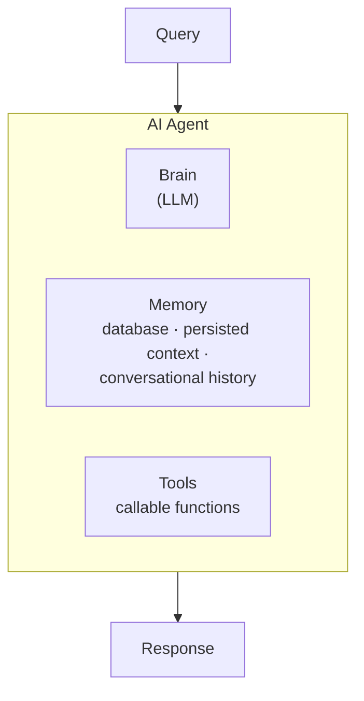
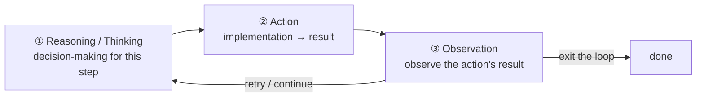
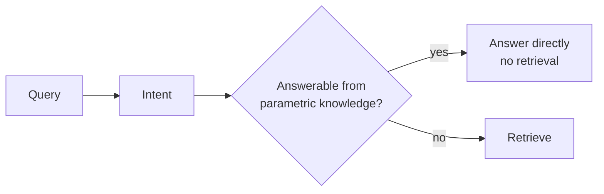
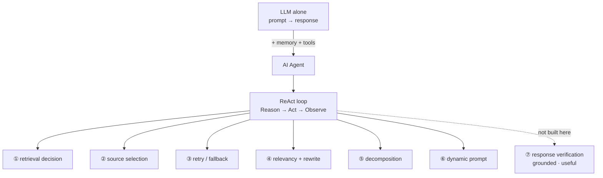

# Agentic RAG — Theory Notes

What actually makes something "agentic": an AI agent's anatomy, why a fixed RAG graph breaks down, and the ReAct loop that replaces it.

> Companion file: [`process.md`](./process.md) walks through *this repo's* build, notebook by notebook, with real run outputs. This file covers the underlying theory the build implements — read this first if the *why* behind `route_question` / `evaluate_docs` / `decompose_query` isn't obvious yet.

**Contents**

- [TL;DR](#tldr)
- [1. What is an AI Agent?](#1-what-is-an-ai-agent)
- [2. The ReAct loop](#2-the-react-loop)
- [3. Why traditional RAG breaks down](#3-why-traditional-rag-breaks-down)
- [4. Properties — need to have](#4-properties--need-to-have)
- [5. Properties — good to have](#5-properties--good-to-have)
- [6. Mapping theory → this repo's code](#6-mapping-theory--this-repos-code)
- [7. Interview one-liners](#7-interview-one-liners)
- [Quick recap](#quick-recap)

---

## TL;DR

| What | Built from | Loop | Replaces |
| :--- | :--- | :--- | :--- |
| An **AI agent** = LLM (**brain**) + **memory** + **tools**, wrapped into a standalone system | NLU (parse intent) + NLG (generate response) | **ReAct**: Reason → Act → Observe, repeat or exit | A single prompt-in/response-out LLM call |

| Traditional RAG's 3 flaws | Agentic RAG's fix | Need-to-have (8) | Good-to-have (3) |
| :--- | :--- | :--- | :--- |
| No control on retrieval · static order · no result verification | The **agent reasons about each of these**, per query, instead of following a fixed graph | Retrieval decision · source selection (where/how) · retry/fallback · relevancy check + rewrite · decomposition · dynamic prompt · **response verification** | Memory · dynamic source adaptation · graceful fallback + guardrails |

---

## 1. What is an AI Agent?

An LLM by itself is just `prompt → response` — a **standalone function**, no state, no ability to act. An **AI agent** wraps that LLM into a **standalone system** with three parts:



| Part | Role |
| :--- | :--- |
| **Brain** | the LLM itself — reasons, decides |
| **Memory** | persists **query · tool calls · tool results · AI responses · retrieved docs** across turns |
| **Tools** | callable actions — in code, literally **Python functions** with defined `input → output` |

Two language capabilities sit underneath everything the agent does:

- **NLU** (Natural Language Understanding) — query → **intent**
- **NLG** (Natural Language Generation) — intent/result → **response**

And three **cognitive abilities**, all supplied by the LLM itself:

| Ability | What it does |
| :--- | :--- |
| **Reasoning** | thinking through a step, deciding what it means |
| **Planning** | turning a goal into a **series of steps** — a roadmap of actions |
| **Orchestration** | coordinating planning + reasoning across **multiple** steps/tools in one query |

### The 5 properties of an agent

| # | Property | Means |
| :--- | :--- | :--- |
| ① | **Autonomous** | makes decisions itself, without a hardcoded branch telling it what to do |
| ② | **Planning** | produces a roadmap of steps before acting |
| ③ | **Reasoning** | thinks through *and* executes each step — e.g. recognizing a query is ambiguous and deciding to rewrite it or issue multiple queries |
| ④ | **Orchestration** | plans and reasons across several tools/steps together |
| ⑤ | **Adaptability** | dynamic, robust, error-free — behaves differently as conditions change, without breaking |

---

## 2. The ReAct loop

**ReAct = Re**asoning **+ Act**ion. This is the mechanism underneath every agentic decision — it's a **loop**, not a single pass:



An agent is **active**, not passive: `Input → Procedure → Output`, where the "procedure" is this Reason–Act–Observe cycle repeating until the agent itself decides it's done. Compare this to the fixed graphs in earlier sections (CRAG, Self-RAG) — those also loop, but the loop condition is code you wrote (a verdict, a token). Here, **the model decides whether to loop again**, fresh, every time.

> [!NOTE]
> In this repo's build, the ReAct loop *is* the `agent ⇄ tools` cycle in the LangGraph — see [`process.md` §1](./process.md#1-why-agentic-rag-one-picture) for the side-by-side diagram against CRAG/Self-RAG's fixed graphs.

---

## 3. Why traditional RAG breaks down

A fixed `retrieve → generate` pipeline has three structural flaws:

| # | Flaw | What it means in practice |
| :--- | :--- | :--- |
| ① | **No control on retrieval** | It *always* retrieves, whether the question needs it or not, from wherever it's wired to retrieve from |
| ② | **Order is static** — a "dumb approach" | The same steps run in the same order for every query, complex or trivial |
| ③ | **No verification of results** | Whatever comes back gets used — there's no check that it's actually relevant |

Agentic RAG's answer to all three is the same move: stop encoding these as fixed pipeline steps, and let the **agent reason about each one, per query**, inside the ReAct loop.

---

## 4. Properties — need to have

The source enumerates **eight** of these (p.156). The **Code** section that follows (p.159–168) then implements them under **six numbered headings** — which is also the order this repo's notebooks were built in, so that's the order used below.

| p.156 property | Covered below in |
| :--- | :--- |
| ① Select retrieval | ① Retrieval decision |
| ② Query decomposition | ⑤ Query decomposition |
| ③ Query rephrasing / rewriting | ④ Relevancy check and query rewriting |
| ④ Source of retriever → tools | ② Retrieval source selection (**WHERE**) |
| ⑤ How to do retrieval | ② Retrieval source selection (**HOW**) |
| ⑥ Perform any retries | ③ Retry logic and fallback |
| ⑦ Relevancy check on retrieved docs | ④ Relevancy check and query rewriting |
| ⑧ **Response verification — grounded + useful** | ⑦ below — **not implemented in this repo** |

### ① Retrieval decision — should this even retrieve?



The agent reasons about **intent** first. If its own parametric knowledge already covers the answer, retrieval is skipped entirely.

### ② Retrieval source selection — where from, and when

Three questions, one decision:

| Question | Answer determines |
| :--- | :--- |
| **WHERE** | which source — e.g. an internal vector store (company docs) vs. live web search |
| **HOW** | which search strategy at that source — similarity search, MMR (`k`, `fetch_k`, `lambda_mult`), metadata filters |
| **WHEN** | whether this needs **orchestration** across sources — e.g. *"Get me the current weather in Delhi, and if it's hot, recommend 3 leave days for a Mumbai→Delhi trip"* chains a web lookup into a conditional decision into a recommendation |

Mechanically, each source is exposed to the agent as a **bound tool** — the same `Retriever → tool definition → bind_tools()` pattern this repo uses for `vector_store_search` and `web_search`.

### ③ Retry logic and fallback

A cap on how many rounds the agent can retry before giving up — the **upper limit** that stops an agent loop from running forever, paired with a **fallback response** when retries are exhausted.

### ④ Relevancy check and query rewriting

After retrieval, check whether what came back is actually relevant. If the query was **ambiguous**, rewrite it — or issue multiple reformulated versions — and retry.

### ⑤ Query decomposition

If the query is **complex** — really several questions bundled together — break it down first:

```
"Compare Python and JS and give me a comparison report"
        ↓ decompose
① retrieve: Python        ② retrieve: JS        ③ compare        ④ respond
```

Each sub-topic gets its own dedicated retrieval instead of one search that's forced to cover all of them at once.

### ⑥ Dynamic generation prompt

The final prompt isn't a fixed template. It's assembled based on what actually happened this turn — augmented with retrieved context (and *from which source*), or reflecting a fallback if nothing relevant was ever found.

### ⑦ Response verification — the one this repo doesn't build

The eighth property on p.156 checks the **generated answer**, not the retrieved documents. Two questions, explicitly labelled *Self-RAG* in the source:

| Question | Asks | Self-RAG equivalent |
| :--- | :--- | :--- |
| Is the response **grounded**? | Is every claim actually supported by the retrieved context, or did the model invent it? | `ISSUP` |
| Is the response **useful**? | Does it actually answer *the query* — not just say something true? | `ISUSE` |

If either check fails, the loop can **reuse a tool** and retry rather than returning a bad answer.

> [!WARNING]
> **This repo's graph stops at `generate`.** Its 11 nodes include `evaluate_docs`, which grades *retrieved documents* — but nothing grades the *generated response*. So a well-grounded retrieval that the model then summarises incorrectly would pass unchallenged. This is the one need-to-have property the build doesn't cover.

---

## 5. Properties — good to have

Three more properties that push an agentic RAG system from "works" to "production-ready":

| # | Property | What it covers |
| :--- | :--- | :--- |
| ① | **Memory** | Short-term: conversational history and context, kept within the context window, so the agent doesn't re-retrieve or re-ask what it already has |
| ② | **Static vs. dynamic augmentation** | Whether the retrieval source is fixed in advance or chosen live, per query (vector store vs. web search, decided dynamically rather than hardcoded) |
| ③ | **Graceful fallback mechanism** | Handling **hallucinations** and errors without crashing: retry logic with an upper limit, a robust mechanism for errors, and **guardrails** for production use |

> [!IMPORTANT]
> "Need to have" makes the system *agentic*. "Good to have" makes it *safe to ship*. A system with all six §4 capabilities but no fallback mechanism will still hallucinate confidently when everything else fails.

---

## 6. Mapping theory → this repo's code

The capabilities above are not abstract — each maps to a real node in this repo's build, verified against the notebooks in [`code/`](../code/). The final graph has **11 nodes**; the last row is the gap:

| Theory capability | This repo's node(s) | Notebook |
| :--- | :--- | :--- |
| ① Retrieval decision | `route_question` | `01_conditional_retrieval.ipynb` |
| ② Retrieval source selection | `agent` bound to `vector_store_search` + `web_search` | `02_tool_use_retrieval_1.ipynb` |
| ③ Retry logic and fallback | `check_retrieval_limit` (`retrieval_count` vs `max_retrieval_steps`) | `03_tool_use_retrieval_2.ipynb` |
| ④ Relevancy check + rewriting | `evaluate_docs` → `rewrite_query` | `04_retrieval_evaluation_and_rewriting.ipynb` |
| ⑤ Query decomposition | `check_decomposition` → `decompose_query` | `05_query_decomposition.ipynb` |
| ⑥ Dynamic generation prompt | `build_prompt` | `agentic_rag.ipynb` (final build) |
| ⑦ Response verification | **— no node —** | **not implemented** |

For real run outputs against each of these (exact retrieval counts, rewrite counts, decomposed sub-queries), see [`process.md` §3–§9](./process.md#3-step-00--base-rag-the-before-picture).

---

## 7. Interview one-liners

**What makes a RAG system "agentic" rather than just a graph with branches?**
The branch conditions are the model's own reasoning at runtime, not code you wrote — the agent decides, per query, whether/where/how many times to retrieve.

**What are the three parts of an AI agent?**
Brain (the LLM), memory (persisted context and history), and tools (callable functions with defined input/output).

**What is the ReAct loop?**
Reasoning (decide) → Action (execute, get a result) → Observation (evaluate the result) → either exit or loop back to reasoning.

**What are traditional RAG's three structural flaws?**
No control over whether to retrieve, a static step order regardless of query, and no verification that retrieved results are actually relevant.

**Name the "need to have" capabilities.**
Retrieval decision, source of retriever, how to retrieve, retries, query rephrasing/rewriting, query decomposition, relevancy check on retrieved docs, and response verification (grounded + useful) — eight in total.

**What's the difference between `evaluate_docs` and response verification?**
`evaluate_docs` grades the *retrieved documents* before generating. Response verification grades the *generated answer* — is it grounded in that context, and is it actually useful for the query? Most builds (including this one) implement the first and skip the second.

**Why decompose a query before retrieving rather than after?**
A single retrieval on a multi-topic query skews toward whichever topic dominates the embedding — decomposing first gives each sub-topic its own dedicated retrieval.

**What separates "need to have" from "good to have"?**
Need-to-have makes the system agentic at all. Good-to-have (memory, dynamic source selection, graceful fallback/guardrails) makes it safe and efficient enough for production.

---

## Quick recap



- **Agent** = LLM (brain) + memory + tools, driven by NLU/NLG, with reasoning + planning + orchestration
- **ReAct loop**: Reasoning → Action → Observation → exit or retry — the mechanism behind every agentic decision
- **Traditional RAG's flaws**: no retrieval control, static order, no result verification
- **Need to have (8 in the source):** retrieval decision · source of retriever · how to retrieve · retries · rewrite/rephrase · decomposition · relevancy check on docs · **response verification (grounded + useful)**
- **Good to have (3):** memory · static vs dynamic source adaptation · graceful fallback + guardrails
- **This repo implements 7 of the 8** — `evaluate_docs` grades retrieved *documents*, but no node grades the generated *response*
- Real run outputs for every implemented node: [`process.md`](./process.md)
