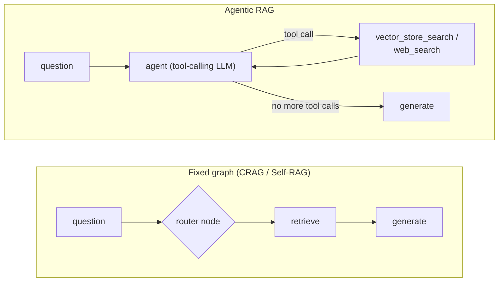
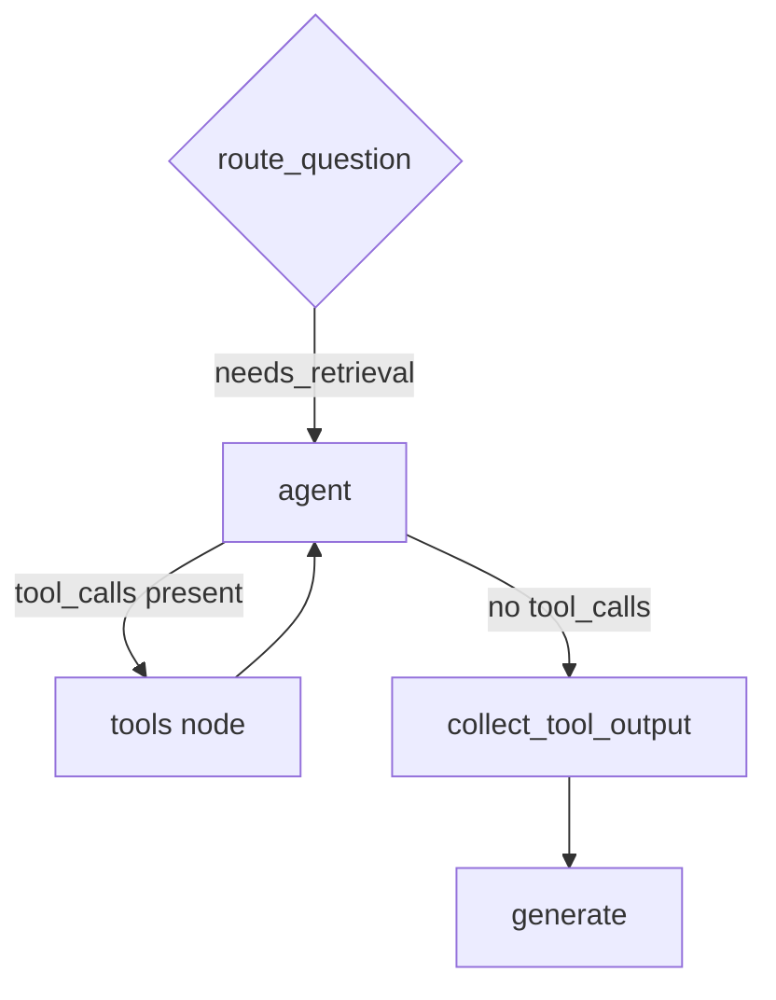
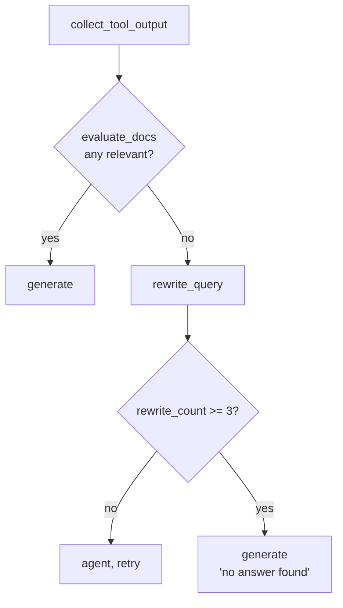
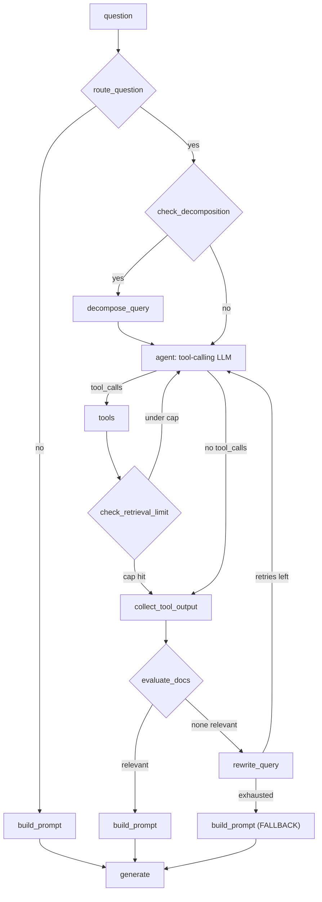

# Agentic RAG — Visual Revision Notes

> Built from `agentic-rag/code/00_base_rag.ipynb` → `05_query_decomposition.ipynb`, plus `agentic_rag.ipynb` (final combined build)
> Companion: open [`process.html`](./process.html) in a browser for the fully styled version.

---

## 1. Why Agentic RAG? (one picture)

CRAG and Self-RAG both still run a *graph* — a fixed set of nodes and edges, even if a verdict or reflection token decides which branch to take. Agentic RAG replaces the fixed branch points with a real **tool-calling agent**: the model itself decides which tool to call, how many times, and in what order — via `agent_llm.bind_tools([...])`, not via a preset routing function.



- **Fixed graph:** the routing logic is code you wrote — an `if` statement, a threshold, a token.
- **Agentic:** the routing logic is the model's own tool-call decision, made fresh at every turn, looped until it stops calling tools.

---

## 2. The building blocks, in the order they were added

| Node                                          | What it decides                                                                                          | Added in                      |
| --------------------------------------------- | -------------------------------------------------------------------------------------------------------- | ----------------------------- |
| `route_question`                            | does this question need retrieval at all?                                                                | step 01                       |
| `agent` (tool-calling)                      | which tool(s) to call —`vector_store_search`, `web_search`, both, or neither — and how many rounds | step 02                       |
| `check_retrieval_limit`                     | hard cap on tool-call rounds, so the agent can't loop forever                                            | step 03                       |
| `evaluate_docs`                             | are the retrieved chunks actually relevant?                                                              | step 04                       |
| `rewrite_query`                             | rephrase the question when nothing relevant came back, then retry                                        | step 04                       |
| `check_decomposition` / `decompose_query` | is this really several distinct questions bundled into one?                                              | step 05                       |
| `build_prompt`                              | dynamically construct the system prompt based on what happened (decomposed? rewritten? failed?)          | final (`agentic_rag.ipynb`) |

---

## 3. Step 00 — base RAG (the "before" picture)

```python
def retrieve(state):
    docs = retriever.invoke(state["query"])
    return {"retrieved_docs": docs, "context": "\n\n".join(d.page_content for d in docs)}
```

Fixed graph: `START → retrieve → generate → END`. Always retrieves, from one source (an in-memory Chroma vector store over `evs_oil_price_shock.pdf`), regardless of whether the question needs it.

---

## 4. Step 01 — conditional retrieval

Adds `route_question`, exactly like CRAG/Self-RAG's `should_retrieve` gate — general-knowledge questions skip the vector store entirely.

Real run:

| Question                                                                               | `needs_retrieval`                                  |
| -------------------------------------------------------------------------------------- | ---------------------------------------------------- |
| "What does the report say about EV adoption trajectories and oil demand displacement?" | `True` — 4 docs retrieved                         |
| "What is the capital of India?"                                                        | `False` — answered directly, no documents touched |

---

## 5. Step 02 — real tool-calling agent

This is the actual shift from "fixed graph" to "agentic": `retrieve` is deleted, and the model gets two **tools** it can call itself.

```python
@tool(response_format="content_and_artifact")
def vector_store_search(query: str, k: int = 3):
    """Search the vector store for relevant document passages."""
    ...

@tool(response_format="content_and_artifact")
def web_search(query: str, max_results: int = 3):
    """Search the web for current or real-time information."""
    ...

agent_llm_with_tools = agent_llm.bind_tools([vector_store_search, web_search])
```



Real run, 4 cases from the same graph:

| Query                                                                | Tool(s) called                         | Result                                |
| -------------------------------------------------------------------- | -------------------------------------- | ------------------------------------- |
| "…impact of EVs on oil demand?"                                     | `vector_store_search` only           | grounded answer from the PDF          |
| "current temperature in New Delhi?"                                  | `web_search` only                    | grounded answer from live web results |
| "Compare EV report's 2030 projection **and** weather in Mumbai" | **both** tools, same turn        | one answer synthesizing both sources  |
| "difference between kinetic and potential energy"                    | neither (skipped at`route_question`) | answered from general knowledge       |

**Why this matters:** the "both tools in one turn" case is something a fixed if/else router can't express cleanly — the agent decided *for itself* that this particular question needed two independent retrieval actions, not a preset branch.

---

## 6. Step 03 — cap the loop

An agent that can call tools repeatedly needs a stopping condition beyond "no more tool calls" — otherwise a bad prompt or a stubborn model can loop indefinitely.

```python
def route_after_limit_check(state):
    return "collect_tool_output" if state["retrieval_count"] >= state["max_retrieval_steps"] else "agent"
```

Real run: a query explicitly asking for a 3-step research process ("look up the report's 2030/2050 projections, then search for 2024–2025 EV data, then search for revised forecasts") drove `retrieval_count: 2` — the agent chose to run two full tool-call rounds on its own, and the cap (`max_retrieval_steps: 5`) was there in case it didn't stop.

---

## 7. Step 04 — evaluate retrieved docs, rewrite the query if they're bad

Adds a relevance filter (like CRAG's evaluator / Self-RAG's ISREL) **after** the agent's tool calls, plus a rewrite-and-retry loop when nothing relevant came back.



Real run: *"how long people take to get rid of their vehicles completely as per the report?"* — an informally-phrased question — got 1 relevant doc back straightaway ("average vehicle lifetimes are about 15 to 20 years..."), no rewrite needed. A genuinely off-topic query about nuclear power triggered rewrites, but because `web_search` is also available to the agent, the rewritten query pulled in a *relevant web result* about nuclear energy — showing the rewrite loop working across both tools, not just the internal vector store.

---

## 8. Step 05 — query decomposition

Some questions are really several questions stitched together. This step checks for that **before** the agent starts calling tools, and if so, breaks it into numbered sub-queries the agent is instructed to satisfy one by one.

```python
class DecompositionDecision(BaseModel):
    needs_decomposition: bool
    sub_queries: list[str]
```

Real run — a genuinely compound question ("Impact of EVs on the oil industry, **and** what is the current price of Brent Crude") got decomposed into **7 numbered steps** (historical impact, future projections, gasoline/diesel trends, industry finances, refining impact, corporate strategy, current Brent price) — and the agent's system prompt was updated to say *"every step is a separate retrieval sub-task... do not skip any step."* The agent then ran 6 retrieval rounds to cover them, and the final answer was structured step-by-step, explicitly flagging which sub-questions the retrieved context couldn't answer (e.g. no live Brent price was available).

**Why decompose before retrieving, not after?** A single vector/web search on a 3-topic question tends to retrieve documents about whichever topic dominates the query semantically — the other topics get starved. Splitting first gives each sub-topic its own dedicated retrieval call.

---

## 9. Final build — dynamic prompt construction

`agentic_rag.ipynb` adds one more piece on top of step 05: instead of hardcoding two prompt templates (with-context / without-context) inside `generate`, a `build_prompt` node assembles the system prompt dynamically based on what actually happened this turn — whether the query was decomposed, rewritten, or ended in the no-answer fallback.

```python
def build_prompt(state):
    if state.get("rewrite_count", 0) >= 3 and not state.get("is_relevant"):
        return {"constructed_prompt": "FALLBACK"}
    sections = ["You are a knowledgeable assistant."]
    if state.get("needs_decomposition"):
        sections.append("The question was decomposed into sub-steps — answer each explicitly.")
    ...
```

This is the fully assembled pipeline — every capability from steps 01–05 present at once.

---

## 10. Full pipeline (final build)



---

## 11. Build progression

| #  | Notebook                                        | What it adds                                                                                                 |
| -- | ----------------------------------------------- | ------------------------------------------------------------------------------------------------------------ |
| 00 | `00_base_rag.ipynb`                           | Baseline: always retrieve from one vector store, then generate                                               |
| 01 | `01_conditional_retrieval.ipynb`              | `route_question`: skip retrieval for general-knowledge questions                                           |
| 02 | `02_tool_use_retrieval_1.ipynb`               | Replace the fixed`retrieve` node with a real tool-calling agent (`vector_store_search` + `web_search`) |
| 03 | `03_tool_use_retrieval_2.ipynb`               | Add`retrieval_count` / `max_retrieval_steps` — a hard cap on tool-call rounds                           |
| 04 | `04_retrieval_evaluation_and_rewriting.ipynb` | Add`evaluate_docs` (relevance filter) and `rewrite_query` (retry loop)                                   |
| 05 | `05_query_decomposition.ipynb`                | Add`check_decomposition` / `decompose_query` for multi-part questions                                    |
| — | `agentic_rag.ipynb`                           | Final combined build: adds`build_prompt` for dynamic system-prompt construction                            |

Corpus: all notebooks load `../documents/evs_oil_price_shock.pdf` — a single dense technical report, chosen so the agent's *tool choice* and *retrieval-round* behavior (not corpus breadth) is what's being demonstrated.

---

## 12. Glossary

| Term                                               | Meaning                                                                                                    |
| -------------------------------------------------- | ---------------------------------------------------------------------------------------------------------- |
| **tool-calling agent**                       | an LLM bound to a set of callable tools (`bind_tools`), which decides at each turn whether/which to call |
| **`vector_store_search` / `web_search`** | the two tools available to the agent — internal corpus vs. live web                                       |
| **retrieval round / `retrieval_count`**    | one full agent → tool → agent cycle; capped by`max_retrieval_steps`                                    |
| **`evaluate_docs`**                        | post-retrieval relevance filter, conceptually the same idea as CRAG's evaluator / Self-RAG's ISREL         |
| **`rewrite_query`**                        | rephrases the question and retries retrieval when nothing relevant came back                               |
| **query decomposition**                      | splitting one compound question into several focused sub-queries before retrieval                          |
| **`build_prompt`**                         | assembles the generation system prompt based on what happened this turn (decomposed / rewritten / failed)  |

---

## 13. Self-test

- **Why replace the fixed `retrieve` node with tool-calling instead of just adding more `if` branches?** → tool-calling lets the model decide, per-query, how many tools to use and in what combination (see the "both tools in one turn" case) — something a finite set of hardcoded branches can't scale to as more tools are added.
- **Why does step 03's retry cap matter even though step 02 already worked in the demos?** → an agent loop has no built-in stopping guarantee; a cap is a safety net for queries or models that keep generating tool calls without converging.
- **Why decompose *before* retrieving rather than retrieve once and see if the answer feels incomplete?** → a single retrieval call on a multi-topic question tends to retrieve chunks skewed toward whichever topic dominates the query's embedding, starving the other sub-topics of any retrieval at all.
- **How does `evaluate_docs` + `rewrite_query` here relate to CRAG's evaluator and Self-RAG's ISREL/rewrite loop?** → same underlying idea (grade retrieval, replace it with a better query if it's bad) — the difference is *where* it sits: here it's one capability inside an open-ended agent loop, not the entire pipeline's structure.

---

## 14. One-line recall

> Give the model two tools instead of one fixed retrieval step, let it call either/both/neither per its own judgement, cap how many rounds it can take, check whether what it got back is actually relevant (rewrite and retry if not), split compound questions into sub-queries before retrieving, and build the final prompt dynamically from whatever actually happened this turn.
