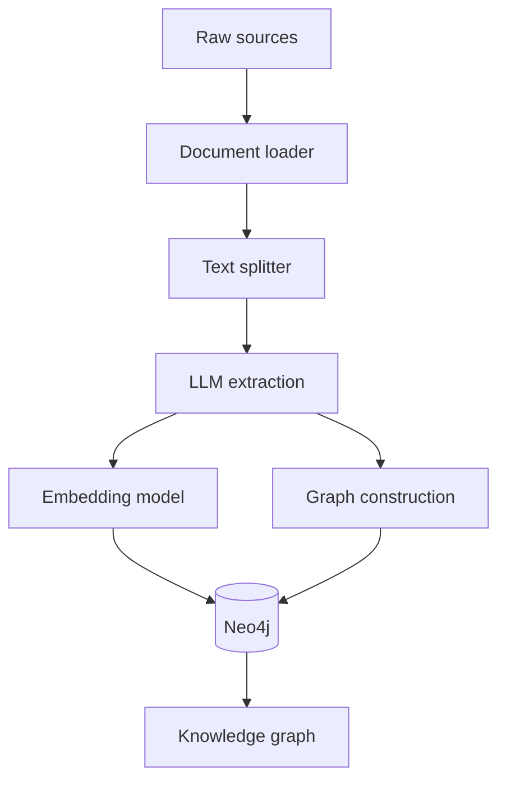
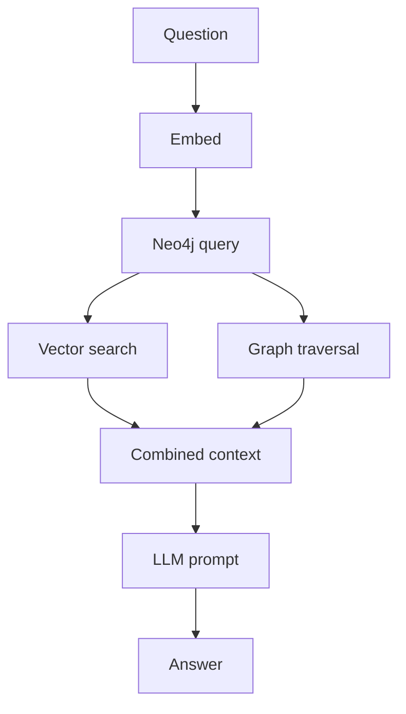
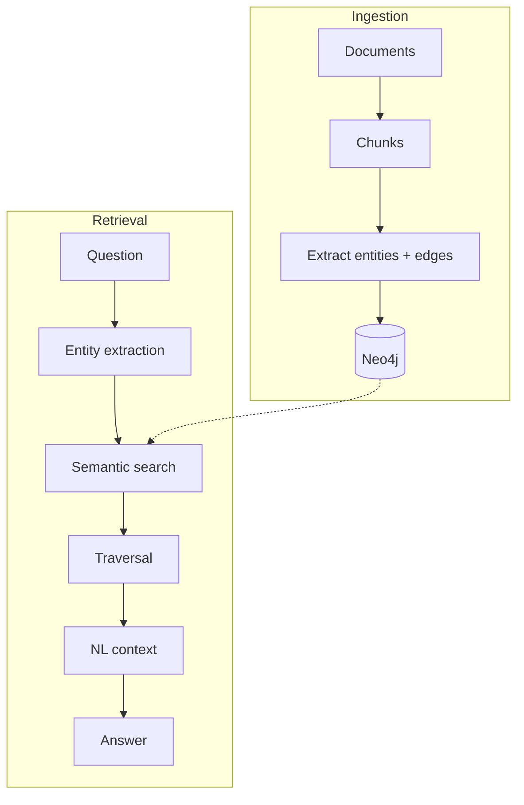

# Graph RAG — Revision Notes

**Stop indexing chunks. Index *entities and the relationships between them*, then answer by walking the graph.**

**Contents**

- [TL;DR](#tldr)
- [1. Where traditional RAG breaks](#1-where-traditional-rag-breaks)
- [2. Graphs — the concept](#2-graphs--the-concept)
- [3. Knowledge graphs and hops](#3-knowledge-graphs-and-hops)
- [4. Graph databases and Cypher](#4-graph-databases-and-cypher)
- [5. Ingestion pipeline](#5-ingestion-pipeline)
- [6. Retrieval pipeline](#6-retrieval-pipeline)
- [7. Traversal — DFS vs BFS](#7-traversal--dfs-vs-bfs)
- [8. Limitations and when to use which](#8-limitations-and-when-to-use-which)
- [9. Code](#9-code)
- [10. Interview one-liners](#10-interview-one-liners)
- [Quick recap](#quick-recap)

---

## TL;DR

| What | Replaces | With | Why it works |
| :--- | :--- | :--- | :--- |
| **Graph RAG** — index entities and relationships, not flat chunks | the vector store as the *only* index | a **property graph** in a graph database, queried by traversal | The answer to a multi-hop question is a **path**, not a passage — so retrieval has to be a graph query |

| The gap | The fix | The two key components | The cost |
| :--- | :--- | :--- | :--- |
| Chunks are embedded **independently of each other** — the relationships between them are never stored | An LLM extracts **entities + relations** per chunk and writes them into a graph | **Nodes** = entities (data) · **Edges** = relationships (connections) | An LLM call **per chunk** at ingestion, plus one per query to write the Cypher |

| Query language | Database | Traversal | Sweet spot |
| :--- | :--- | :--- | :--- |
| **Cypher** — readable, expresses nodes and edges directly | **Neo4j** | **hops** — one step across one edge | **Multi-hop** questions over a **specialised domain** with many interconnected entities |

---

## 1. Where traditional RAG breaks

> **Eg:** *"Which company of Elon Musk has its HQ in Austin?"*

To answer, you must chain two facts:

```
Elon Musk  --OWNS-->  Tesla  --HQ_IN-->  Austin
             hop 1              hop 2
```

Those two facts may live in **different chunks** — and no single chunk contains both. Similarity search returns the *closest* passage, which is not the same as the passage containing a multi-step answer.

| Traditional RAG | Graph RAG |
| :--- | :--- |
| chunk → embed → store; each chunk scored against the query **independently of each other** | chunk → extract **individual entities** and the edges between them → store the connections themselves |
| relationships between chunks are **never represented** | relationships are the *primary* thing represented |

> [!IMPORTANT]
> A vector database stores **vector embeddings**. It does **not** store relationships. That is the entire gap Graph RAG fills.

---

## 2. Graphs — the concept

Graph RAG borrows the **graph** from data structures — an advanced DS whose defining property is *relationships*.

| Component | Is | Holds |
| :--- | :--- | :--- |
| **Nodes** | entities | data — and, in Graph RAG, a vector embedding too |
| **Edges** | connecting points | a **relationship**, plus its **start node** and **end node** |

**A graph = a collection of nodes (entities / data) + a collection of edges (relationships).**

---

## 3. Knowledge graphs and hops

A **knowledge graph** is that structure applied to a real domain — every node a separate data entity, every edge a named relationship:


`Customer` --`buys`--> `Product`, `Product` --`has_brand`--> `Brand`, and so on.

| Term | Meaning |
| :--- | :--- |
| **Hop** | one step across one edge |
| **Graph traversal** | following edges from a starting node outward |
| **Multi-hop query** | a question whose answer needs 2+ hops — exactly what vector databases fail at |

---

## 4. Graph databases and Cypher

| Database | Persists | Also gives you |
| :--- | :--- | :--- |
| **Vector database** | ① your embeddings ② an index | fast approximate similarity search |
| **Graph database** | ① entities ② connections | quick retrieval by *traversal* |

**Neo4j** is the graph database used here. A node is **data-agnostic** — it carries text properties *and* its vector on the same record:

```
Node: Elon Musk
├── name:      "Elon Musk"                ← text property
├── type:      "Person"                   ← entity type
├── source:    "chunk_42"                 ← which chunk it came from
└── embedding: [0.23, 0.81, -0.14, ...]   ← vector stored ON THE SAME NODE
```

**Cypher** is the query language — deliberately readable, because it draws nodes and edges as ASCII:

```cypher
MATCH (a:Actor)-[:ACTED_IN]->(m:Movie)
WHERE m.name = 'Top Gun'
RETURN a.name
```

Read it as a picture: `(ACTOR: Tom Cruise) --ACTED_IN--> (MOVIE: Top Gun)`. Start node = `Actor`, relationship = `ACTED_IN`, end node = `Movie`.

---

## 5. Ingestion pipeline



Steps 1 and 2 are **identical to traditional RAG** — loaders and splitters, unchanged. Step 3 is where it diverges.

**Why an LLM and not a NER model?**

| Approach | Verdict |
| :--- | :--- |
| **NER** (named entity recognition) — text → entities with a type | Finds entities, but **not** the relationships between them |
| **LLM + a specific prompt** | Semantic and **context-aware** — can be asked for both |

The prompt asks for exactly two things: **all the entities** (→ Nodes) and **all the relationships between them** (→ Edges). So per chunk: `chunk + LLM + prompt → entities + relationships → written into Neo4j`. A 5-page PDF split into ~50 chunks means ~50 LLM calls before a single question is asked.

Finally the **embedding model** runs over the entity nodes, so each node carries its own vector — which is what makes step ① of retrieval possible.

---

## 6. Retrieval pipeline



Two mechanisms, in order — **① semantic search finds where to start, ② traversal collects the context**:

```
User query (text)
   ↓
Entity extraction   →  "Elon Musk"  →  embedding vector
   ↓
Semantic search     →  find the [Elon Musk] node in Neo4j     ← ① start node
   ↓
Graph traversal     →  follow edges outward                   ← ② context
   ↓
Context assembly    →  collect nodes + relationships
   ↓
LLM                 →  generate final answer
```

**The LLM sees the graph schema, not the graph.** That is what lets it write valid Cypher:

```
Nodes available:
- Person       (properties: name, description)
- Organization (properties: name, description)
- Location     (properties: name)

Relationships available:
- FOUNDED          (Person → Organization)
- HEADQUARTERED_IN (Organization → Location)
- BORN_IN          (Person → Location)
```

Traversal over two hops returns **triples**, which are flattened into natural-language context:

```
[Elon Musk] --FOUNDED-->     [Tesla]        ⎫
[Elon Musk] --FOUNDED-->     [SpaceX]       ⎬ 1st hop
[Elon Musk] --FOUNDED-->     [xAI]          ⎭
[Tesla]     --LOCATED_IN-->  [Austin]       ⎫ 2nd hop
[SpaceX]    --LOCATED_IN-->  [Hawthorne]    ⎭

↓ NL context handed to the LLM ↓

Elon Musk founded Tesla. Tesla is located in Austin.
Elon Musk founded SpaceX. SpaceX is located in Hawthorne.
Elon Musk founded xAI.
```

The context deliberately includes the **misses** (SpaceX → Hawthorne) as well as the hit — more coverage, and the LLM does the final selection: **Tesla**.

Input is text, output is text — the graph is invisible from the outside.

---

## 7. Traversal — DFS vs BFS

Once you have a start node, *how far and in what order* you walk decides how much context you collect.

| Strategy | Walks | Good for |
| :--- | :--- | :--- |
| **DFS** — depth first search | one branch all the way to a **leaf / end node**, then backtracks | long relationship *chains* |
| **BFS** — breadth first search | the whole **neighbourhood** at hop 1, then hop 2 | "everything related to X" |

More hops → more nodes collected → **context coverage ↑**, and prompt size up with it.

---

## 8. Limitations and when to use which

| Limitation | Why it hurts |
| :--- | :--- |
| **An LLM call per chunk at ingestion** | 50 chunks = 50 API calls — slow and expensive before you ask anything |
| **Extraction quality is not guaranteed** | inaccurate entity/relationship extraction → bad graph → bad context → **worse response** |
| **Two models per entity** | LLM **and** embedding model — latency and cost stack up |
| **Overkill for simple questions** | a plain semantic lookup does not need entity extraction and Cypher generation |

| Use **Graph RAG** when | Use **regular RAG** when |
| :--- | :--- |
| Data has many interconnected entities | Simple Q&A over small documents |
| Questions require **multi-hop** reasoning | Semantic similarity is sufficient |
| Relationships **across documents** matter | Fast, cheap ingestion is a priority |

---

## 9. Code

Two notebooks: [`code/01_ingestion.ipynb`](../code/01_ingestion.ipynb) builds the graph, [`code/02_retrieval.ipynb`](../code/02_retrieval.ipynb) queries it.

<details open>
<summary><b>Ingestion</b> — chunks to knowledge graph</summary>

```python
# temperature=0 ensures deterministic entity and relationship extraction
llm = ChatOpenAI(model="gpt-5-mini", temperature=0)
embeddings = OpenAIEmbeddings(model="text-embedding-3-small")

pages = PyPDFLoader("../documents/elon_musk.pdf").load()

# smaller chunks give the LLM tighter context for entity extraction
splitter = RecursiveCharacterTextSplitter(chunk_size=300, chunk_overlap=50)
chunks = splitter.split_documents(pages)

graph_transformer = LLMGraphTransformer(llm=llm)
graph_docs = graph_transformer.convert_to_graph_documents(chunks)
```

`chunk_size=300` — much smaller than the 900–1500 used elsewhere in this repo. Extraction needs *tight* context per call; a large chunk lets the LLM conflate entities across unrelated sentences.

</details>

<details>
<summary><b>What one chunk actually yields</b></summary>

```
Nodes: ['Elon Musk', 'June 28, 1971', 'Pretoria, South Africa', 'American',
        'Entrepreneur', 'Engineer', "World'S Wealthiest Person"]
Rels:  [('Elon Musk', 'BORN_ON', 'June 28, 1971'),
        ('Elon Musk', 'BORN_IN', 'Pretoria, South Africa'),
        ('Elon Musk', 'HAS_NATIONALITY', 'American'),
        ('Elon Musk', 'HAS_OCCUPATION', 'Entrepreneur'),
        ('Elon Musk', 'RECOGNISED_AS', "World'S Wealthiest Person")]
```

14 chunks from a 2-page PDF produced **18 node labels** and **40+ relationship types** — richer than any flat chunk index could represent.

</details>

<details>
<summary><b>Storing it, plus a vector index on the same graph</b></summary>

```python
# include_source=True links each entity node back to its source Document node,
# which is required for Neo4jVector.from_existing_graph below
graph.add_graph_documents(graph_docs, include_source=True, baseEntityLabel=True)

vector_index = Neo4jVector.from_existing_graph(
    embedding=embeddings,
    index_name="elon_musk_chunks",
    node_label="Document",
    text_node_properties=["text"],
    embedding_node_property="embedding",
)
```

This is the "vectors **and** graph structure in one database" box from the ingestion diagram — the vector index sits over the `Document` nodes, the entity graph over everything else.

</details>

<details>
<summary><b>Retrieval</b> — natural language to Cypher</summary>

```python
graph.refresh_schema()      # gives the chain an accurate view of labels and relationship types

cypher_chain = GraphCypherQAChain.from_llm(
    llm=llm,
    graph=graph,
    verbose=True,                    # prints the generated Cypher — watch the traversal path
    allow_dangerous_requests=True,
    cypher_prompt=_cypher_prompt,
)

response = cypher_chain.invoke({"query": "Where is Spacex HQ located?"})
```

</details>

<details>
<summary><b>Why the custom Cypher prompt exists</b> — three real failure modes</summary>

```
1. When matching multiple relationship types with |, only the FIRST type gets a colon:
   Correct:   (n)-[:TYPE1|TYPE2|TYPE3]->(m)
   Incorrect: (n)-[:TYPE1|:TYPE2|:TYPE3]->(m)

2. Organization and place names are stored title-cased. Always compare case-insensitively:
   Correct:   WHERE toLower(n.id) = toLower("SpaceX")

3. Person names may be stored in partial forms ("Musk" instead of "Elon Musk").
   Always match person names with CONTAINS rather than exact equality:
   Correct:   WHERE toLower(p.id) CONTAINS 'elon' AND toLower(p.id) CONTAINS 'musk'
```

All three come from the same root cause: **the LLM wrote the graph, so the LLM's own naming quirks are baked into the data.** `LLMGraphTransformer` title-cases ids (`SpaceX` → `Spacex`) and abbreviates names inconsistently — so the query side has to be forgiving.

</details>

<details>
<summary><b>The multi-hop questions this exists for</b></summary>

```python
multi_hop_queries = [
    "What product was released by the organisation whose board Elon Musk left?",
    "At which organisation is Elon Musk's partner Shivon Zilis a director?",
    "In which city is the solar energy company that Tesla acquired headquartered?",
]
```

Each one chains 2+ relationships. No single chunk of the source PDF states any of them outright.

</details>

---

## 10. Interview one-liners

**What is Graph RAG, and what does it solve?**
Extract entities and relationships with an LLM, store them as a property graph, answer by traversing it. It solves multi-hop questions: chunks are embedded independently of each other, so the relationships *between* them are never stored — and a multi-hop answer is a path, not a passage.

**What are the two components of a graph?**
Nodes = entities (the data). Edges = relationships (the connections), each with a start node and an end node.

**Why an LLM for extraction instead of NER?**
NER gives you entities but not the relationships between them. An LLM is context-aware and can be prompted for both at once.

**How does retrieval find where to start?**
Semantic search over node embeddings finds the start node; graph traversal from there collects the context. DFS for long chains, BFS for the neighbourhood around an entity.

**Does the LLM see the graph?**
No — it sees the **schema** (available node labels and relationship types) and writes Cypher against it.

**What's the main cost?**
One LLM call per chunk at ingestion, plus one per query to write the Cypher — and if extraction quality is poor, the whole graph is poor.

**When would you *not* use it?**
Simple Q&A over small documents where semantic similarity is enough, or when fast cheap ingestion matters more than multi-hop reasoning.

---

## Quick recap



- **The failure:** multi-hop questions — the answer spans chunks, so no single passage contains it
- **Graph:** ① **Nodes** = entities ② **Edges** = relationships. A knowledge graph is that, applied to a domain
- **Ingestion:** loaders and splitters unchanged → **LLM extracts entities + relations per chunk** → Neo4j; embeddings live on the nodes
- **Retrieval:** ① semantic search → **start node** ② **traversal** → context. The LLM writes **Cypher** from the **schema**
- **Hops:** one edge each; DFS for chains, BFS for neighbourhoods; more hops = more coverage
- **Cost:** an LLM call per chunk, plus one per query — and bad extraction poisons everything downstream
- **Use it when:** interconnected entities, multi-hop reasoning, relationships across documents. Otherwise use regular RAG
