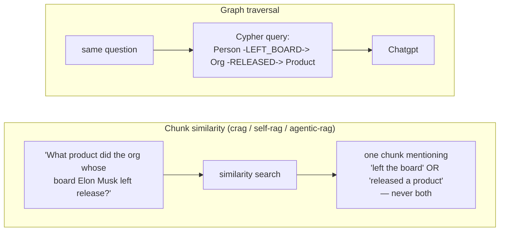
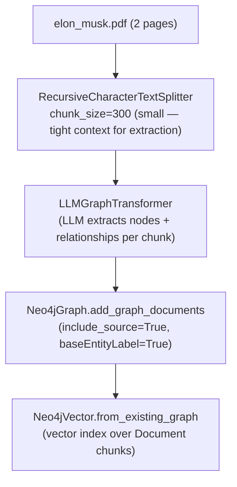
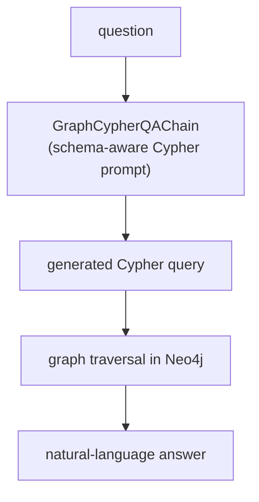

# Graph RAG — Visual Revision Notes

> Built from `graph-rag/code/01_ingestion.ipynb` → `02_retrieval.ipynb`
> Setup required first: [`../SETUP.md`](../SETUP.md) (free Neo4j AuraDB instance)
> Companion: open [`process.html`](./process.html) in a browser for the fully styled version.

---

## 1. Why Graph RAG? (one picture)

Every other technique in this repo indexes **chunks** and retrieves by similarity. That's great when the answer lives entirely inside one passage. It falls apart on **multi-hop** questions — where the answer requires chaining two or three separate facts that never appear together in any single chunk.



- **Chunk similarity:** finds the passage that's semantically *closest* to the question — but "closest passage" isn't the same as "passage containing the multi-step answer."
- **Graph traversal:** the answer is a *path* through the graph, not a single passage — so the retrieval mechanism itself has to be a graph query, not a similarity search.

---

## 2. The two-stage pipeline

| Stage               | What it does                                                                                                                         | Notebook               |
| ------------------- | ------------------------------------------------------------------------------------------------------------------------------------ | ---------------------- |
| **Ingestion** | PDF → chunks → LLM extracts entities/relationships → stored as a Neo4j property graph, plus a vector index over the source chunks | `01_ingestion.ipynb` |
| **Retrieval** | Natural-language question → LLM generates a **Cypher** query against the graph schema → traversal → answer                 | `02_retrieval.ipynb` |

---

## 3. Ingestion — PDF to knowledge graph



Real extraction, from the very first chunk (`self_rag`-style spot check):

```python
graph_transformer = LLMGraphTransformer(llm=llm)
graph_docs = graph_transformer.convert_to_graph_documents(chunks)
```

```
Nodes: ['Elon Musk', 'June 28, 1971', 'Pretoria, South Africa', 'American', 'Entrepreneur', 'Engineer', "World'S Wealthiest Person"]
Rels:  [('Elon Musk', 'BORN_ON', 'June 28, 1971'),
        ('Elon Musk', 'BORN_IN', 'Pretoria, South Africa'),
        ('Elon Musk', 'HAS_NATIONALITY', 'American'),
        ('Elon Musk', 'HAS_OCCUPATION', 'Entrepreneur'),
        ('Elon Musk', 'HAS_OCCUPATION', 'Engineer'),
        ('Elon Musk', 'RECOGNISED_AS', "World'S Wealthiest Person")]
```

From 14 chunks (2 pages), the full graph ended up with **18 node labels** (`Person`, `Organization`, `Company`, `Product`, `Location`, `Date`...) and **40+ relationship types** (`FOUNDER`, `CEO`, `ACQUIRED`, `HEADQUARTERED_IN`, `SPOUSE`, `SIBLING`, `LEFT_BOARD`...) — far richer than a flat chunk index could represent.

**Why `chunk_size=300` here vs. 900 elsewhere in this repo?** Entity/relationship extraction needs *tight*, focused context per LLM call — a small chunk keeps the extraction accurate; a large chunk risks the LLM missing or conflating entities across unrelated sentences.

---

## 4. Retrieval — natural language → Cypher → traversal



The Cypher-generation prompt is hand-tuned with rules the model kept getting wrong by default — worth knowing as real-world graph RAG gotchas, not just theory:

| Rule                                                                             | Why it's needed                                                                                                          |
| -------------------------------------------------------------------------------- | ------------------------------------------------------------------------------------------------------------------------ |
| `[:TYPE1\|TYPE2]` — colon only on the *first* type in a union                | Neo4j 5+ syntax; a colon before every type is a syntax error                                                             |
| `MATCH (n:Organization\|Company)` for label unions                              | Extraction sometimes labels the same kind of entity inconsistently                                                       |
| `WHERE toLower(n.id) = toLower("SpaceX")`                                      | `LLMGraphTransformer` title-cases node ids ("SpaceX" → "Spacex") — exact-case match silently returns nothing         |
| `WHERE toLower(p.id) CONTAINS 'elon' AND ... CONTAINS 'musk'` for person names | names get stored in partial/abbreviated forms across different chunks ("Musk" vs "Elon Musk") — exact match misses rows |

---

## 5. Real queries — single-hop vs. multi-hop

**Single-hop** (one relationship):

> **Q:** "Where is SpaceX HQ located?"
> **Cypher:** `MATCH (o:Organization|Company)-[:HEADQUARTERED_IN]->(loc:Location) WHERE toLower(o.id)=toLower("SpaceX") RETURN DISTINCT loc.id`
> **A:** SpaceX HQ is located in Hawthorne, California, United States.

**Multi-hop** (2+ relationships chained — this is what graph RAG is actually for):

| Question                                                                       | Path traversed                                           | Answer                               |
| ------------------------------------------------------------------------------ | -------------------------------------------------------- | ------------------------------------ |
| "What product was released by the organisation whose board Elon Musk left?"    | `Person -[LEFT_BOARD]-> Org -[RELEASED]-> Product`     | Chatgpt                              |
| "At which organisation is Elon Musk's partner Shivon Zilis a director?"        | `Person -[PARTNER]- Person -[DIRECTOR]-> Org`          | Neuralink                            |
| "In which city is the solar energy company that Tesla acquired headquartered?" | `Org -[ACQUIRED]-> Org -[HEADQUARTERED_IN]-> Location` | San Mateo, California, United States |

None of these three answers exist as a single sentence anywhere in the source PDF — each one required the graph to connect two facts that were stated in entirely different chunks.

---

## 6. Build progression

| # | Notebook               | What it does                                                                                                                  |
| - | ---------------------- | ----------------------------------------------------------------------------------------------------------------------------- |
| 1 | `01_ingestion.ipynb` | Load PDF → chunk small → extract entities/relationships → store in Neo4j → build a vector index over source chunks        |
| 2 | `02_retrieval.ipynb` | `graph.refresh_schema()` → schema-aware Cypher-generation prompt → `GraphCypherQAChain` → single-hop and multi-hop Q&A |

Setup dependency: unlike every other technique in this repo (which only need an OpenAI key), Graph RAG requires a running **Neo4j AuraDB** instance — see [`../SETUP.md`](../SETUP.md). Running `02_retrieval.ipynb` before `01_ingestion.ipynb` returns an empty graph and no useful answers.

---

## 7. Glossary

| Term                                          | Meaning                                                                                                          |
| --------------------------------------------- | ---------------------------------------------------------------------------------------------------------------- |
| **`LLMGraphTransformer`**             | LangChain component that extracts`(entity, relation, entity)` triples from text chunks via an LLM              |
| **`Neo4jGraph`**                      | connection wrapper for storing/querying the extracted graph in Neo4j                                             |
| **`include_source=True`**             | links each extracted entity back to the`Document` chunk it came from, needed for the vector index step         |
| **`Neo4jVector.from_existing_graph`** | builds a vector index over the`Document` nodes, so the same graph can also be searched by similarity if needed |
| **`GraphCypherQAChain`**              | the retrieval chain: question → generated Cypher → execute → natural-language answer                          |
| **multi-hop question**                  | a question whose answer requires traversing 2+ relationships, none of which co-occur in a single source passage  |

---

## 8. Self-test

- **Why does chunk-similarity retrieval fail on the "board → product" question?** → the sentence about Musk leaving the board and the sentence about the product release are in different, unrelated chunks — no single chunk's embedding is close to the full question, so similarity search can't surface "the answer" because no chunk *contains* the answer.
- **Why title-case and CONTAINS matching in the Cypher prompt, instead of exact match?** → `LLMGraphTransformer` normalizes entity ids inconsistently across extraction calls (case, partial names) — the query layer has to compensate for that, or real matches get silently missed.
- **Why build a vector index over `Document` nodes too, if the retrieval chain uses Cypher?** → keeps the option open for hybrid retrieval (similarity search for open-ended questions, graph traversal for multi-hop ones) from the same ingested data — this build only exercises the Cypher path, but the index is there.
- **How is this different from Microsoft's "GraphRAG" (community summaries)?** → that variant clusters the graph and summarizes each cluster, aimed at *global* thematic questions ("what are the themes in this corpus?"). This build instead traverses the raw graph directly per-question, aimed at *multi-hop factual* questions. Same "build a graph first" instinct, different downstream use.

---

## 9. One-line recall

> Extract entities and relationships from the corpus into a real graph (Neo4j), then answer questions by having an LLM write a Cypher traversal instead of doing a similarity search — because some answers are a path through several facts, not a single passage.
