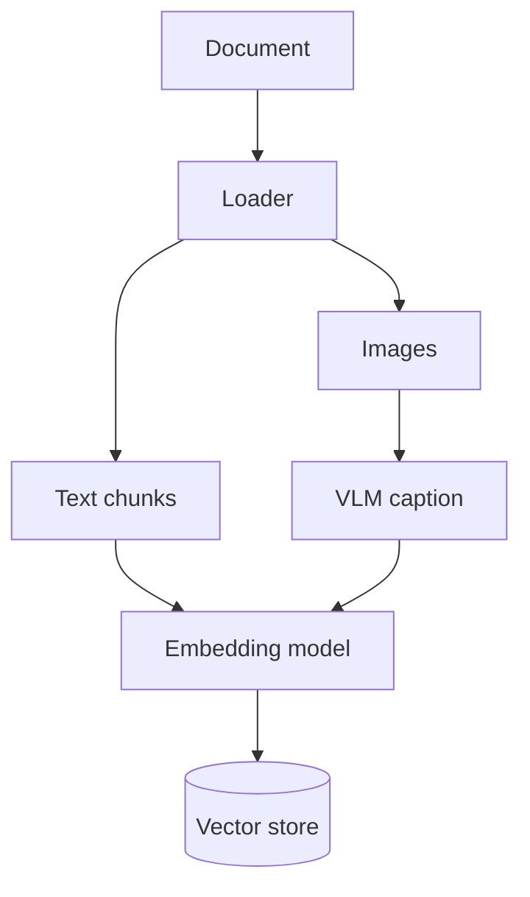
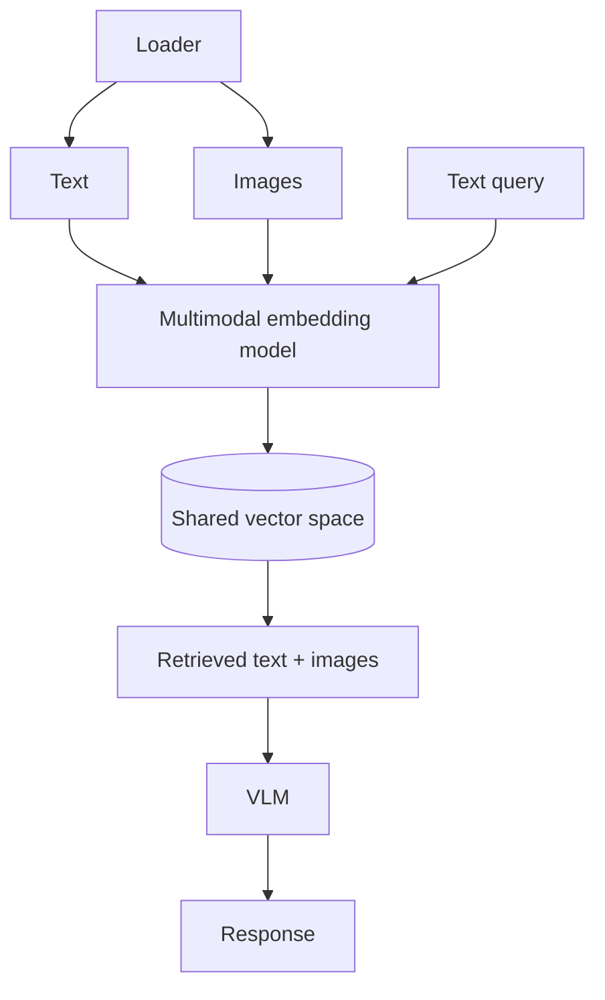
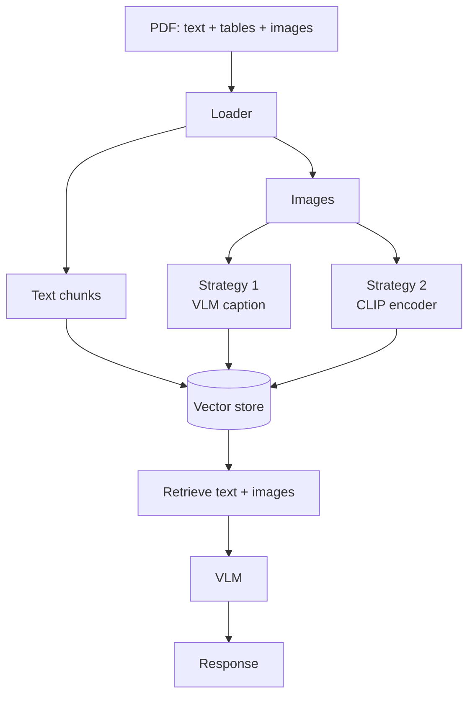

# Multi-Modal RAG — Revision Notes

**A PDF isn't text. It's text *and* tables *and* charts — and a text-only pipeline silently throws two of those away.**

**Contents**

- [TL;DR](#tldr)
- [1. Why OCR doesn't fix it](#1-why-ocr-doesnt-fix-it)
- [2. The two problems to solve](#2-the-two-problems-to-solve)
- [3. Strategy 1 — image to text](#3-strategy-1--image-to-text)
- [4. Strategy 2 — multimodal embeddings](#4-strategy-2--multimodal-embeddings)
- [5. CLIP](#5-clip)
- [6. Contrastive learning](#6-contrastive-learning)
- [7. Code](#7-code)
- [8. Interview one-liners](#8-interview-one-liners)
- [Quick recap](#quick-recap)

---

## TL;DR

| What | The gap in naïve RAG | The two fixes | Which wins |
| :--- | :--- | :--- | :--- |
| **Multi-Modal RAG** — retrieve over text **and** images from the same document | Loaders extract text and drop images and tables; embedding models can't encode a picture | **① image → text** (VLM captions it) or **② multimodal embeddings** (one shared vector space) | ② is more accurate and production-grade; ① is simpler and more common |

| CLIP | Trained on | Trained how | Result |
| :--- | :--- | :--- | :--- |
| **C**ontrastive **L**anguage–**I**mage **P**re-training | **400M** image–caption pairs | **contrastive loss** — pull matching pairs together, push mismatched ones apart | a query string and a matching image land near each other in one shared space |

---

## 1. Why OCR doesn't fix it

Base RAG assumes **text in, text out**. A real PDF is text **+ tables + images**, and the answer often lives in a chart no chunk describes.

The obvious move — OCR the image and treat the result as text — doesn't work. Take a bar chart of city populations:

```
3   1.3   0.7   4   Mumbai   Delhi   Guwahati   Surat
```

| What OCR gives you | What's gone |
| :--- | :--- |
| labels and numbers, as a flat string | **structure** — which number belongs to which city |
| every visible character | **format** — that it was a bar chart at all |
| — | **context** — what is being measured, and the trend it shows |

An image is **lines, curves, colour and text** together. OCR keeps only the last one. Tables fail the same way: a grid flattened into word soup, and the row/column relationship — the entire point of a table — is lost.

---

## 2. The two problems to solve

Text becomes a **dense vector** with a fixed dimensionality. An image is **binary data** with a resolution — a collection of RGB pixels. Not the same kind of object, and that breaks the pipeline in two separate places:

| # | Problem | Why |
| :--- | :--- | :--- |
| ① | **Representational** | An ordinary embedding model has no way to turn an image into a meaning vector. Feed it the file path and you embed a *string*, not a picture |
| ② | **Retrieval** | Text vectors carry semantic meaning; image vectors carry visual properties — **different dimensionality, different features, not comparable** |

Both strategies below are just different answers to those two questions.

---

## 3. Strategy 1 — image to text

Convert the image into a **detailed text description** with a vision-capable model, then run an ordinary text pipeline over it.



Because the caption *is* text, the representational problem disappears and similarity search never changes.

The loader emits two kinds of chunk:

| Chunk type | `page_content` | Metadata |
| :--- | :--- | :--- |
| **Text based** | the text itself | source, page no, section |
| **Image based** | the **VLM caption** | source, page no, **path to the original image** |

That image path is the critical piece — it's how you get the *real* picture back at generation time:

```
Prompt = ① query  +  ② retrieved text  +  ③ retrieved image (loaded from its stored path)
                                    ↓
                                   VLM  →  Response
```

> [!IMPORTANT]
> The caption is what gets **searched**. The original image is what gets **sent to the model**. Retrieval and generation use different representations of the same thing.

**Two changes from base RAG:** ① input — image → text via a VLM at ingestion; ② generation — the final model receives text **and** images, so it must be a VLM.

**Bottlenecks:**

| Bottleneck | Why it hurts |
| :--- | :--- |
| **The VLM itself** | accurate *and* affordable is a trade-off, and you pay per image — 100 images = 100 detailed descriptions |
| **Hallucination** | asked to describe a bar chart, the model can invent values or miss them. The caption is text about an image, and text hallucinates |
| **The system prompt** | a weak instruction gives a vague description → a poor chunk → never retrieved. Human error, baked into the index |

---

## 4. Strategy 2 — multimodal embeddings

Skip the VLM at ingestion. Use a model that embeds **images directly**, into the **same space** as the text.



| | Strategy 1 | Strategy 2 |
| :--- | :--- | :--- |
| Representational problem | solved by converting to text | solved by a **specialised image encoder** |
| Retrieval problem | never arises — all text | solved: **same dimensionality, same features** |
| Cost at ingestion | one **LLM call per image** | one cheap **encoder pass** per item |
| Information loss | whatever the caption missed | none — the image itself is the vector |
| In practice | more common, less accurate | **more accurate, production-grade** |

Generation is identical to Strategy 1: query + retrieved text + retrieved images → VLM.

---

## 5. CLIP

**C**ontrastive **L**anguage–**I**mage **P**re-training — the model that makes the shared space possible. Think of it as a **translator**: French and German both map into English so two sentences become comparable; CLIP does that for *modalities*.

| Property | Value |
| :--- | :--- |
| Training data | **~400M image–caption pairs** |
| Architecture | **two encoders** — one for images, one for text |
| Objective | a **contrastive loss** that pulls real pairs together and pushes mismatched pairs apart |
| Output | one vector per input, **same dimensionality** whichever modality went in |

A training pair is just an image and its short description — `[photo of a golden retriever playing fetch]` ↔ `"a golden retriever playing fetch in a park"`. The payoff, once trained:

```
"a dog playing outside"     →  [0.21, -0.54,  0.87, ...]  ⎫
[golden retriever image]    →  [0.23, -0.51,  0.85, ...]  ⎭ very close

"quarterly revenue chart"   →  [0.91,  0.12, -0.33, ...]    far from the dog vectors
```

A **string** and a **picture** land next to each other. That's the whole point.

```
At ingestion:  PDF page with a revenue chart image
                 → CLIP image encoder
                 → vector stored in the vector DB (with a pointer to the image)

At query time: "What were the Q3 revenue trends?"
                 → CLIP text encoder → query vector
                 → cosine similarity against all stored vectors
                 → retrieves the revenue chart image (their vectors are close)
                 → passes image + query to a vision LLM for the final answer
```

---

## 6. Contrastive learning

How the two encoders learn to agree. Two forces pulling in opposite directions:

| Force | Pair | Goal |
| :--- | :--- | :--- |
| **Attractive** | Image *dog* ↔ Caption *dog* | similarity **↑** |
| **Repulsive** | Image *building* ↔ Caption *dog* | similarity **↓** — as far apart as possible |

**The similarity matrix.** Take a batch of N pairs, encode all images and all captions, compute cosine similarity for every combination — an **N×N** matrix. For 4 pairs, 16 similarities:

```
              T1     T2      T3     T4
            (dog) (chart)  (mtn)  (cat)
I1 (dog)   [ 0.98   0.05   0.02   0.81 ]
I2 (chart) [ 0.06   0.97   0.08   0.04 ]
I3 (mtn)   [ 0.03   0.07   0.96   0.05 ]
I4 (cat)   [ 0.79   0.03   0.04   0.97 ]
```

The objective reads straight off it:

- **Diagonal scores should approach 1** — the true pairs (attractive)
- **Off-diagonal scores should not** — the mismatches (repulsive)

Which is exactly **multi-class classification**, so the loss is **categorical cross-entropy**: for each row, the correct class is its own diagonal column.

> [!IMPORTANT]
> **Why the repulsive half is mandatory.** With only the attractive term the model can cheat: map *everything* to the same vector, say `[0,0,0,0,0]`. Every pair scores a perfect 1 and the loss is zero, but the embeddings carry no information. That's **representational collapse** — the repulsive term is what prevents it.

**Symmetric contrastive learning.** The loss is applied both ways — image→text *and* text→image. That symmetry is why you can ingest an **image** and retrieve it later with **text**, which is precisely what Multi-Modal RAG needs.

---

## 7. Code

Two notebooks, one per strategy, both over the same `crag_paper.pdf`: [`code/strategy1_text_conversion.ipynb`](../code/strategy1_text_conversion.ipynb) and [`code/strategy2_multimodal_embeddings.ipynb`](../code/strategy2_multimodal_embeddings.ipynb).

<details open>
<summary><b>Loading</b> — one loader, both strategies</summary>

```python
loader = UnstructuredLoader(
    PDF_PATH,
    mode="elements",           # one Document per structural element, not per page
    strategy="hi_res",         # layout-aware — needed to detect images at all
    extract_images_in_pdf=True,
)
elements = loader.load()
```

`mode="elements"` gives each element a `category` (`Title`, `NarrativeText`, `Table`, `Image`) — every later step filters on it. `hi_res` needs **poppler** and **tesseract** at OS level (see [`additional_dependencies_installation_steps.md`](../code/additional_dependencies_installation_steps.md)).

</details>

<details>
<summary><b>Strategy 1</b> — captioning, and keeping the path</summary>

```python
IMAGE_CAPTION_SYSTEM_PROMPT = """...These descriptions will be embedded into a vector
store and used for semantic retrieval, so they must capture all information a user
might search for.

For each image, describe:
- The image type (chart, diagram, photograph, table, illustration, screenshot, etc.)
- All visible text, labels, titles, captions, and annotations
- Key data, values, trends, or patterns (especially for charts and graphs)
..."""

for el in elements:
    if el.metadata.get("category") == "Image":
        caption = caption_image(el.metadata["image_path"])
        image_docs.append(Document(page_content=caption, metadata=el.metadata))
```

This prompt **is** the third bottleneck from §3 — it names every axis a user might search on, because anything it omits becomes unsearchable. `page_content` is the caption (embedded and searched); `metadata["image_path"]` keeps the pointer to the real file, reloaded at generation time.

</details>

<details>
<summary><b>Strategy 2</b> — CLIP embeddings, images added directly</summary>

```python
clip_embeddings = OpenCLIPEmbeddings(model_name="ViT-B-32", checkpoint="laion2b_s34b_b79k")

store = Chroma(embedding_function=clip_embeddings, collection_name="multimodal")
store.add_documents(filter_complex_metadata(text_docs))      # text  → CLIP text encoder
store.add_images(uris=image_uris, metadatas=image_metadatas) # image → CLIP image encoder
```

No VLM, no captions. Both calls write into the **same collection** because both encoders emit the same-shaped vector — the shared space from §5, in two lines. Note `add_images` stores the **URI as `page_content`**, so retrieval reads the path from there rather than from metadata.

</details>

<details>
<summary><b>Both</b> — assembling a multimodal prompt</summary>

```python
def build_messages(inputs):
    docs, question = inputs["docs"], inputs["question"]

    text_chunks  = [d for d in docs if d.metadata.get("category") != "Image"]
    image_chunks = [d for d in docs if d.metadata.get("category") == "Image"]

    text_context = "\n\n".join(d.page_content for d in text_chunks)

    content = [{"type": "text", "text": f"...context:\n\n{text_context}\n\nQuestion: {question}"}]
    for doc in image_chunks:                       # deduped by path
        content.append({"type": "image_url",
                        "image_url": {"url": f"data:image/jpeg;base64,{encode_image(path)}"}})

    return [HumanMessage(content=content)]
```

The retrieved set is **split by `category`**, text joined into the prompt, images base64-inlined alongside — a single `HumanMessage` carrying both modalities. Both notebooks dedupe by path, since several chunks can point at the same figure.

</details>

<details>
<summary><b>The questions both notebooks are tested with</b></summary>

```python
"How does Self-CRAG compare with Self-RAG as shown in the line chart?"
"Computational requirements of CRAG vs Self-RAG — which has faster execution
 time, and can you give me the actual TFLOPS values?"
```

Both answers live **only in figures** of the CRAG paper — a line chart and a table. A text-only pipeline cannot answer either, which is the whole demonstration.

</details>

---

## 8. Interview one-liners

**What is Multi-Modal RAG?**
RAG where the knowledge base holds images as well as text, so retrieval can return a chart or diagram and the generator can actually look at it.

**Why not just OCR the images?**
OCR returns the characters and throws away structure, format and context. A bar chart becomes a list of loose numbers and city names with nothing tying them together.

**What are the two problems it has to solve?**
Representational — an embedding model can't encode an image. Retrieval — even with image vectors, they aren't comparable to text vectors.

**What are the two strategies, and which is better?**
① Convert images to text with a VLM and run a normal text pipeline — simpler, more common, costs an LLM call per image and can hallucinate. ② Use a multimodal embedding model so both modalities share one vector space — more accurate, production-grade.

**In strategy 1, what gets stored?**
The caption is the `page_content` that gets embedded and searched; the path to the original image lives in metadata and is reloaded at generation time.

**What is CLIP, and how is it trained?**
Contrastive Language–Image Pre-training — two encoders trained on ~400M image–caption pairs. Attractive force pulls matching pairs together, repulsive pushes mismatched ones apart. On the N×N similarity matrix, diagonal scores should approach 1 and off-diagonal ones should not — categorical cross-entropy per row.

**Why is the repulsive term necessary?**
Without it the model maps everything to the same vector, scoring a perfect 1 on every pair while carrying zero information. That's representational collapse.

**Why symmetric?**
The loss is applied image→text *and* text→image, which is what lets you ingest an image and retrieve it later with a text query.

---

## Quick recap



- **The gap:** naïve RAG extracts text and drops tables and images — the answer often lives in a chart
- **OCR is not the fix:** it keeps characters, loses structure, format and context
- **Two problems:** ① **representational** — can't embed an image ② **retrieval** — text and image vectors aren't comparable
- **Strategy 1:** image → **VLM caption** → embed the text. Simple, common, less accurate
- **Strategy 2:** a **multimodal embedding model** puts both in one space. More accurate, production-grade
- **CLIP:** 400M pairs, two encoders, contrastive loss → a string and a picture land next to each other
- **Contrastive learning:** attractive on the diagonal, repulsive off it; without the repulsive half you get **representational collapse**
- **Always:** extract images and text **separately** (never OCR), keep the **image path in metadata**, generate with a **VLM**, and return a fallback message when nothing relevant is retrieved
