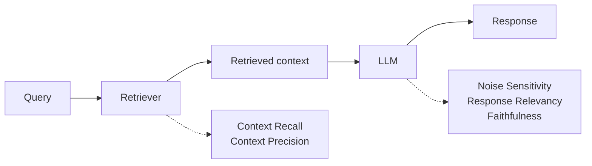

# RAGAS — Revision Notes

**RAG Assessment. You can't tune what you can't measure — so score the retriever and the generator *separately*.**

**Contents**

- [TL;DR](#tldr)
- [1. Why evaluate at all](#1-why-evaluate-at-all)
- [2. How metrics are classified](#2-how-metrics-are-classified)
- [3. LLM as a Judge](#3-llm-as-a-judge)
- [4. Key terminology](#4-key-terminology)
- [5. The five metrics](#5-the-five-metrics)
- [6. Context Recall](#6-context-recall)
- [7. Context Precision](#7-context-precision)
- [8. Noise Sensitivity](#8-noise-sensitivity)
- [9. Response Relevancy](#9-response-relevancy)
- [10. Faithfulness](#10-faithfulness)
- [11. Code](#11-code)
- [12. Interview one-liners](#12-interview-one-liners)
- [Quick recap](#quick-recap)

---

## TL;DR

| What | Why | The unit of blame | The output |
| :--- | :--- | :--- | :--- |
| **RAGAS** — RAG Assessment | A RAG pipeline has dozens of knobs (chunk size, top-k, embedding model, prompt). Without a score, tuning is guesswork | **Two components, two failure modes** — retriever failure vs generator failure | a number per metric, so you can measure the **delta** after each change |

| Metric | Targets | Question it answers | Good score |
| :--- | :--- | :--- | :--- |
| **Context Recall** | retriever | Did we fetch **everything** needed? | high |
| **Context Precision** | retriever | Are the relevant chunks **ranked at the top**? | high |
| **Noise Sensitivity** | LLM | Did the LLM get **misled by irrelevant** chunks? | **low** |
| **Response Relevancy** | LLM | Does the answer actually **address the question**? | high |
| **Faithfulness** | LLM | Is every claim **traceable to the context**? (hallucination check) | high |

---

## 1. Why evaluate at all

Accuracy leaks at *every* stage, and each stage has parameters you could have set differently:

| Phase | Step | Knobs |
| :--- | :--- | :--- |
| **Ingestion** | chunking | strategy, chunk size, chunk overlap |
| | embeddings | provider, output dimensions |
| | vector DB | provider, indexing |
| **Retrieval** | retriever | search strategy, search parameters |
| | LLM | provider, parameters, prompt template |

Two components carry all of it, so there are exactly **two failure modes**:

| Failure | Means |
| :--- | :--- |
| **Retriever failure** | the right chunks never made it into the context |
| **Generator failure** | the chunks were fine, the LLM mishandled them |

A metric turns "it feels better" into a **delta** you can act on. Metrics are the **guiding compass** for experimentation — change one component, re-score, keep the change or revert it.

---

## 2. How metrics are classified

**By what they see:**

| Type | How it works | Verdict |
| :--- | :--- | :--- |
| **End-to-end** | treats the pipeline as a **black box** — query in, response out, one score | Tells you *that* it broke, not *where* |
| **Component-based** | tests the **retriever** and the **LLM** separately | This is what RAG evaluation uses |
| **Business metrics** | revenue, engagement, etc. | out of scope here |

**By output type:** discrete (pass/fail, a category) · numerical (int/float in a range — supports statistical analysis) · ranked (a ranked list).

**By turns:** **single-turn** (input → processing → output — a RAG pipeline is query → response) vs **multi-turn** (agentic systems, a ReAct loop, conversational).

So a RAG pipeline is evaluated with **component-based, single-turn** metrics. **Quality matters over quantity** — a few well-chosen metrics beat a dashboard of twenty.

---

## 3. LLM as a Judge

The last axis: **LLM-based vs non-LLM-based** metrics.

| | Non-LLM based | LLM based |
| :--- | :--- | :--- |
| Compares by | **keyword matching** | **semantic meaning** and intent |
| Accuracy | lower | higher |
| Cost | free | **API calls** — cost and latency per sample |

Why keyword matching isn't enough — the model has to understand that these mean different things, and that only one is correct:

```
Response:          "The capital of India is Mumbai"
Grounded response: "The capital of India is New Delhi"
```

So RAGAS hands the **response**, the **grounded response**, the **query** and the **context** to an LLM acting as a **judge**, and the judge returns a score.

| Component | Answer key |
| :--- | :--- |
| Retriever | the **correct retrieved docs** (`reference_contexts`) |
| LLM | the **correct response** (`reference`) |

---

## 4. Key terminology

| # | Term | Is |
| :--- | :--- | :--- |
| 1 | **sample** | one row — a single test query run through the RAG pipeline |
| 2 | **user_input** | the query |
| 3 | **retrieved_contexts** | `list[str]` — the chunks the retriever returned |
| 4 | **response** | what the pipeline output |
| 5 | **reference** | the **answer key** — the grounded response |
| 6 | **reference_contexts** | the grounded **context** — the answer key for the *retriever* |
| 7 | **Evaluation Dataset** | all the samples together — the RAG equivalent of a validation set |
| 8 | **Experiments** | one run with one configuration, e.g. `retriever k=3` + `LLM temperature=0.7`. Vary them and compare scores |

---

## 5. The five metrics

What each component has to get right, and the metric that checks it:

| Component | Requirement | Metric |
| :--- | :--- | :--- |
| **Retriever** | retrieved context is **complete** | **Context Recall** |
| | relevant chunks are **ranked first** (context = fact **+** noise) | **Context Precision** |
| **LLM** | response is **robust** to the noise | **Noise Sensitivity** |
| | response is **useful** for the query | **Response Relevancy** |
| | response is **grounded** — no hallucinations | **Faithfulness** |

Every one of them scores in **[0, 1]**.

---

## 6. Context Recall

> Did the retriever fetch **all the information needed** to answer correctly? A completeness check — did it *miss* anything important?

```
                 claims in `reference` that are supported by the retrieved context
Context Recall = ─────────────────────────────────────────────────────────────────
                              total claims in `reference`
```

**Worked example.** Query: *"Tell me about the Eiffel Tower."*

Reference (ground truth) broken into claims:

| Claim | | Found in retrieved context? |
| :--- | :--- | :--- |
| C1 | The Eiffel Tower is located in Paris | Yes — chunk 1 |
| C2 | It was built in 1889 | Yes — chunk 2 |
| C3 | It is 330 metres tall | No |
| C4 | It was designed by Gustave Eiffel | No |

```
Context Recall = 2 / 4 = 0.5
```

**How the judge does it:** ① an LLM extracts every fact from the grounded response ② each is checked against the retrieved context ③ count the supported ones.

| Low score means | High score means |
| :--- | :--- |
| the retriever is **missing important chunks** | it's fetching everything needed for a complete answer |
| the LLM is then forced to **hallucinate or answer incompletely** — through no fault of its own | whether the LLM *uses* it well is then the generation metrics' problem |
| likely causes: chunk size too small, **top-k too low**, embedding model too weak | |

> Same shape as ML recall — `TP / (TP + FN)` — this is **coverage**. Raising `k` raises recall.

---

## 7. Context Precision

> Are the relevant chunks **ranked higher** in the retrieved list? Not *whether* the right chunks came back — *where* they appear.

```
                        Σ (Precision@k × v_k)   for k = 1..K
Context Precision@K = ───────────────────────────────────────
                       total number of relevant chunks in top K

                       true positives@k
      Precision@k = ─────────────────────────      v_k = 1 if chunk k is relevant, else 0
                    true positives@k + false positives@k
```

**Worked example.** Query: *"What is the capital of France?"*, `k = 5`:

| Position | Chunk | Relevant (`v_k`) |
| :--- | :--- | :--- |
| 1 | "Paris is the capital of France." | 1 |
| 2 | "France is famous for its cuisine." | 0 |
| 3 | "The Eiffel Tower is in Paris." | 1 |
| 4 | "France joined the EU in 1993." | 0 |
| 5 | "Paris has a population of 2 million." | 1 |

```
P@1 = 1/1 × 1 = 1        P@4 = 0 (v_4 = 0)
P@2 = 1/2 × 0 = 0        P@5 = 3/5 × 1 = 0.6
P@3 = 2/3 × 1 = 0.67

Context Precision@5 = (1 + 0.67 + 0.6) / 3 = 2.27 / 3 = 0.756
```

Note the denominator is **3** — the number of *relevant* chunks, not `k`. Irrelevant positions contribute a zero to the numerator and nothing to the denominator.

**Reorder the same five chunks** so all three relevant ones come first, and every term becomes 1:

```
Context Precision@5 = (1 + 1 + 1) / 3 = 1
```

Same chunks. Same recall. Different **ranking** — that's the entire metric.

| Low score means | High score means |
| :--- | :--- |
| relevant chunks are being **buried behind irrelevant ones** | the retriever prioritises the best chunks at the top |
| the LLM sees **noise before signal** | the LLM gets the best context first |
| fix: tune similarity search, add a **re-ranker**, or change the embedding model | |

---

## 8. Noise Sensitivity

> How much is the LLM **misled by irrelevant chunks**? A robustness check on the generator. **Lower is better** — this is the one metric where 0 is the goal.

```
                    incorrect claims in the response attributable to noise
Noise Sensitivity = ─────────────────────────────────────────────────────
                              total claims in the response
```

**Worked example.** Query: *"When was the Eiffel Tower built and how tall is it?"*

| Chunk | Type |
| :--- | :--- |
| "The Eiffel Tower was completed in 1889." | relevant |
| "The Eiffel Tower stands 330 metres tall." | relevant |
| "The Louvre Museum attracts 9 million visitors per year." | noise |
| "The Arc de Triomphe is 50 metres tall." | noise |

Response: *"The Eiffel Tower was built in 1889. It stands 330 metres tall. It attracts 9 million visitors per year. It is 50 metres tall."*

Four claims; the last two were dragged in **from the noise chunks**:

```
Noise Sensitivity = 2 / 4 = 0.5
```

Half the response is built from noise.

**How the judge does it:** ① extract the facts from the grounded response ② match retrieved docs against them — matching = useful, non-matching = **noisy** ③ count how many of the response's claims trace back to the noisy ones.

| High score means (bad) | Low score means (good) |
| :--- | :--- |
| the retriever is bringing in too many irrelevant chunks, **or** the LLM isn't robust enough to ignore them, **or both** | the LLM distinguishes relevant from irrelevant — even when the retriever brings noise, it isn't misled |

> A robust LLM performs **knowledge filtration**: takes query + context, keeps the useful information, **discards the noisy** parts.

---

## 9. Response Relevancy

> Does the generated response **actually address the question**? On-topic and direct — **not** whether it's factually correct.

The trick is **reverse engineering**: give the response to an LLM and ask it to write the questions this response *would* answer. Then compare those to the real query.

```
                       1   N
Response Relevancy =  ─── Σ  cos(e_gi , e_o)
                       N  i=1

e_gi = embedding of generated question i        e_o = embedding of the original query
```

Typically N = 3: three hypothetical questions → embed each → cosine similarity against the original query's embedding → **mean**.

**Worked example.** Query: *"What is the capital of France?"*

**Good response** — *"Paris is the capital of France. It is also the largest city in the country."*

```
Q1: "What is the capital city of France?"
Q2: "Which city serves as France's capital?"
Q3: "What is the largest and capital city of France?"        → high average similarity
```

**Poor response** — *"France is a country in Western Europe. It is known for its wine, cheese, and the Eiffel Tower. France has a population of about 68 million people."*

```
Q1: "What is France known for?"
Q2: "Where is France located?"
Q3: "What is the population of France?"                      → low average similarity
```

Every sentence is *true*. None of it answers the question — which is precisely the failure this metric catches, and precisely why it is **not** a factual-accuracy check.

| Low score means | High score means |
| :--- | :--- |
| the LLM goes off-topic, gives evasive answers, or **pads** with unnecessary information | it stays focused on what was asked |
| the prompt template may not be instructing it clearly enough | the prompt template is working |

> Note the resemblance to **HyDE** — both generate hypothetical text and compare embeddings. HyDE does it to *improve retrieval*; this does it to *score an answer*.

---

## 10. Faithfulness

> Can **every claim** in the response be traced back to the retrieved context? The primary **hallucination detection** metric in RAGAS.

A response is faithful if the LLM only says things **directly supported by the retrieved chunks** — no outside knowledge, no assumptions, no invented facts.

```
               claims in the response supported by the retrieved context
Faithfulness = ─────────────────────────────────────────────────────────
                         total claims in the response
```

**Worked example.** Query: *"Tell me about Albert Einstein."*

Retrieved chunks cover: born 14 March 1879 in Ulm, Germany · developed the theory of relativity · awarded the Nobel Prize in Physics in 1921.

Response: *"Albert Einstein was born on 14 March 1879 in Germany. He developed the theory of relativity. He won the Nobel Prize in Physics in 1921. He was also known for his work on quantum mechanics. He had an IQ of 160."*

| Claim | Supported by context? |
| :--- | :--- |
| C1 Born on 14 March 1879 in Germany | True |
| C2 Developed the theory of relativity | True |
| C3 Won the Nobel Prize in Physics in 1921 | True |
| C4 Known for work on quantum mechanics | False |
| C5 Had an IQ of 160 | False |

```
Faithfulness = 3 / 5 = 0.6
```

C4 and C5 are true *in the world* — and still count against the score, because they came from the model's **parametric knowledge**, not the retrieved context.

**How the judge does it:** ① an LLM extracts the claims from the response ② each is checked against the retrieved context and given a **binary True/False** ③ count the Trues.

| Low score means | High score means |
| :--- | :--- |
| the LLM is **hallucinating** — claiming more than the context supports | it stays strictly inside the retrieved context |
| the prompt may not clearly instruct it to use only the provided context | hallucination is under control |
| it may be over-relying on its **own parametric knowledge** | |

---

## 11. Code

Five notebooks — one metric each, scored on hand-built examples — plus a three-file pipeline that evaluates a real RAG chain end to end.

<details open>
<summary><b>Scoring one metric directly</b> — the shape every notebook uses</summary>

```python
from ragas.llms import llm_factory
from ragas.metrics.collections import Faithfulness

client = AsyncOpenAI()
llm = llm_factory("gpt-5-mini", client=client)
scorer = Faithfulness(llm=llm)

result = await scorer.ascore(
    user_input="What are the health benefits of green tea?",
    response="Green tea contains antioxidants that help reduce inflammation. "
             "It also boosts metabolism and has been proven to prevent all forms of cancer.",
    retrieved_contexts=[
        "Green tea is rich in antioxidants, particularly catechins, which help reduce inflammation.",
        "Studies suggest green tea may modestly boost metabolic rate.",
    ],
)
print(result.value)
```

Each metric takes **only the fields it needs** — which is the classification from §2 made concrete:

| Notebook | Metric | Required fields |
| :--- | :--- | :--- |
| `context_recall` | `ContextRecall` | `user_input`, `retrieved_contexts`, `reference` |
| `context_precision` | `ContextPrecision` | `user_input`, `retrieved_contexts`, `reference` |
| `noise_sensitivity` | `NoiseSensitivity` | + `response` |
| `response_relevancy` | `AnswerRelevancy` | `user_input`, `response` (+ an **embedding** model) |
| `faithfulness` | `Faithfulness` | `user_input`, `response`, `retrieved_contexts` |

Note `AnswerRelevancy` is the only one needing embeddings — §9's cosine similarity.

</details>

<details>
<summary><b>Each notebook is three deliberately-chosen examples</b></summary>

```python
# context_precision — Example 3: two irrelevant chunks ranked BEFORE the relevant one
retrieved_contexts=[
    "The capital of France is Paris, a major European city known for the Eiffel Tower.",
    "The density of water is 1 gram per cubic centimetre at 4 degrees Celsius.",
    "Water boils at 100 degrees Celsius at standard atmospheric pressure.",   # ← the answer, at rank 3
]
```

The examples are built to isolate the metric: one where it should score high, one where it should score low, and one edge case. In the precision notebook the *content* is identical across examples — only the **ordering** changes.

</details>

<details>
<summary><b>The real pipeline</b> — <code>rag_pipeline.py</code> → <code>evaluate.py</code></summary>

```python
# rag_pipeline.py — the thing under test
chunks = RecursiveCharacterTextSplitter(chunk_size=800, chunk_overlap=150).split_documents(docs)
retriever = Chroma.from_documents(chunks, embeddings, persist_directory=CHROMA_DIR) \
                  .as_retriever(search_kwargs={"k": 4})
```

```python
# evaluate.py — 10 hand-written (question, ground_truth) pairs become the evaluation dataset
QA_PAIRS = [
    ("What does sustainable development mean?",
     "Development that meets today's needs without preventing future generations..."),
    ...
]

for question, ground_truth in QA_PAIRS:
    contexts = [d.page_content for d in retriever.invoke(question)]
    response = chain.invoke({"context": "\n\n".join(contexts), "question": question}).content
    dataset.append({
        "user_input": question,
        "retrieved_contexts": contexts,
        "response": response,
        "reference": ground_truth,
    })

results = evaluate(dataset=EvaluationDataset.from_list(dataset), embeddings=embeddings)
results.to_pandas().to_csv(PROJECT_ROOT / "evaluation_results.csv", index=False)
```

Those four keys are exactly terms 2–5 from §4. The **`reference` is written by hand** — that's the answer key, and it's the part no pipeline can generate for you.

`chunk_size=800`, `chunk_overlap=150`, `k=4` are the **experiment** (§4, term 8): change one, re-run, compare the CSV.

</details>

---

## 12. Interview one-liners

**What is RAGAS?**
RAG Assessment — a framework that scores a RAG pipeline with LLM-as-judge metrics, separately for the retriever and the generator.

**Why component-based rather than end-to-end?**
An end-to-end score tells you the pipeline is bad, not which half. RAG has two failure modes — retriever failure and generator failure — and they need different fixes.

**What are the five metrics?**
Retriever: Context Recall, Context Precision. Generator: Noise Sensitivity, Response Relevancy, Faithfulness.

**Difference between Context Recall and Context Precision?**
Recall asks whether everything needed was retrieved (completeness). Precision asks whether what's relevant was ranked at the top (ordering).

**Which metric is lower-is-better?**
Noise Sensitivity — it measures the fraction of response claims that came from irrelevant chunks.

**What is Faithfulness?**
The hallucination check: what fraction of the response's claims are supported by the retrieved context. A true-in-the-world fact that isn't in the context still counts against it.

**Faithfulness vs Response Relevancy?**
Faithfulness = is it grounded in the context. Relevancy = does it answer the question. A response can be perfectly faithful and still be irrelevant.

**How is Response Relevancy computed?**
Reverse-engineer N questions from the response, embed them, take the mean cosine similarity against the original query's embedding.

**What's `reference` vs `reference_contexts`?**
`reference` is the answer key for the LLM (the grounded response); `reference_contexts` is the answer key for the retriever (the chunks that *should* have come back).

**Why LLM-as-judge instead of keyword matching?**
Keyword matching can't tell "The capital of India is Mumbai" from "…is New Delhi". Semantic judgement can — at the cost of an API call per sample.

---

## Quick recap



- **Two components → two failure modes:** retriever failure vs generator failure. Metrics exist to tell them apart
- **RAG uses component-based, single-turn, LLM-based metrics** — keyword matching can't judge meaning
- **Retriever:** **Recall** = did we get everything · **Precision** = is it ranked well
- **Generator:** **Noise Sensitivity** = misled by junk (lower better) · **Relevancy** = on-topic · **Faithfulness** = grounded
- **All in [0, 1]**, and all computed by an LLM extracting claims and checking them one by one
- **`reference` is hand-written** — the answer key is the input no pipeline generates for you
- **The point is the delta:** change chunk size / top-k / prompt, re-score, keep or revert